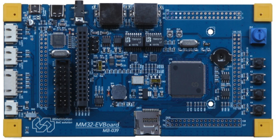

# MM32F3270 EVBoard 开发板BSP 说明

标签： MM32、Cortex-M3、MM32F3270、国产MCU

---

## 1. 简介

本文档为MM32F3270 EVB 评估板bsp适配说明

### 1.1  开发板介绍

MM32F3270 EVB 是为了用户快速上手、了解学习MM32系列MCU的一块入门级开发板，可满足基础测试及高端开发需求。

开发板外观如下图所示：

MM32F3270 EVB

MM32F3270 EVB 开发板特性：

- 支持 MindMotion MM32F3270 系列 MCU 开发评估，外部时钟 8MHz/32.768KHz
- 支持 Keil uVision v5.0 / IAR EWARM v7.80 或以上版本
- 支持 MM32 FDS 固件开发平台
- 支持 MM32 Program 编程软件 
- 内嵌 MM32-LINK-OB，支持虚拟串口(CDC) 
- MCU 基于 3.3V 电压设计，评估板 USB(Micro USB)接口供电 
- 4-按键，其中一个支持唤醒高电平有效，三个低电平有效按键 
- 4-发光二极管 
- 2-UART 三芯扩展插座(CMOS 电平)
- 1-SPI 五芯扩展插座(CMOS 电平)
- 1-带电平驱动器、终端匹配电阻选择的 CAN 总线驱动接口
- 1-Type-C 插座，支持 MCU USB Host/Device 工作模式
- 1-1M 字节 SPI Flash 存储器
- 1-256 字节 I2C EEPROM 存储器
- 1-3.5mm 耳机插座，用于 I2S L/R 音频输出
- 1-SDIO 方式的 TF Card 插座
- 2-RJ45 10M/100Mbps 以太网接口
- 1-34 芯并行总线接口，选配支持 2.8’’LCD 显示屏
- CR1210(用户配制)后备电池 
- 1-无源扬声器  3-模拟输入电位器 
- 3-开关：支持 USB 工作模式，引脚功能和 CAN 终端匹配电阻选择 
- 4-36pin0.1 英寸间距双排连接器, 管脚顺序与 MCU 相同
- PCB 板面尺寸：6.4*3.2 英寸

更多详细信息请咨询[灵动微电子技术支持][http://www.mm32.com.cn]

## 2. 编译说明

本 BSP 为开发者提供 MDK5 工程。下面以 MDK5 开发环境为例，介绍如何将系统运行起来。

双击 project.uvprojx 文件，打开 MDK5 工程，编译并下载程序到开发板。

推荐熟悉 RT_Thread 的用户使用[env工具](https://www.rt-thread.org/download.html#download-rt-thread-env-tool)，可以在console下进入到 `bsp/mm32l37x` 目录中，运行以下命令：

`scons`

来编译这个板级支持包。如果编译正确无误，会产生rtthread.elf、rtthread.bin文件。其中 rtthread.bin 可以烧写到设备中运行。

## 3. 驱动支持情况及计划

| 驱动       | 支持情况 | 备注                         |
| ---------- | :------: | :--------------------------: |
| UART       | 支持     | UART1/2                   |
| GPIO       | 支持     | / |

## 4. 联系人信息

维护人：

-[Mazhiyuan](https://github.com/cndabai) email: 1468728718@qq.com

## 5. 参考

- [MM32F3270系列数据手册]([DS_MM32F3270_V1.02_SC.pdf (mindmotion.com.cn)](http://www.mindmotion.com.cn/userfiles/images/MM32F3270XiLieWenDang/DS_MM32F3270_V1.02_SC.pdf))

- [MM32F3270系列用户手册]([www.mindmotion.com.cn/userfiles/images/MM32F3270XiLieWenDang/UM_MM32F3270_V0.93_SC.pdf](http://www.mindmotion.com.cn/userfiles/images/MM32F3270XiLieWenDang/UM_MM32F3270_V0.93_SC.pdf))

- [MiniBoardStartKit资料包](http://www.mm32.com.cn/download.aspx?cid=2545)

- [keil pack安装包](http://www.mm32.com.cn/download.aspx?cid=2546)

- [MM32 支持工具包](http://www.mm32.com.cn/download.aspx?cid=2547)

