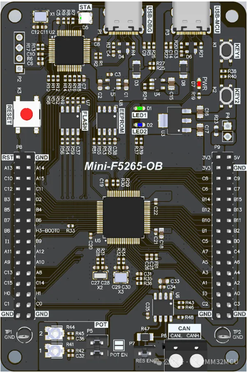

# MM32F5265-OB开发板BSP 说明

标签： MM32、Cortex-M33、MM32F5265、国产MCU

---

## 1. 简介

本文档为MM32F5265-OB 评估板bsp适配说明

### 1.1  开发板介绍

MM32F5265-OB 是为了用户快速上手、了解学习MM32系列MCU的一块入门级开发板，可满足基础测试及高端开发需求。

开发板外观如下图所示：

MM32F5265-OB



#### MM32F5265-OB 开发板特性：

#### 内核与系统
- 工作频率可达 120MHz
- 搭载 “星辰”STAR-MC1 (兼容 Cortex-M33）处理器，采用 Armv8-M Mainline 架构，内置单精度浮点运算单元（FPU），支持 DSP 扩展
- 4KB L1 指令缓存（I-Cache）和 4KB L1 数据缓存（D-Cache）
- 三角函数加速单元（CORDIC），支持 Sin，Cos 和 Atan 操作
- 外设互联矩阵 MindSwitch，支持定时器、GPIOs、EXTI、ADC、DAC 和比较器等模块信号间的直接连接或触发连接
- 2 个 8 通道 DMA 控制器，支持外设类型包括定时器、ADC、DAC、UART、LPUART、I2C、SPI、QSPI 和 FlexCAN

#### 存储器
- 多达 256KB 的 Flash 存储器
- 多达 128KB 的 SRAM
- Boot loader 支持片内 Flash 在线系统编程（ISP）
- QSPI 接口，支持扩展外部 NOR Flash 存储，支持在线执行模式（eXecute-In-Place，XIP）
- FSMC 接口，支持外扩 SRAM/PSRAM/NOR Flash 类型，兼容 8080/6800 通信总线模式

#### 时钟、复位和电源管理
- 2.0V ∼ 5.5V 供电
- 上电/断电复位（POR/PDR）、可编程电压监测器（PVD）
- 外部 4 ∼ 24MHz 高速晶体振荡器
- 内置经出厂调校的 8MHz 高速 RC 振荡器
- 内置的 PLL1 可产生系统时钟，支持多种分频模式，为总线矩阵和外设提供时钟
- 内置的 PLL2 可产生最高 100MHz 的系统时钟，支持多种分频模式，为 USB 和ADC 提供时钟
- 内置 40KHz 低速振荡器
- 外部 32.768KHz 低速振荡器，支持旁路功能

#### 低功耗
- 多种低功耗模式，包括：低功耗运行（Lower Power Run）、睡眠（Sleep）、低功耗睡眠（Low Power Sleep）、停机（Stop）、深度停机（Deep Stop）和待机模式（Standby）
- VBAT 为 RTC 和后备寄存器（20 x 16 位）供电
- 内置LPUART、LPTimer，支持从低功耗模式下触发唤醒

#### 多达 14 个通信接口
- 5 个 UART 接口
- 1 个 LPUART 接口
- 2 个 I2C 接口
- 3 个 SPI 接口（支持 I2S 模式）
- 1 个 USB 2.0，支持 Device & Host 模式
- 2 个 FlexCAN 接口，兼容 CAN 2.0B 协议

#### 13 个定时器
- 2 个 16 位 4 通道高级定时器（TIM1 / TIM8），有 4 组包含互补输出功能的 PWM输出通道，并支持硬件死区插入和故障检测后的紧急停止功能
- 2 个 16 位 4 通道通用定时器（TIM3 / TIM4）和 2 个 32 位 4 通道通用定时器（TIM2 / TIM5），每个通道配有 1 个 PWM 输出，并支持输入捕捉和输出比较，可用于红外、霍尔传感器或者编码器信号的解码
- 2 个 16 位基础定时器（TIM6 / TIM7）可用作通用定时和产生中断
- 1 个 16 位低功耗定时器（LPTIM）能在除了 Standby 以外的所有低功耗模式下唤醒处理器
- 2 个看门狗定时器，包括独立型的 IWDG 和窗口型的 WWDG
- 1 个 24 位 Systick 定时器
- 1 个 RTC 实时时钟

#### 2 个 12 位 ADC，共支持 19 个外部输入通道和 2 个内部输入通道，其中每个 ADC 支持最快 3MSPS 转换率，硬件支持过采样到 16 位分辨率
- 转换范围：0 ∼ VDDA
- 支持采样时间和分辨率配置
- 支持硬件过采样，过采样次数从 2 到 256 次可选
- 片上温度传感器
- 片上电压传感器
- VBAT 电压传感器

#### 2 个 12 位 DAC

#### 3 个 高速模拟比较器

#### 多达 86 个快速 I/O 端口
- 所有 I/O 口可以映像到 16 个外部中断
- 所有端口均可输入输出电压不高于 VDD 的信号
- 多达 61 个 5V 容忍 I/O 端口

#### CRC 计算单元

#### 96 位芯片唯一 ID（UID）

#### 调试模式
- 串行调试接口（SWD）
- JTAG 接口

#### 采用 LQFP100、LQFP64 和 LQFP48 封装
#### 全系列支持 -40℃ ∼ +105℃ 扩展工业型工作温度范围

#### 板载主控：MM32F5265E7PV

板载资源：
- 2 个用户LED
- 2 个用户按键
- 1 个复位按键
- 1 个可调电位器
- 8M SPI FLASH 和 2K EEPROM

板载接口：
- 1 x USB Type-C (USB-DBG)

供电方式：
- USB TYPE-C

更多详细信息请咨询[上海灵动微电子](https://www.mindmotion.com.cn/)

## 2. 编译说明

推荐熟悉 RT_Thread 的用户使用[env工具](https://www.rt-thread.org/download.html#download-rt-thread-env-tool)，可以在console下进入到 `bsp/mm32f526x` 目录中，运行以下命令：

```
pkgs --update
make
```

来编译这个板级支持包。如果编译正确无误，会产生rtthread.elf、rtthread.bin、rtthread.hex文件。其中 rtthread.bin、rtthread.hex 都可以烧写到设备中运行。

## 3. 驱动支持情况及计划

| 驱动       | 支持情况 | 备注                         |
| ---------- | :------: | :--------------------------: |
| UART       | 支持     | UART1/2/3                   |
| GPIO       | 支持     | / |
| ADC       | 支持     | ADC1/2 |
| FLASH       | 支持     | / |

## 4. 联系人信息

维护人：

- [Chasel](https://github.com/Maihuanyi) email: m19825309307@163.com

## 5. 参考

- [MM32F5260系列产品手册](https://www.mindmotion.com.cn/download/products/DS_MM32F5260_SC.pdf)

- [MM32F5260系列用户手册](https://www.mindmotion.com.cn/download/products/UM_MM32F5260_SC.pdf)

- [MiniBoard(MM32F5260)资料包](https://www.mindmotion.com.cn/support/development_tools/evaluation_boards/miniboard/mm32f5265e7pv/)

- [KEIL Pack 设备支持包](https://www.mindmotion.com.cn/support/software/keil_pack/)

- [IAR Pack 设备支持包](https://www.mindmotion.com.cn/support/software/iar_pack/)

- [J-Link Pack 设备支持包](https://www.mindmotion.com.cn/support/software/jlink_pack/)

