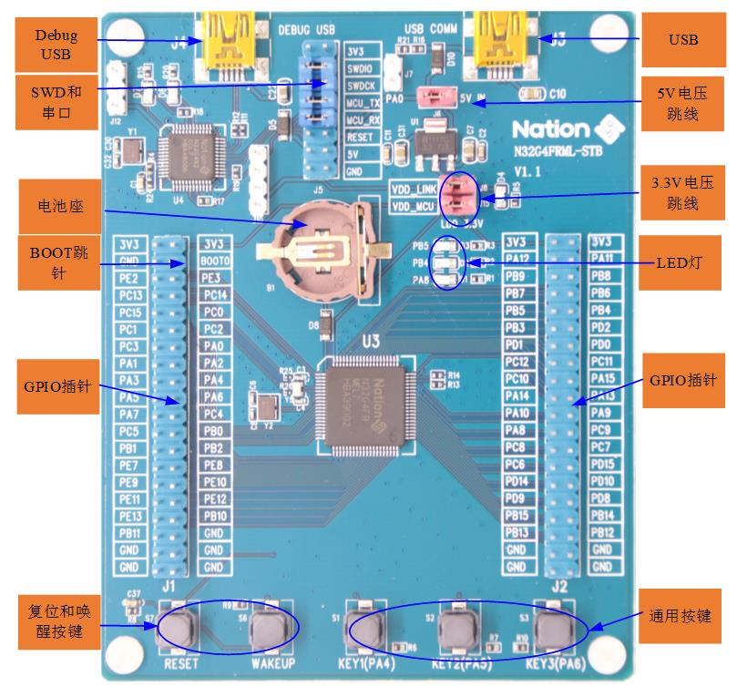

# N32G4FRML-STB 开发板BSP 说明

## 简介

N32G4FRML-STB 是国民技术推出的一款N32G4FR系列的评估板，该开发板具有丰富的板载资源，开发板外观如下图所示：




该开发板常用 **板载资源** 如下：

- N32G4FRML，主频 144MHz，512KB Flash、144KB SRAM
- 常用外设

  - LED ：3个，D1 (PA8），D2（PB4），D3（PB5）
  - 按键：3个，S1（用户按键，PA4），S2（用户按键，PA5），S3（用户按键，PA5）  
  - General TM * 4、Advanced TM * 2、Basic TM * 2
  - 系统时钟 * 1
  - 看门狗 * 2
  - RTC * 1
  - USART * 3、UART * 4
  - I2C * 4、I2S * 2
  - SPI * 3
  - SDIO * 1
  - CAN2.0B * 2
  - USB2.0   * 1
  - DVP * 1
  - EXMC/SDRAM * 1
  - ADC * 2
  - DAC * 2
- 调试接口：NS-Link，J-Link


## 外设支持

本 BSP 目前对外设的支持情况如下：

| **片上外设** | **支持情况** | **备注**                         |
| :----------- | :----------: | :------------------------------- |
| GPIO         |     支持     | PA0, PA1... ---> PIN: 0, 1...143 |
| UART         |     支持     | UART0 - UART7                    |
| I2C          |     支持     | I2C1                             |
| SPI          |     支持     | SPI0 - SPI2                      |
| SPI FLASH    |     支持     |                                  |
| ADC          |     支持     | ADC0 - ADC2                      |
| **扩展模块** | **支持情况** | **备注**                         |
| 暂无         |   暂不支持   | 暂不支持                         |


## 使用说明

使用说明分为如下两个章节：

- 快速上手

  本章节是为刚接触 RT-Thread 的新手准备的使用说明，遵循简单的步骤即可将 RT-Thread 操作系统运行在该开发板上，看到实验效果 。

- 进阶使用

  本章节是为需要在 RT-Thread 操作系统上使用更多开发板资源的开发者准备的。通过使用 ENV 工具对 BSP 进行配置，可以开启更多板载资源，实现更多高级功能。

### 快速上手

本 BSP 为开发者提供MDK /IAR工程，并且支持 GCC 开发环境。下面以 MDK5 开发环境为例，介绍如何将系统运行起来。

#### 硬件连接

使用数据线连接开发板到 PC，使用USB转232连接PA9(MCU TX)和PA10(MCU RX)，打开电源开关。

#### 编译下载

双击 project.uvprojx 文件，打开 MDK5 工程，编译并下载程序到开发板。

> 工程默认配置使用 NS-Link  仿真器下载程序，在通过 NS-Link  连接开发板的基础上，点击下载按钮即可下载程序到开发板

#### 运行结果

下载程序成功之后，系统会自动运行，LED 闪烁。

连接开发板对应串口到 PC , 在终端工具里打开相应的串口（115200-8-1-N），复位设备后，可以看到 RT-Thread 的输出信息:

```bash
 \ | /
- RT -     Thread Operating System
 / | \     5.0.0 build Dec 24 2022 22:54:17
 2006 - 2022 Copyright by RT-Thread team
msh >
```

### 进阶使用

此 BSP 默认只开启了 GPIO 和 串口0的功能，如果需使用高级功能，需要利用 ENV 工具对BSP 进行配置，步骤如下：

1. 在 bsp 下打开 env 工具。

2. 输入`menuconfig`命令配置工程，配置好之后保存退出。

3. 输入`pkgs --update`命令更新软件包。

4. 输入`scons --target=mdk4/mdk5`/iar命令重新生成工程。

## 注意事项

暂无

## 联系人信息

维护人:

- [BruceOu](https://github.com/Ouxiaolong/), 邮箱：<ouxiaolong@bruceou.cn>


