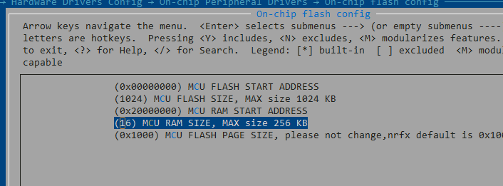
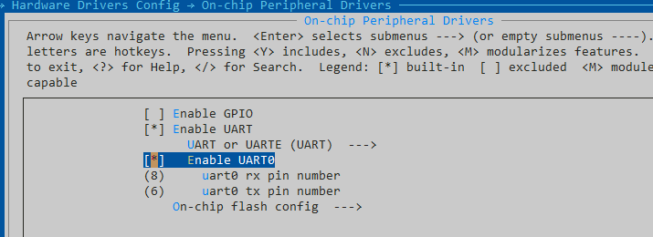

# Nordic 系列 BSP 制作教程

为了让广大开发者更好、更方便地使用 BSP 进行开发，重新整理了现有的 Nordic 系列的 BSP，推出了新的 BSP 框架。新的 BSP 框架在易用性、移植便利性、驱动完整性、代码规范性等方面都有较大提升，在新的 BSP 框架下进行开发，可以大大提高应用的开发效率。

这边参考了官方stm32的相关制作流程，熟悉STM32的可以参考[STM32](https://github.com/RT-Thread/rt-thread/blob/master/bsp/stm32/docs/STM32%E7%B3%BB%E5%88%97BSP%E5%88%B6%E4%BD%9C%E6%95%99%E7%A8%8B.md)

## 1. 知识准备

制作一个 BSP 的过程就是构建一个新系统的过程，因此想要制作出好用的 BSP，要对 RT-Thread 系统的构建过程有一定了解，需要的知识准备如下所示：

- 掌握  Nordic系列 BSP 的使用方法

  了解 BSP 的使用方法，可以阅读 [Nordic 说明文档](../README.md) 中使用教程表格内的文档。

- 了解 scons 工程构建方法

  RT-Thread 使用 scons 作为系统的构建工具，因此了解 scons 的常用命令对制作新 BSP 是基本要求。

- 了解设备驱动框架

  在 RT-Thread 系统中，应用程序通过设备驱动框架来操作硬件，因此了解设备驱动框架，对添加 BSP 驱动是很重要的。

- 了解 kconfig 语法

  RT-Thread 系统通过 menuconfig 的方式进行配置，而 menuconfig 中的选项是由 kconfig 文件决定的，因此想要对 RT-Thread 系统进行配置，需要对 kconfig 语法有一定了解。


##  BSP 制作方法

本节以制作microbit添加 BSP。在接下来的章节中将会详细介绍具体步骤，帮助开发者快速创建所需要的 BSP。

### 复制通用模板
制作新 BSP 的第一步是复制一份同系列的 BSP 模板作为基础，通过对 BSP 模板的修改来获得新 BSP。目前提供的 BSP 模板系列如下表所示：

| 工程模板 | 说明 |
| ------- | ---- |
| libraries/templates/nrfx | nrfx系列 BSP 模板 |

### 修改芯片类型

打开board/Kconfig找到SOC_NRF52840 

SOC_NRF52840 要改成你对应的芯片类型，例如SOC_NRF51822 这个时候要确认[nrfx](https://github.com/xckhmf/nrfx)软件包中的SConscript中有对应的配置选项，没用的话，可以pr到对应的软件包

```
elif GetDepend('SOC_NRF51822') == True:
	define += ['NRF51822_XXAA']
	src += ['./mdk/system_nrf51.c']
	
	if rtconfig.PLATFORM == 'armcc':
		src += ['./mdk/arm_startup_nrf51.s']
		
	if rtconfig.PLATFORM == 'gcc':
		src += ['./mdk/gcc_startup_nrf51.S']
		
	if rtconfig.PLATFORM == 'iar':
		D_SRC += ['./mdk/iar_startup_nrf51.s']
```

### 修改templete.uvprojx模板

修改template.uvprojx中的soc和jlink等配置选项，这个可以参考官方SDK sample的keil配置

这边如果要配置jlink的话，要注意flash download算法是否需要修改。

### 检查rtconfig.py

检查rtconfig.py中的CPU类型，nrf52是`cortex-m4` 如果是nrf51需要改成`cortex-m0`

### 修改menuconfig中的相关配置

menuconfig中修改RAM size大小。并且修改link.sct文件，这个可以参考官方sample



配置UART0相关的的引脚配置， 选中对应的UART0 TX RX引脚



最后调试`scons --target=mdk5`

### 修改整理readme.md

修改readme.md, 将你的开发板常用的链接信息整理到readme.md中


## FAQ:

1. 编译keil遇到 `No section matches selector - no section to be FIRST`

这个因为package里面的nrfx中的Sconscript未添加好对应的芯片，没有加载arm_startup_nrf51.s等文件导致