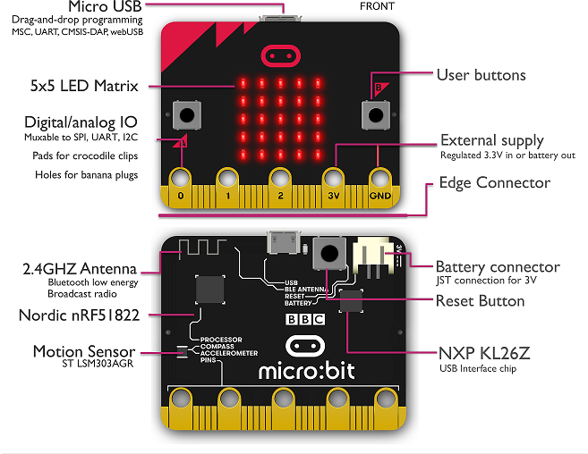

# nRF51822 BSP说明

## 简介

该文件夹主要存放所有主芯片为nRF51822的板级支持包。目前默认支持的开发板是[Micro:bitV1.5](https://tech.microbit.org/hardware/1-5-revision/)
本文主要内容如下：

- 开发板资源介绍
- 进阶使用方法

## 开发板介绍

Microbit是BCC基于nordic的mcu nrf51822的开发板，基于ARM Cortex-M0内核，最高主频64 MHz，具有丰富的外设资源。

开发板外观如下图所示

nrf51822 开发板常用 **板载资源** 如下：

- MCU：NRF51822，主频 16MHz，256kB FLASH ，16kB RAM
- MCU 外设: GPIO, UART, SPI, I2C(TWI), RTC,TIMER,PWM,ADC
- 板载外设
  - LED墙：25个，矩阵控制。
  - 按键：3个，2个USER and 1个RESET 。
  - 三轴加速度传感器:   LSM303AGR 
  - CMSIS-DAP: KL26Z调试器
- 调试接口：板载CMSIS-DAP 调试器。

更详细的整理的资料见[nrf51822](https://github.com/supperthomas/BSP_BOARD_Nrf51822_microbit)

官方主页[nrf51822](https://infocenter.nordicsemi.com/index.jsp?topic=%2Fstruct_nrf51%2Fstruct%2Fnrf51822.html)

## 外设支持

本 BSP 目前对外设的支持情况如下：

| **片上外设** | **支持情况** | **备注** |
| :----------- | :----------: | :------: |
| GPIO         |    待支持    |          |
| UART         |     支持     |  UART0   |
|              |              |          |
|              |              |          |
|              |              |          |

### 进阶使用

此 BSP 默认只开启了串口 0 的功能，更多高级功能需要利用 env 工具对 BSP 进行配置，步骤如下：

1. 在 bsp 下打开 env 工具。

2. 输入`menuconfig`命令配置工程，配置好之后保存退出。

3. 输入`pkgs --update`命令更新软件包。

4. 输入`scons --target=mdk5命令重新生成工程。

## 支持其他开发板

可以在board/Kconfig里面的`bsp choice`里面添加对应的其他开发板

## 联系人信息

维护人:

-  [supperthomas], 邮箱：<78900636@qq.com>