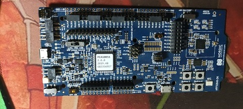

# nRF52840-PCA10056 BSP说明

## 简介

该文件夹主要存放所有主芯片为nRF52840的板级支持包。目前默认支持的开发板是官方[PCA10056](https://www.nordicsemi.com/Software-and-tools/Development-Kits/nRF52840-DK)
本文主要内容如下：

- 开发板资源介绍
- 进阶使用方法

## 开发板介绍

PCA10056-nRF52840是Nordic 官方的开发板，搭载nRF52840 芯片，基于ARM Cortex-M4内核，最高主频64 MHz，具有丰富的外设资源。

开发板外观如下图所示

PCA10056-nrf52840 开发板常用 **板载资源** 如下：

- MCU：NRF52840，主频 64MHz，1MB FLASH ，256kB RAM
- MCU 外设: GPIO, UART, SPI, I2C(TWI), RTC,TIMER,NFC,QSPI,PWM,ADC,USB,I2S
- 板载设
  - LED：4个，USB communication (LD1), user LED (LD2), power LED (LD3) 。
  - 按键：5个，4个USER and 1个RESET 。
  - USB:   1个
- 常用接口：USB device、Arduino Uno 接口
- 调试接口：板载 J-LINK 调试器。

开发板更多详细信息请参考NORDIC官方[PCA10056](https://www.nordicsemi.com/Software-and-tools/Development-Kits/nRF52840-DK)

## 外设支持

本 BSP 目前对外设的支持情况如下：

| **片上外设** | **支持情况** |        **备注**        |
| :----------- | :----------: | :--------------------: |
| GPIO         |     支持     |         GPION          |
| UART         |     支持     |         UART0          |
| PWM          |     支持     |          支持          |
| SPI          |     支持     |          支持          |
| QSPI         |     支持     | 支持开发板上QSPI FLASH |
| RTC          |     支持     |                        |
| ADC          |     支持     |                        |
|              |              |                        |
|              |              |                        |
|              |              |                        |

### 进阶使用

此 BSP 默认只开启了 GPIO 和 串口 0 的功能，更多高级功能需要利用 env 工具对 BSP 进行配置，步骤如下：

1. 在 bsp 下打开 env 工具。

2. 输入`menuconfig`命令配置工程，配置好之后保存退出。

3. 输入`pkgs --update`命令更新软件包。

4. 输入`scons --target=mdk4/mdk5/iar` 命令重新生成工程。

## 支持其他开发板

客户可以将自己的开发板的.config文件和board/Kconfig文件到board/$(board_name)下面添加README.md即可，使用的时候替换.config文件

## 注意事项

## 联系人信息

维护人:

-  [supperthomas], 邮箱：<78900636@qq.com>