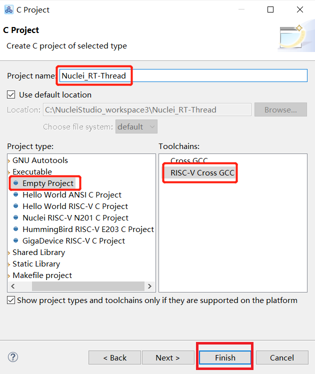
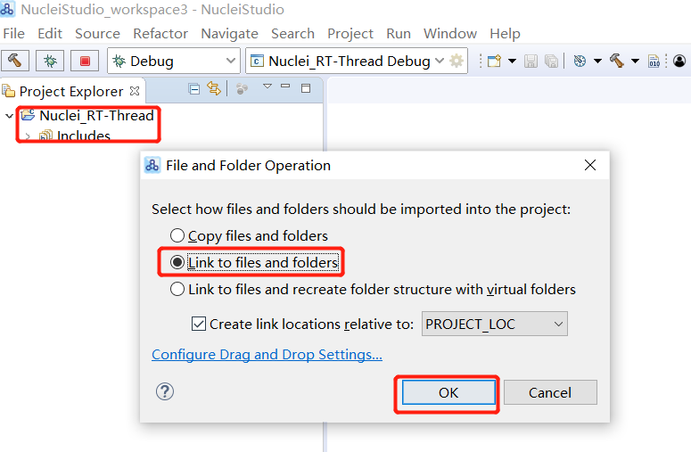
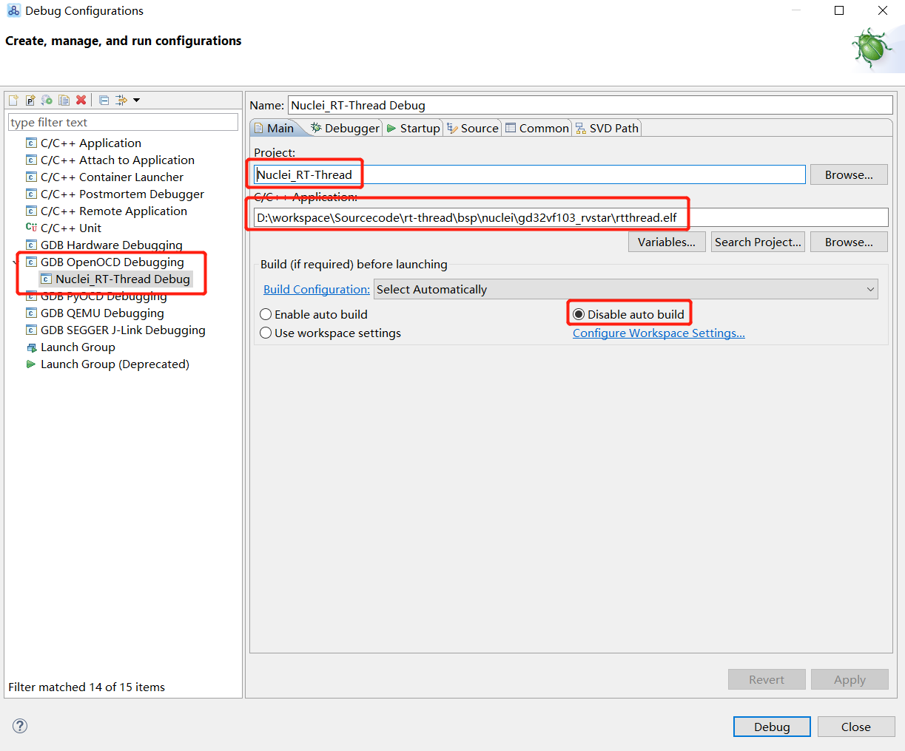
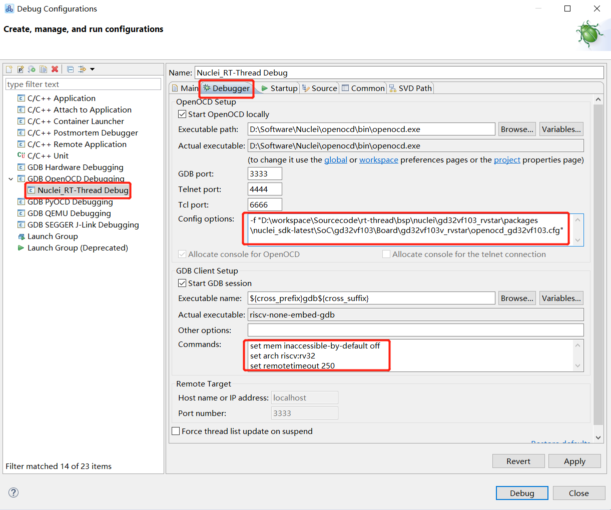
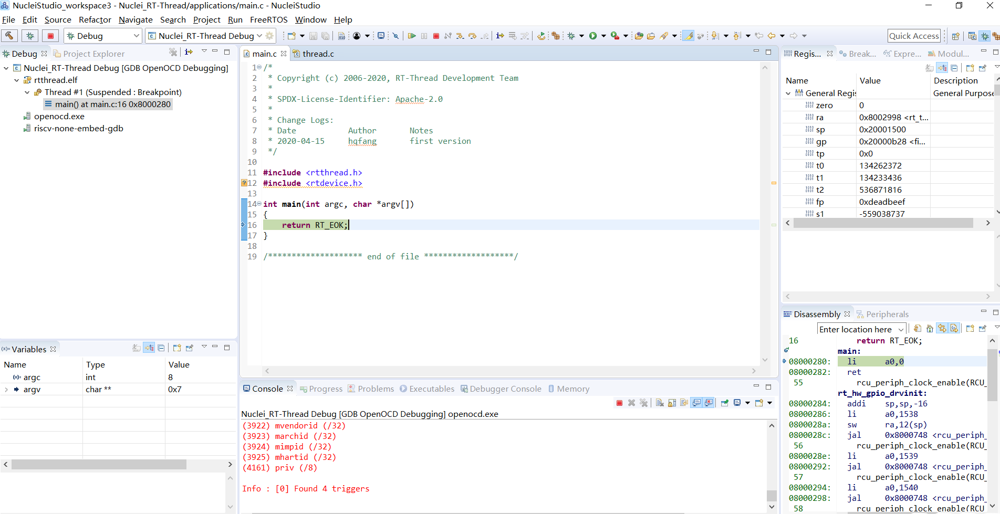

# 芯来科技RVSTAR开发板 #

## 简介

**RVSTAR开发板** 是由[芯来科技Nuclei](https://nucleisys.com/)公司推出的基于采用芯来科技RISC-V架构处理器芯片的GD32VF103的开发板。

更多关于 **RVSTAR开发板** 开发板的详细资料请参见 [RVSTAR开发板快速入门](https://www.rvmcu.com/quickstart-doc-u-rvstar.html)

### 板载资源

| 硬件 | 描述            |
| ---- | --------------- |
| 内核 | Nuclei N205     |
| 架构 | 32-bit RV32IMAC |
| 主频 | 108 MHz         |

## 工具安装

### 安装工具链

请根据[安装Nuclei RISC-V GCC Toolchain和OpenOCD](https://doc.nucleisys.com/nuclei_sdk/quickstart.html#setup-tools-and-environment) 来安装依赖的工具。

### 添加环境变量

将Nuclei RISC-V GCC Toolchain和OpenOCD的环境变量进行设置。

#### Windows

假设工具安装在 **D:\Software\Nuclei**目录下, 则可以修改系统环境变量**PATH**,
将**D:\Software\Nuclei\gcc\bin;D:\Software\Nuclei\openocd\bin;**增加到**PATH**中。

或者在ENV工具命令行中运行

~~~cmd
set PATH=D:\Software\Nuclei\gcc\bin;D:\Software\Nuclei\openocd\bin;%PATH%
~~~

#### Linux

假设工具安装在 **~/Software/Nuclei**目录下, 通过在Linux的``.bashrc``增加如下一行代码
来添加环境变量。

~~~bash
export PATH=~/Software/Nuclei/gcc/bin:~/Software/Nuclei/openocd/bin:$PATH
~~~

或者在ENV工具命令行中运行

~~~bash
export PATH=~/Software/Nuclei/gcc/bin:~/Software/Nuclei/openocd/bin:$PATH
~~~

**注意**: 对应的RISC-V GCC和OPENOCD的路径请替换成自己安装的路径。

## 烧写及执行

### [驱动设置](https://doc.nucleisys.com/nuclei_board_labs/hw/hw.html#on-board-debugger-driver)

### 编译程序

下载好[RT-Thread](https://github.com/RT-Thread/rt-thread)的代码和[ENV工具](https://www.rt-thread.org/download.html#download-rt-thread-env-tool)以后。

按照ENV工具的教程, 在**rt-thread\bsp\nuclei\gd32vf103_rvstar**目录打开ENV工具命令行。

**注意**: 请确保Nuclei GCC和Nuclei OpenOCD的路径设置正确无误。

1. 运行 ``pkgs --update``来下载最新的依赖的**Nuclei SDK**开发包,修改链接脚本。

   ```c
     .stack ORIGIN(RAM) + LENGTH(RAM) - __TOT_STACK_SIZE (NOLOAD) :
     {
   	...
       PROVIDE( _sp = . );
       PROVIDE( __rt_rvstack = . );//在链接脚本中补充该条语句
     } >RAM AT>RAM
   ```

2. **可选**: 运行 ``menuconfig``来进行内核配置

3. 运行 ``scons -c``清理之前的编译结果

4. 运行 ``scons``来进行代码的编译

### 下载程序

在保证程序能够正常编译后, 在相同ENV终端执行``scons --run upload``进行代码的下载。

正常下载的输出如下:

~~~bat
57856@DESKTOP-4LATIEU D:\workspace\Sourcecode\rt-thread\bsp\nuclei\gd32vf103_rvstar
> scons --run upload
scons: Reading SConscript files ...
Supported downloaded modes for board gd32vf103v_rvstar are flashxip, chosen downloaded mode is flashxip
Upload application rtthread.elf using openocd and gdb
riscv-nuclei-elf-gdb rtthread.elf -ex "set remotetimeout 240"                     -ex "target remote | openocd --pipe -f D:/workspace/Sourcecode/rt-thread/bsp/nuclei/gd32vf103_rvstar/packages/nuclei_sdk-latest/SoC/gd32vf103/Board/gd32vf103v_rvstar/openocd_gd32vf103.cfg"                     --batch -ex "monitor halt" -ex "monitor flash protect 0 0 last off" -ex "load"                     -ex "monitor resume" -ex "monitor shutdown" -ex "quit"
D:\Software\Nuclei\gcc\bin\riscv-nuclei-elf-gdb.exe: warning: Couldn't determine a path for the index cache directory.
Nuclei OpenOCD, 64-bit Open On-Chip Debugger 0.10.0+dev-00014-g0eae03214 (2019-12-12-07:43)
Licensed under GNU GPL v2
For bug reports, read
        http://openocd.org/doc/doxygen/bugs.html
rt_assert_handler (ex_string=ex_string@entry=0x800ab10 "0", func=func@entry=0x800ac14 <__FUNCTION__.3090> "rt_sem_take", line=line@entry=363) at D:\workspace\Sourcecode\rt-thread\src\kservice.c:1371
1371                while (dummy == 0);
cleared protection for sectors 0 through 127 on flash bank 0

Loading section .init, size 0x264 lma 0x8000000
Loading section .text, size 0xa646 lma 0x8000280
Loading section .rodata, size 0x2a80 lma 0x800a8c8
Loading section .data, size 0x350 lma 0x800d348
Start address 0x800015c, load size 54906
Transfer rate: 6 KB/sec, 9151 bytes/write.
shutdown command invoked
A debugging session is active.

        Inferior 1 [Remote target] will be detached.

Quit anyway? (y or n) [answered Y; input not from terminal]
[Inferior 1 (Remote target) detached]
~~~

下载程序之后, 连接串口(115200-N-8-1), 可以看到 RT-Thread 的输出信息：

```
initialize rti_board_start:0 done

 \ | /
- RT -     Thread Operating System
 / | \     4.0.3 build Jun  9 2020
 2006 - 2020 Copyright by rt-thread team
do components initialization.
initialize rti_board_end:0 done
initialize rt_work_sys_workqueue_init:0 done
initialize rt_hw_pin_init:0 done
initialize libc_system_init:0 done
initialize finsh_system_init:0 done
msh >
```

在串口终端(我这里使用的是TeraTerm)输入``ps``即可查看当前线程工作情况:

~~~
msh >ps
thread   pri  status      sp     stack size max used left tick  error
-------- ---  ------- ---------- ----------  ------  ---------- ---
tshell    20  running 0x000000f8 0x00000800    21%   0x00000008 000
sys_work  23  suspend 0x00000098 0x00000800    07%   0x0000000a 000
tidle0    31  ready   0x000000b8 0x0000018c    46%   0x00000013 000
timer      4  suspend 0x00000098 0x00000200    29%   0x00000009 000
msh >list_device
device           type         ref count
-------- -------------------- ----------
pin      Miscellaneous Device 0
uart4    Character Device     2
msh >version

 \ | /
- RT -     Thread Operating System
 / | \     4.0.3 build Jun 11 2020
 2006 - 2020 Copyright by rt-thread team
msh >free
total memory: 14208
used memory : 5248
maximum allocated memory: 6424
~~~

### 调试程序

#### 命令行GDB调试

在保证程序编译成功后, 在相同ENV终端执行``scons --run debug``进行代码在命令行下进行GDB调试。

正常的调试输出如下：

~~~bat
57856@DESKTOP-4LATIEU D:\workspace\Sourcecode\rt-thread\bsp\nuclei\gd32vf103_rvstar
> scons --run debug
scons: Reading SConscript files ...
Supported downloaded modes for board gd32vf103v_rvstar are flashxip, chosen downloaded mode is flashxip
Debug application rtthread.elf using openocd and gdb
riscv-nuclei-elf-gdb rtthread.elf -ex "set remotetimeout 240"                     -ex "target remote | openocd --pipe -f D:/workspace/Sourcecode/rt-thread/bsp/nuclei/gd32vf103_rvstar/packages/nuclei_sdk-latest/SoC/gd32vf103/Board/gd32vf103v_rvstar/openocd_gd32vf103.cfg"
D:\Software\Nuclei\gcc\bin\riscv-nuclei-elf-gdb.exe: warning: Couldn't determine a path for the index cache directory.
GNU gdb (GDB) 8.3.0.20190516-git
Copyright (C) 2019 Free Software Foundation, Inc.
License GPLv3+: GNU GPL version 3 or later <http://gnu.org/licenses/gpl.html>
This is free software: you are free to change and redistribute it.
There is NO WARRANTY, to the extent permitted by law.
Type "show copying" and "show warranty" for details.
This GDB was configured as "--host=i686-w64-mingw32 --target=riscv-nuclei-elf".
Type "show configuration" for configuration details.
For bug reporting instructions, please see:
<http://www.gnu.org/software/gdb/bugs/>.
Find the GDB manual and other documentation resources online at:
    <http://www.gnu.org/software/gdb/documentation/>.

For help, type "help".
Type "apropos word" to search for commands related to "word"...
Reading symbols from rtthread.elf...
Remote debugging using | openocd --pipe -f D:/workspace/Sourcecode/rt-thread/bsp/nuclei/gd32vf103_rvstar/packages/nuclei_sdk-latest/SoC/gd32vf103/Board/gd32vf103v_rvstar/openocd_gd32vf103.cfg
Nuclei OpenOCD, 64-bit Open On-Chip Debugger 0.10.0+dev-00014-g0eae03214 (2019-12-12-07:43)
Licensed under GNU GPL v2
For bug reports, read
        http://openocd.org/doc/doxygen/bugs.html
0x080011ca in rt_thread_idle_excute () at D:\workspace\Sourcecode\rt-thread\src\idle.c:153
153         while (_has_defunct_thread())
(gdb) b irq_entry
Breakpoint 1 at 0x8003840: file D:\workspace\Sourcecode\rt-thread\libcpu\risc-v\nuclei\interrupt_gcc.S, line 190.
(gdb) c
Continuing.
Note: automatically using hardware breakpoints for read-only addresses.

Breakpoint 1, irq_entry () at D:\workspace\Sourcecode\rt-thread\libcpu\risc-v\nuclei\interrupt_gcc.S:190
190         SAVE_CONTEXT
(gdb) c
~~~

调试例子参见如下文档:

* https://doc.nucleisys.com/nuclei_sdk/quickstart.html#debug-application

#### Nuclei Studio IDE调试

为了更方便的进行图形化调试, 也可以下载并使用[**Nuclei Studio IDE**](https://nucleisys.com/download.php)集成开发环境.

1. 打开Nuclei Studio IDE, 创建一个名为**Nuclei_RT-Thread**的**C Project**，Project Type选择**Empty Project**,
   Toolchain选择**RISC-V Cross GCC**, 然后点击**Finish**.

   

2. 选中**rt-thread**的代码目录，然后鼠标左键拖到Nuclei Studio中创建好的**Nuclei_RT-Thread**工程中，选择
   **Link to files and folders**, 点击**OK**, 就将**rt-thread**的代码拖到了工程中并创建软链接，注意这里建立的工程
   仅用于调试，不可以用于编译，编译请使用上文中提到的`scons`命令。

   

3. 创建一个OpenOCD Debugging Configuration, 选择编译好的ELF文件, 并选定**Disable auto build**, 如下图所示:

   

4. 然后打开**Debugger**Tab, 配置好OPENOCD的配置文件路径, 其中OPENOCD配置文件路径为
*bsp\nuclei\gd32vf103_rvstar\packages\nuclei_sdk-latest\SoC\gd32vf103\Board\gd32vf103v_rvstar\openocd_gd32vf103.cfg*，
   请在配置时使用完整绝对路径，根据自己文件所在目录来提供。配置完毕后，点击 **Debug**，开始下载调试。

   

5. 最终调试界面如下所示

   

6. 上面步骤中的路径请根据自己的环境进行调整，调试时请确保开发板正常连接到电脑，并且调试器驱动安装正确。

## 驱动支持情况

| 驱动    | 支持情况 |               备注               |
| ------- | -------- | :------------------------------: |
| UART    | 支持     | RV-STAR板载串口是UART4, 默认使能 |
| GPIO    | 支持     |      默认使能，支持中断控制      |
| SPI     | 支持     |             默认关闭             |
| I2C     | 支持     |             默认关闭             |
| HWTIMER | 支持     |             默认关闭             |
| PWM     | 支持     |             默认关闭             |
| WDT     | 支持     |             默认关闭             |
| RTC     | 支持     |             默认关闭             |
| ADC     | 支持     |             默认关闭             |

### 适配开发板Pinmux

如果需要使用到其他的外设驱动，则首先需要运行`menuconfig`命令，在
`Hardware Drivers Config -> On-chip Peripheral Drivers`中使能对应的外设接口，
但是由于针对不同的外设接口GPIO的pinux配置不一样，开发者仍需要根据自己的需求
在 `board/board.c` 中的 `rt_hw_drivers_init`入口函数中找到需要使用到的子函数，
并在对应的子函数中进行功能适配。

**使用举例**

* I2C外设Pinmux

如果需要将I2C1的SCL和SDA配置在PB10和PB11，首先需要在menuconfig中将I2C1使能，然后
更改board.c中`rt_hw_i2c_drvinit`函数，并进行如下设定。

~~~c
/* Configure PB10 PB11 (I2C1 SCL SDA) as alternate function  */
gpio_init(GPIOB, GPIO_MODE_AF_OD, GPIO_OSPEED_50MHZ, GPIO_PIN_10 | GPIO_PIN_11);
~~~

* SPI外设Pinmux

如果需要将SPI0的SCK MISO和MOSI配置在PA5, PA6和PA7，首先需要在menuconfig中将SPI0使能，
然后更改board.c中的`rt_hw_spi_drvinit`函数，并进行如下设定。

~~~c
/* Configure PA5 PA6 PA7 (SPI0 SCK MISO MOSI) as alternate function */
gpio_init(GPIOA, GPIO_MODE_AF_PP, GPIO_OSPEED_50MHZ, GPIO_PIN_5 | GPIO_PIN_7);
gpio_init(GPIOA, GPIO_MODE_IN_FLOATING, GPIO_OSPEED_50MHZ, GPIO_PIN_6);
~~~

* 其余类似的外设也是如上做适配处理

### 注意

- 适配RT-Thread的驱动框架的代码在 [../libraries/gd32vf103/HAL_Drivers](../libraries/gd32vf103/HAL_Drivers)目录下。
- 如果有开发者想适配更多的驱动, 请在对应目录下增加驱动适配支持。
- GD32VF103的驱动适配开关在 `menuconfig -> Hardware Drivers Config -> On-chip Peripheral Drivers` 可以找到。
- HWTIMER和PWM都是采用的TIMER模块进行功能实现，所以在使用驱动时，请务必注意不要重叠使用相同模块。

## 联系人信息

维护人：
- [fanghuaqi](https://github.com/fanghuaqi)

