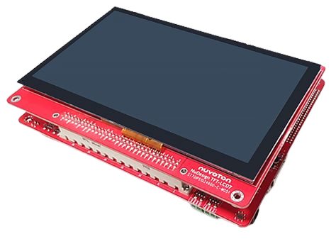
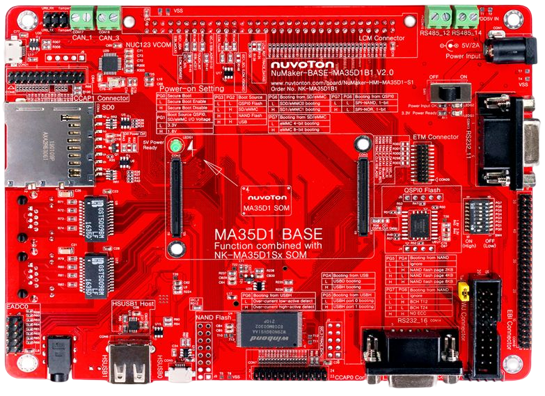
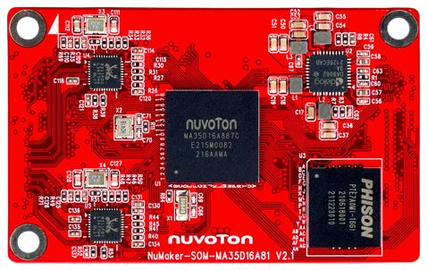
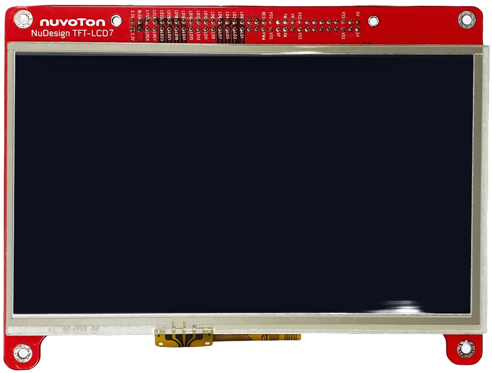
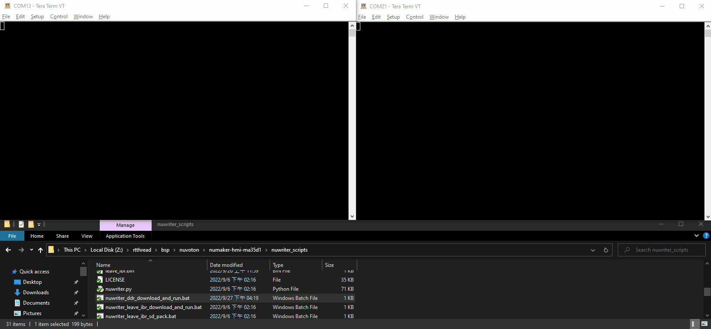
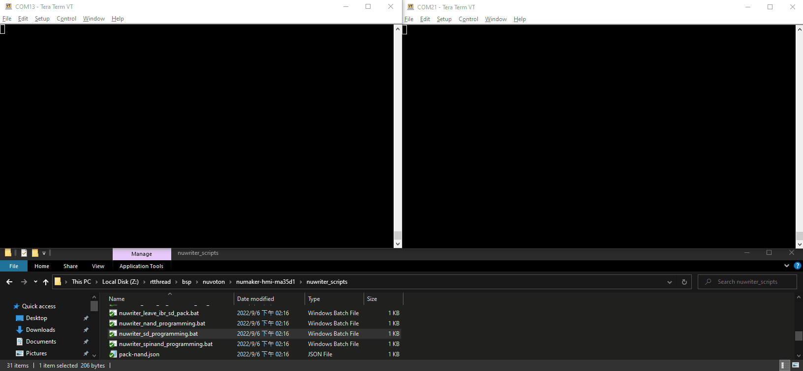
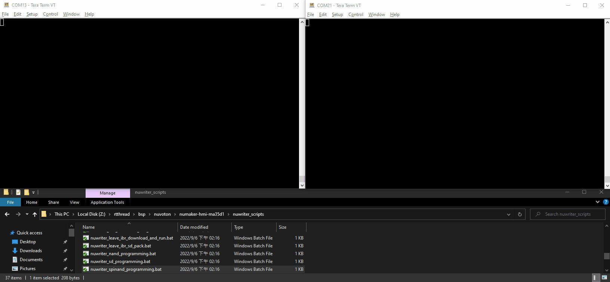
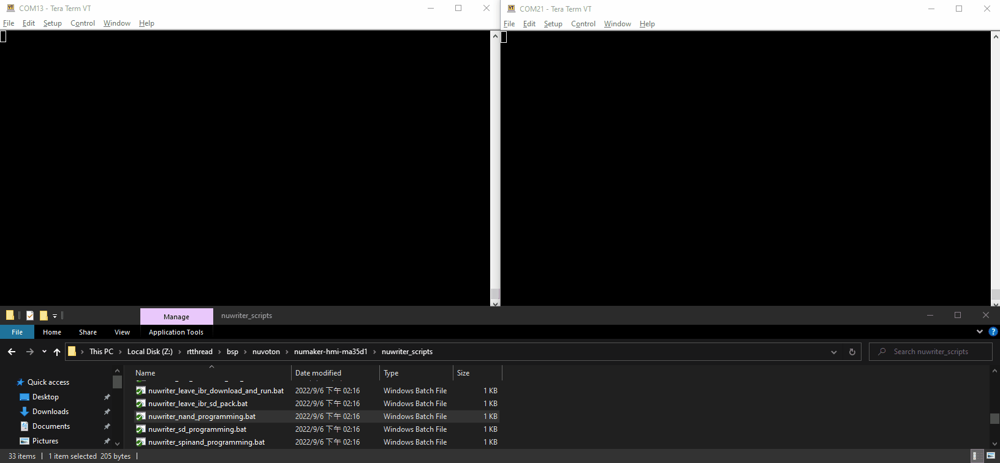

# **NuMaker-HMI-MA35D1**

## **Introduction**

The NuMaker-HMI-MA35D1 is an evaluation board for Nuvoton NuMicro MA35D1 series microprocessors, and consists of three parts: a NuMaker-SOM-MA35D16A81 SOM board, a NuMaker-BASE-MA35D1B1 base board and a 7 inch TFT-LCD daughter board. The SOM board integrates core components to simplify the system design, based on MA35D16A887C (BGA312 package, and stacking a 256 MB DDR), PMIC power solution, a 16 GB eMMC Flash, and two Gigabit Ethernet PHY. The NuMaker-HMI-MA35D1-S1 has rich peripherals such as 2 sets of Gigabit Ethernet, USB2.0 high-speed host and device, 2 sets of CAN FD, and SPI, I2C, UART, RS-485 serial communication ports for users to facilitate the evaluation in HMI and industrial control, home appliances, 2-wheel cluster, medical device, new energy applications, ML (Machine Learning) or your creative applications.

The NuMicro MA35D1 series is a heterogeneous multi-core microprocessor targeted to high-end edge IIoT gateway. It is based on dual 64-bit Arm Cortex-A35 cores, and one 180 MHz Arm Cortex-M4 core. Based on the high-performance cores, the MA35D1 series facilities the tiny AI/ML for edge computing. The MA35D1 supports 16-bit DDR2 and DDR3/DDR3L SDRAM. For an easy system design and manufacture, the MA35D1 series also offers LQFP and BGA packages stacked with the DDR2/DDR3L SDRAM and density up to 512 MB, which significantly reduces PCB layer, size and electromagnetic interference (EMI).

<p align="center">

</p>

|NuMaker-BASE-MA35D1B1|NuMaker-SOM-MA35D16A81|7-inch LCD Panel|
|--|--|--|
|<p align="center"></p>|<p align="center"></p>|<p align="center"></p>|

## **NuMaker-SOM-MA35D16A81 Features**

<ul>
<li>Target Chip</li>
  <ul>
    <li>MA35D16A887C (BGA 312-Ball) MCP package with DDR3L (256 MB), which can run up to 800 MHz</li>
  </ul>
<li> Power </li>
    <ul>
    <li>DC 5V input through the high speed connector**</li>
    <li>PMIC DA9062-3A</li>
      <ul>
      <li>Four DC/DC</li>
        To supply 1.2V Core power, 1.2V CPU power, 1.35V DDR3L Memory power and 3.3V I/O power
      <li>Four LDO</li>
        To supply 3.0V RTC power, 1.8V I/O power, 2.5V PLL power and 3.3V/1.8V eMMC NAND Flash power
      </ul>
    <li>Battery input header</li>
</ul>
<li>Memory Devices</li>
  <ul>
  <li>An on-board eMMC NAND Flash memory device (16 GB)</li>
  </ul>
<li>Two Gigabit Ethernet (RGMII) PHY devices</li>
<li>Two 120-pin high speed connectors to connect with BASE board</li>
<li>One PMIC reset key button</li>
</ul>

## **NuMaker-BASE-MA35D1B1 Features**

<ul>
  <li>Power</li>
  <ul>
    <li>5V/2A Power Jack and Slide Switch</li>
  </ul>
  <li>Debug/Trace</li>
  <ul>
    <li> UART0 debug port: USB Virtual COM (VCOM) port </li>
    <li> Debug/Trace ports: SWJ (JTAG+SWD), ETM and SWD connectors </li>
  </ul>
  <li>Memory Devices</li>
  <ul>
    <li>An on-board Quad SPI NAND Flash device (512 MB)</li>
    <li>An on-board NAND Flash device (1 GB)</li>
    <li>Standard-SD (SD2.0) memory card slot</li>
  </ul>

  <li>One power-on setting DIP-Switch for evaluation booting source selection</li>

  <li>Two 120-pin high speed connectors to connect with SOM board</li>
  <li>Two sets of Gigabit Ethernet ports: Two Gigabit Ethernet transformer devices and two RJ45 port connectors</li>
  <li>Two sets of high speed USB ports: One Host/Device port and one Host port</li>
  <li>Two camera capture (CMOS sensor) header connectors</li>
  <li>One LCM connector to connect with 7-inch 1024x600 LCD daughter board</li>
  <li>One audio codec with microphone input and speaker output</li>
  <li>One SIM card slot</li>
  <li>One External Bus Interface (EBI) header connector</li>
  <li>Two sets of UART transceivers and DB9 connectors</li>
  <li>Two sets of RS485 transceivers and header connectors</li>
  <li>Two sets of CAN FD transceivers and header connectors</li>
  <li>One 8-channel ADC header connector</li>
  <li>MEMS Microphone</li>
  <li>MEMS G-Sensor</li>
  <li>Three user key buttons</li>
  <li>Two user LEDs</li>
  <li>One set of buzzer pads</li>
</ul>

## **Supported compiler**

Support GCC compiler. More information of these compiler version as following:

| Compiler | Tested version |
| -- | -- |
| GCC | Arm Embedded Toolchain 10.3-2021.10 (Env 1.3.5 embedded version)|

## **Build RT-Thread**
You can build rt-thread.bin for NuMaker-HMI-MA35D1 board. Steps as following. Notice, the building will include **ma35-rtp/rtthread.bin** file into **numaker-hmi-ma35d1/rtthread.bin** for heterogeneous multi-core demonstration.

```bash
# cd rt-thread/bsp/nuvoton/numaker-hmi-ma35d1
# menuconfig --generate
# scons -c
# pkgs --update
Cloning into '<Path-to-rt-thread>\bsp\bsp\nuvoton\numaker-hmi-ma35d1\packages\LVGL-latest'...
remote: Enumerating objects: 67821, done.
remote: Counting objects: 100% (1085/1085), done.
remote: Compressing objects: 100% (608/608), done.
remote: Total 67821 (delta 512), reused 964 (delta 476), pack-reused 66736
Receiving objects: 100% (67821/67821), 109.32 MiB | 572.00 KiB/s, done.
Resolving deltas: 100% (52349/52349), done.
Updating files: 100% (1248/1248), done.
==============================>  LVGL latest is downloaded successfully.
...
==============================>  OPTPARSE latest is downloaded successfully.
==============================>  wavplayer update done
==============================>  ramdisk update done
==============================>  optparse update done
Operation completed successfully.

# scons -j 16
…
…
LINK rtthread.elf
arm-none-eabi-objcopy -O binary rtthread.elf rtthread.bin
arm-none-eabi-size rtthread.elf
   text    data     bss     dec     hex filename
1208928   14828 15507944        16731700         ff4e34 rtthread.elf
scons: done building targets.

<Path-to-rt-thread>\bsp\nuvoton\numaker-hmi-ma35d1\rtthread.bin
```

## **Program firmware using NuWriter**

To switch SW4 dip-switch on NuMaker-BASE-MA35D1B1 to do corresponding  actions as below.

**Power-on Setting**
L: OFF dip-switch
H: ON dip-switch

| Memory Storage | **Burn to** settings | **Boot from** settings |
|--|--|--|
| **DDR** | <ul><li>Switch 1(PG0) to ON.</li><li>Switch 3(PG2) to ON.</li><li>Switch 4(PG3) to ON.</li><li>Switch Others to OFF.</li></ul> |  |
| **EMMC**<br>(Select eMMC1 device and 8-bit mode) | <ul><li>Switch 1(PG0) to ON.</li><li>Switch 3(PG2) to ON.</li><li>Switch 4(PG3) to ON.</li><li>Switch 7(PG6) to ON.</li><li>Switch 8(PG7) to ON.</li><li>Switch Others to OFF.</li></ul> | <ul><li>Switch 1(PG0) to ON.</li><li>Switch 3(PG2) to ON.</li><li>Switch 7(PG6) to ON.</li><li>Switch 8(PG7) to ON.</li><li>Switch Others to OFF.</li></ul> |
| **Raw NAND**<br>(Select Ignore BCH and Page setting) | <ul><li>Switch 1(PG0) to ON.</li><li>Switch 3(PG2) to ON.</li><li>Switch 4(PG3) to ON.</li><li>Switch Others to OFF.</li></ul> | <ul><li>Switch 1(PG0) to ON.</li><li>Switch 4(PG3) to ON.</li><li>Switch Others to OFF.</li></ul> |
| **Serial NAND**<br>(Select 4-bit mode) | <ul><li>Switch 1(PG0) to ON.</li><li>Switch 3(PG2) to ON.</li><li>Switch 4(PG3) to ON.</li><li>Switch 7(PG6) to ON.</li><li>Switch Others to OFF.</li></ul> | <ul><li>Switch 1(PG0) to ON.</li><li>Switch 7(PG6) to ON.</li><li>Switch Others to OFF.</li></ul>

### **Download to DDR and Run**

You can run windows batch script to download rtthread.bin into memory, then run it. The path of batch script as below.

```bash
<path-to-rtthread>\bsp\nuvoton\numaker-hmi-ma35d1\nuwriter_scripts\nuwriter_ddr_download_and_run.bat
```

<p align="center">

</p>

### **Burn to EMMC**

You can run windows batch script to download rtthread.bin into emmc flash, then run it. The path of batch script as below.

```bash
<path-to-rtthread>\bsp\nuvoton\numaker-hmi-ma35d1\nuwriter_scripts\nuwriter_sd_programming.bat
```

<p align="center">

</p>

### **Burn to Serial NAND**

You can run windows batch script to download rtthread.bin into SPI-NAND flash, then run it. The path of batch script as below.

```bash
<path-to-rtthread>\bsp\nuvoton\numaker-hmi-ma35d1\nuwriter_scripts\nuwriter_spinand_programming.bat
```

<p align="center">

</p>

### **Burn to Raw NAND**

You can run windows batch script to download rtthread.bin into Raw NAND flash, then run it. The path of batch script as below.

```bash
<path-to-rtthread>\bsp\nuvoton\numaker-hmi-ma35d1\nuwriter_scripts\nuwriter_nand_programming.bat
```

<p align="center">

</p>

## **Test**

|Connector on board|Wiring|Usage|
|-|-|-|
|VCOM(CON21)|Use an USB line| rt-thread@CA35 Console |
|RS232_16(CON14)|Using an USB to RS232 convert| rt-thread@RTP Console |

You can use Tera Term terminate emulator (or other software) to type commands of RTT. All parameters of serial communication are shown in below image. Here, you can find out the corresponding port number of Nuvoton Virtual Com Port in window device manager.

<p align="center">

</p>
<br>

## **Purchase**

* [Nuvoton Direct](https://direct.nuvoton.com/en/numaker-hmi-ma35d1-s1)

## **Resources**

* [Download Board Schematics](https://www.nuvoton.com/resource-download.jsp?tp_GUID=HL102022102107140870)
* [Download User Manual](https://www.nuvoton.com/resource-download.jsp?tp_GUID=UG132022101900252882)
* [Download Datasheet](https://www.nuvoton.com/resource-download.jsp?tp_GUID=DA00-MA35D16)
* [Download NuWriter](https://github.com/OpenNuvoton/MA35D1_NuWriter)
