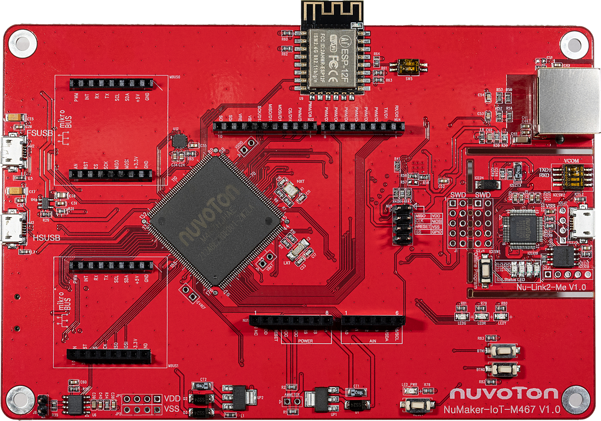
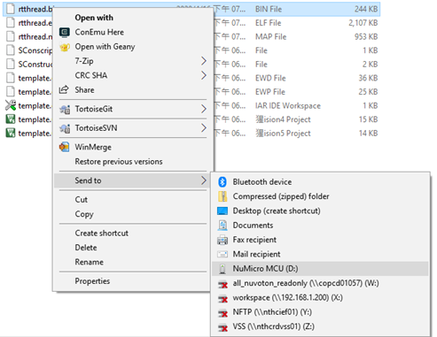
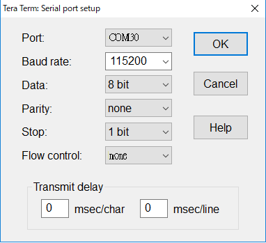

# NuMaker-IoT-M467

## 1. Introduction

NuMaker-IoT-M467 provides multiple networking, interfaces, and flexible extended data storage. Whether you need a sensor node or a light-weight gateway, the NuMaker-IoT-M467 is an ideal choice for IoT applications.

The M467HJ target board is based on NuMicro M467HJHAN. For the development flexibility, the M467HJ target board provides the extension connectors, the Arduino UNO, mikroBUS compatible headers and the capability of adopting multiple power supplies.

The NuMaker-IoT-M467 is an evaluation board for Nuvoton NuMicro M467HJ microcontrollers. The NuMaker-IoT-M467 consists of two parts: an M467HJ target board and an on-board Nu-Link2-Me debugger and programmer. The NuMaker-IoT-M467 is designed for project evaluation, prototype development and validation with power consumption monitoring function.

### 1.1 MCU specification

|  | Features |
| -- | -- |
| MCU | M467HJHAN |
| Operation frequency | 200 MHz |
| embedded Flash size | 1 MB, Dual Bank |
| SRAM size | 512 kB |
| Crypto engine |  TRNG, PRNG, AES, SHA/HMAC, RSA, and ECC crypto accelerator |
| RMII interface | Support 10/100 Mbps Ethernet |

### 1.2 Interface

| Interface |
| -- |
| An Arduino UNO compatible extension connector |
| Two mikroBUS compatible extension connector |
| RJ45 Ethernet port |
| USB 1.1/2.0 OTG ports |
| A microSD slot |
| A CAN FD communication port |
| Debug through SWD interface |

### 1.3 On-board devices

| Device | Description | Driver supporting status |
| -- | -- | -- |
| SPI flash | 32Mb, W25Q32 | Supported |
| Wi-Fi | ESP8266 | Supported |
| Ethernet PHY | RTL8201F | Supported |
| Thermal Sensor | NCT7717U | Supported |
| 6-axis MotionTracking Sensor | MPU6500 | Supported |

### 1.4 Board extended module

| Device | Description | Driver supporting status |
| -- | -- | -- |
| LCD Panel(NuTFT V1.2) | ILI9341(over spi2) | Supported |
| Touch screen | ADC S/W touch(over eadc0) | Supported |

## 2. Supported compiler

Support GCC, MDK5, IAR IDE/compilers. More information of these compiler version as following:

| IDE/Compiler  | Tested version            |
| ---------- | ---------------------------- |
| MDK5       | 5.26.2                       |
| IAR        | 8.2                          |
| GCC        | GCC 5.4.1 20160919 (release) |

Notice: Please install Nu-Link_Keil_Driver or Nu-Link_IAR_Driver for development.

## 3. Program firmware

### Step 1

At first, you need to configure switch on the NuMaker-IoT-M467 board. Set the No.1/2 switches to ‘ON’ position. After the configuration is done, connect the NuMaker-IoT-M467 board and your computer using the USB Micro cable. After that, window manager will show a ‘NuMicro MCU’ virtual disk. Finally, you will use this virtual disk to burn firmware.

### Step 2

A simple firmware burning method is that you can drag and drop the binary image file to NuMicro MCU virtual disk or copy the binary file to NuMicro MCU disk to burn firmware.

## 4. Test

You can use Tera Term terminate emulator (or other software) to type commands of RTT. All parameters of serial communication are shown in below image. Here, you can find out the corresponding port number of Nuvoton Virtual Com Port in window device manager.

## 5. Purchase

* [Nuvoton Direct][1]

## 6. Resources

* [Download Board User Manual][2]
* [Download MCU TRM][3]
* [Download MCU Datasheet][4]

  [1]: https://direct.nuvoton.com/en/numaker-iot-m467
  [2]: https://Coming_soon
  [3]: https://www.nuvoton.com/resource-download.jsp?tp_GUID=DA05-M460
  [4]: https://www.nuvoton.com/resource-download.jsp?tp_GUID=DA00-M460
