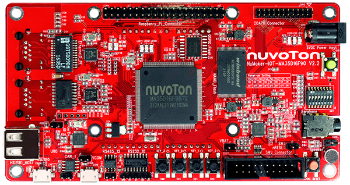
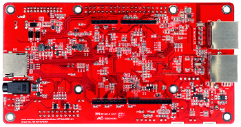

# **NuMaker-IOT-MA35D1**

## **Introduction**

The NuMicro® MA35D1 series is a heterogeneous multi-core microprocessor targeted to high-end edge IIoT gateway. It is based on dual 64-bit Arm® Cortex®-A35 cores with speed up to 1 GHz, and one 180 MHz Arm® Cortex®-M4 core. Based on the high-performance cores, the MA35D1 series facilities the tiny AI/ML for edge computing.

The NuMaker-IoT-MA35D1 evaluation board provides the Ethernet and connectivity features of Nuvoton NuMicro MA35D1 series microprocessors, based on MA35D16F987C (LQFP216 package, and stacking a 512 MB DDR). The NuMaker-IoT-MA35D1 includes rich peripherals such as one set of Gigabit Ethernet, one set of Megabit Ethernet, high-speed USB2.0 Host and device, one set of SD3.0 in MicroSD slot, one set of CAN FD, and RS-485 and RS232 serial communication ports. Furthermore, the NuMaker-IoT-MA35D1 provides discrete power supply to be the reference design. It also provides compatible headers with Raspberry Pi and Arduino UNO for minimizing effort in connecting popular sensors and modules to the system.

|<p align="center">NuMaker-IoT-MA35D1(Frontend view)</p>|<p align="center">NuMaker-IoT-MA35D1(Backend view)</p>|
|--|--|
|<p align="center"></p>|<p align="center"></p>|

## **NuMaker-IoT-MA35D1 Features**

<ul>
<li>Target Chip</li>
    <ul>
    <li>MA35D16F987C (LQFP216) MCP package with DDR3L (512 MB), which can run up to 800 MHz</li>
    </ul>
<li> Power </li>
    <ul>
    <li>5V/2A Power Jack, USB VCOM Port or HUSB0 Device</li>
    <li>Battery header for RTC power</li>
    </ul>
<li>Memory Devices (Power-on Setting DIP switches for system booting selection)</li>
  <ul>
    <li>Quad SPI Flash (QSPI0): Winbond SPI-NAND Flash W25N04KWZEIR (512 MB)</li>
    <li>NAND Flash: Winbond NAND Flash W29N08GVSIAA (1 GB)</li>
    <li>MicroSD memory card (SD1, supports SD3.0)</li>
  </ul>
<li>One Gigabit Ethernet: 1 x RGMII PHY (RTL8211FDI-CG) and RJ45 port connector</li>
<li>One 10/100 Megabit Ethernet: 1 x RMII PHY (RTL8201FI-VC) and RJ45 port connector</li>
<li>Two High Speed USB: HSUSB0 (Host/Device) and HSUSB1 (Host)</li>
<li>One Raspberry Pi 40-pin header connector</li>
<li>Arduino UNO Compatible Extension Connectors</li>
<li>One Camera Capture (CMOS sensor) header connector</li>
<li>One Audio codec (NAU88C22) with microphone input and speaker output</li>
<li>One set of RS232: Transceiver and header connector</li>
<li>One set of RS485: Transceiver and header connector</li>
<li>One set of CAN FD: Transceiver and header connector</li>
<li>Four Key buttons</li>
<li>Three user defined LEDs</li>
</ul>

## **Supported compiler**

Support GCC compiler. More information of these compiler version as following:

| Compiler | Tested version |
| -- | -- |
| GCC | Arm Embedded Toolchain 10.3-2021.10 (Env 1.3.5 embedded version)|

## **Build RT-Thread**

You can build rt-thread.bin for NuMaker-IoT-MA35D1 board. Steps as following. Notice, the building will include **ma35-rtp/rtthread.bin** file into **numaker-iot-ma35d1/rtthread.bin** for heterogeneous multi-core demonstration.

```bash
# cd rt-thread/bsp/nuvoton/numaker-iot-ma35d1
# menuconfig --generate
# scons -c
# pkgs --update
# scons -j 16

<Path-to-rt-thread>\bsp\nuvoton\numaker-iot-ma35d1\rtthread.bin
```

## **Program firmware using NuWriter**

To switch SW7 dip-switch on NuMaker-IoT-MA35D1 to do corresponding  actions as below.

**Power-on Setting**
L: OFF dip-switch
H: ON dip-switch

| Memory Storage | **Burn to** settings | **Boot from** settings |
|--|--|--|
| **DDR** | <ul><li>Switch 1(PG0) to ON.</li><li>Switch 3(PG2) to ON.</li><li>Switch 4(PG3) to ON.</li><li>Switch Others to OFF.</li></ul> |  |
| **Raw NAND**<br>(Select Ignore BCH and Page setting) | <ul><li>Switch 1(PG0) to ON.</li><li>Switch 3(PG2) to ON.</li><li>Switch 4(PG3) to ON.</li><li>Switch Others to OFF.</li></ul> | <ul><li>Switch 1(PG0) to ON.</li><li>Switch 4(PG3) to ON.</li><li>Switch Others to OFF.</li></ul> |
| **Serial NAND**<br>(Select 4-bit mode) | <ul><li>Switch 1(PG0) to ON.</li><li>Switch 3(PG2) to ON.</li><li>Switch 4(PG3) to ON.</li><li>Switch 7(PG6) to ON.</li><li>Switch Others to OFF.</li></ul> | <ul><li>Switch 1(PG0) to ON.</li><li>Switch 7(PG6) to ON.</li><li>Switch Others to OFF.</li></ul>

### **Download to DDR and Run**

You can run windows batch script to download rtthread.bin into memory, then run it. The path of batch script as below.

For 512MB DD3L downloading:
```bash
<path-to-rtthread>\bsp\nuvoton\numaker-iot-ma35d1\nuwriter_scripts\nuwriter_ddr3_512mb_download_and_run.bat
```

For 128MB DD2 downloading:
```bash
<path-to-rtthread>\bsp\nuvoton\numaker-iot-ma35d1\nuwriter_scripts\nuwriter_ddr2_128mb_download_and_run.bat
```

### **Burn to Serial NAND**

You can run windows batch script to download rtthread.bin into SPI-NAND flash, then run it. The path of batch script as below.

```bash
<path-to-rtthread>\bsp\nuvoton\numaker-iot-ma35d1\nuwriter_scripts\nuwriter_spinand_programming.bat
```

### **Burn to Raw NAND**

You can run windows batch script to download rtthread.bin into Raw NAND flash, then run it. The path of batch script as below.

```bash
<path-to-rtthread>\bsp\nuvoton\numaker-iot-ma35d1\nuwriter_scripts\nuwriter_nand_programming.bat
```

## **Test**

|Connector on board|Wiring|Usage|
|-|-|-|
|VCOM(CON9)|Use an USB line| rt-thread@CA35 Console |

You can use Tera Term terminate emulator (or other software) to type commands of RTT. All parameters of serial communication are shown in below image. Here, you can find out the corresponding port number of Nuvoton Virtual Com Port in window device manager.

<p align="center">

</p>
<br>

## **Purchase**

* [Nuvoton Direct](https://direct.nuvoton.com/en/numaker-iot-ma35d1-a1)

## **Resources**

* [Download Board Schematics](https://www.nuvoton.com/resource-download.jsp?tp_GUID=HL102022101207193137)
* [Download User Manual](https://www.nuvoton.com/resource-download.jsp?tp_GUID=UG132022101707255524)
* [Download Datasheet](https://www.nuvoton.com/resource-download.jsp?tp_GUID=DA00-MA35D16)
* [Download NuWriter](https://github.com/OpenNuvoton/MA35D1_NuWriter)
