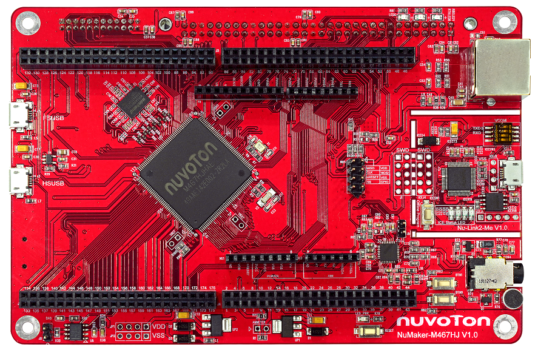
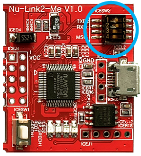
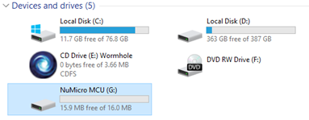

# NuMaker-M467HJ

## 1. Introduction

The NuMaker-M467HJ is an evaluation board for Nuvoton NuMicro M467HJ microcontrollers. The NuMaker-M467HJ consists of two parts: an M467HJ target board and an on-board Nu-Link2-Me debugger and programmer. The NuMaker-M467HJ is designed for project evaluation, prototype development and validation with power consumption monitoring function.

The M467HJ target board is based on NuMicro M467HJHAN. For the development flexibility, the M467HJ target board provides the extension connectors, the Arduino UNO compatible headers and the capability of adopting multiple power supplies. Furthermore, the Nuvoton-designed ammeter connector can measure the power consumption instantly, which is essential for the prototype evaluation.

In addition, there is an attached on-board debugger and programmer “Nu-Link2-Me”. The Nu-Link2-Me supports on-chip debugging, online and offline ICP programming via SWD interface. The Nu-Link2-Me supports virtual COM (VCOM) port for printing debug messages on PC. Besides, the programming status could be shown on the built-in LEDs. Lastly, the Nu-Link2-Me could be detached from the evaluation board and become a stand-alone mass production programmer.

### 1.1 MCU specification

|  | Features |
| -- | -- |
| MCU | M467HJHAN |
| Operation frequency | 192 MHz |
| embedded Flash size | 1 MB, Dual Bank |
| SRAM size | 512 kB |
| Crypto engine |  TRNG, PRNG, AES, SHA/HMAC, RSA, and ECC crypto accelerator |
| RMII interface | Support 10/100 Mbps Ethernet |

### 1.2 Interface

| Interface |
| -- |
| Arduino UNO compatible extension connector |
| RJ45 Ethernet port |
| USB 1.1/2.0 OTG ports |
| A microSD slot |
| A 3.5mm Audio connector |
| A CAN FD communication port |
| Debug through SWD interface |
| A LCD panel EBI interface |
| A Camera Capture interface |

### 1.3 On-board devices

| Device | Description | Driver supporting status |
| -- | -- | -- |
| SPI flash | 32Mb, W25Q32 | Supported |
| HyperRAM | 64Mb, W956A8MBYA5I | Supported |
| Ethernet PHY | RTL8201F | Supported |
| Audio Codec | NAU88L22 | Supported |
| Thermal Sensor | NCT7717U | Supported |

### 1.4 Board extended module

| Device | Description | Driver supporting status |
| -- | -- | -- |
| LCD Panel | SSD1963(over ebi0) | Supported |
| LCD Panel | LCD FSA506(over ebi0) | Supported |
| Touch screen controller | TPC ILI2130(over i2c1) | Supported |
| Touch screen controller | TPC ST1663I(over i2c1) | Supported |
| CCAP sensor module(over i2c0/PG11/PD12) | HM1055, ADV7280 | Supported |

## 2. Supported compiler

Support GCC, MDK5, IAR IDE/compilers. More information of these compiler version as following:

| IDE/Compiler  | Tested version            |
| ---------- | ---------------------------- |
| MDK5       | 5.26.2                       |
| IAR        | 8.2                          |
| GCC        | GCC 5.4.1 20160919 (release) |

Notice: Please install Nu-Link_Keil_Driver or Nu-Link_IAR_Driver for development.

## 3. Program firmware

### Step 1

At first, you need to configure switch on the NuMaker-M467HJ board. Set the No.1/2 switches to ‘ON’ position. After the configuration is done, connect the NuMaker-M467HJ board and your computer using the USB Micro cable. After that, window manager will show a ‘NuMicro MCU’ virtual disk. Finally, you will use this virtual disk to burn firmware.

### Step 2

A simple firmware burning method is that you can drag and drop the binary image file to NuMicro MCU virtual disk or copy the binary file to NuMicro MCU disk to burn firmware.

## 4. Test

You can use Tera Term terminate emulator (or other software) to type commands of RTT. All parameters of serial communication are shown in below image. Here, you can find out the corresponding port number of Nuvoton Virtual Com Port in window device manager.

## 5. Purchase

* [Nuvoton Direct][1]

## 6. Resources

* [Download Board User Manual][2]
* [Download MCU TRM][3]
* [Download MCU Datasheet][4]

  [1]: https://direct.nuvoton.com/en/numaker-m467hj
  [2]: https://www.nuvoton.com/resource-files/en-us--UM_NuMaker-M467HJ_EN_Rev1.00.pdf
  [3]: https://www.nuvoton.com/resource-download.jsp?tp_GUID=DA05-M460
  [4]: https://www.nuvoton.com/resource-download.jsp?tp_GUID=DA00-M460