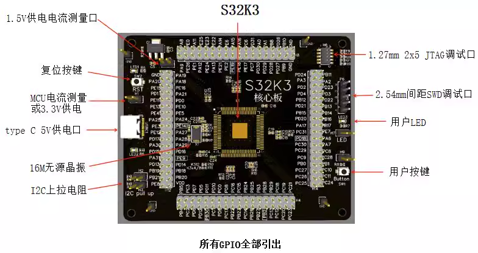

# S32K3 BSP 说明

## S32K344

### 1. 介绍：

基础工程：

- LPUART3(PD3-Rx, PD2-Tx) :
  - 每2s打印hello
  - finsh 

使用软件包：SW32K3_S32M27x_RTD_R21-11_5.0.0

生成工具：S32 Design Studio for S32 Platform 3.5


使用样板：



### 2. 例程使用准备：

- 目前仅使用gcc编译，为了增加同通用性，例程尽量使用了寄存器操作。在编译前请将`bsp\nxp\S32K3\S32K344-core\libraries\s32k344_SDK`和`board`中的文件补充完整：

  | 目录名               | 对应nxp目录                                | 备注                                    |
  | -------------------- | ------------------------------------------ | --------------------------------------- |
  | header               | BaseNXP_TS_T40D34M50I0R0\header            | 寄存器定义（在nxp软件包目录下查找）     |
  | include              |                                            | 在下一步中补充                          |
  | Startup_Code\inc     | Platform_TS_T40D34M50I0R0\startup\include  | 芯片启动头文件（在nxp软件包目录下查找） |
  | Startup_Code\src     | 生成模板工程\Project_Settings\Startup_Code | 芯片启动源文件                          |
  | linker_scripts | 生成模板工程\Project_Settings\Linker_Files | 芯片链接脚本（在board中）                 |

- 在补充完成后：

	1. 编译，寻找缺失头文件，在`BaseNXP_TS_T40D34M50I0R0\include`目录下查找并放入目录`include`
	
	2. 重复步骤 1 直到缺失的头文件无法在`BaseNXP_TS_T40D34M50I0R0\include`目录下找到，或者不在是头文件缺失错误
	
	3. 删除`include` 目录下的`Mcal.h`，将工程中所有的 `#include "Mcal.h"`替换为`#include "S32K344.h"`
	
	4. 在`ststem.h`头部添加：
	
	   ```c
	   #define OsIf_GetCoreID()   Sys_GetCoreID()
	   #define MCAL_DATA_SYNC_BARRIER()     __asm__(" DSB")
	   #define MCAL_INSTRUCTION_SYNC_BARRIER() __asm__(" ISB")
	   ```
	
	5. 删除`exceptions.c`中的`PendSV_Handler`和`SysTick_Handler`实现。
	
	6. 修改`startup_cm7.s`：`main`改为 RTT 入口`entry`，删除 `_start:`
