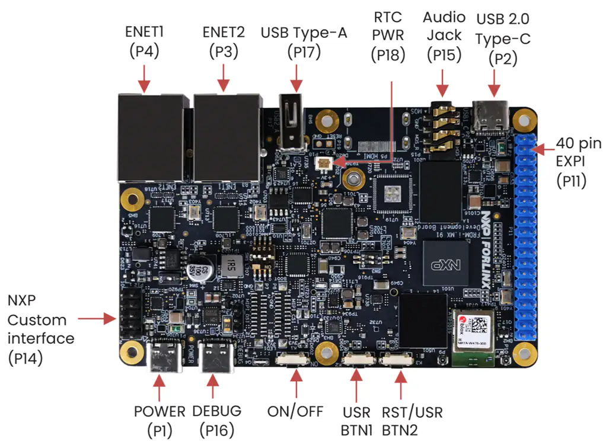
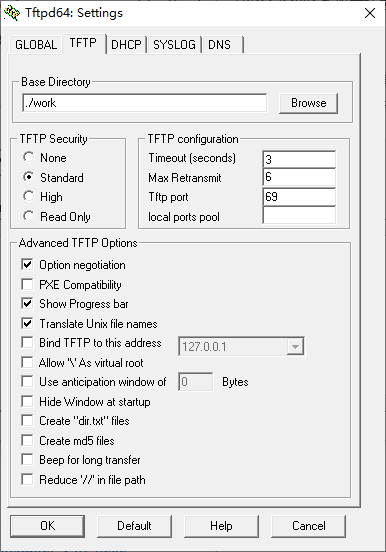
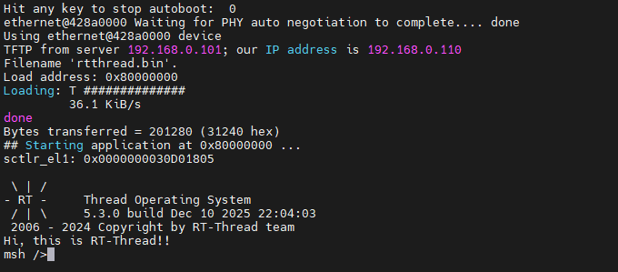

# FRDM-IMX91 板级支持包 使用说明

本目录包含NXP FRDM-IMX91 开发板的板级支持包代码。

## 1. 简介

### 1.1 i.MX91系列处理器简介

i.MX 91系列采用了可扩展的Arm® Cortex®-A55内核，其主频高达1.4GHz，支持新一代LPDDR4内存以延长平台寿命，支持双千兆以太网和双USB端口，以及面向医疗、工业和消费物联网市场细分领域的丰富外设。


### 1.2 FRDM-i.MX91开发板简介

FRDM i.MX 91开发板是一款低成本、紧凑型开发板，采用i.MX 91应用处理器。该板配备板载IW610模块，集成了恩智浦的三频解决方案，支持Wi-Fi 6、BLE 5.4和802.15.4，适用于开发现代工业和物联网应用。该开发板包含LPDDR4、用于快速启动的eMMC存储、PMIC以及扩展功能。

FRDM i.MX 91开发板是一款入门级紧凑型开发板，采用i.MX 91应用处理器。



开发板主要硬件资源：

| 资源               | 简介                                                         |
| ------------------ | ------------------------------------------------------------ |
| 处理器             | ◆ i.MX 91应用处理器<br />◆ Cortex-A55@1.4G<br />◆ EdgeLock®安全区域 |
| 存储器             | ◆ 1GB LPDDR4<br />◆ 8GB eMMC5.1<br />◆ MicroSD插槽<br />◆ EEPROM |
| 显示器和摄像头接口 | ◆ 并行RGB LCD接口(40引脚扩展接口)<br />◆ 并行摄像头接口(40引脚扩展接口) |
| 无线               | ◆ u-blox MAYA-W476-00B三频Wi-Fi 6/BLE 5.4/802.15.4模块       |
| 音频               | ◆ 3.5mm耳机插孔                                              |
| 连接               | ◆ USB2.0 Type-C连接器<br />◆ USB2.0 type A连接器 <br />◆ 两个GbE RJ45 <br />◆ CAN(HDR) <br />◆ 40引脚(2x20) <br />◆ 扩展接口 <br />◆ I²C HDR <br />◆ ADC HDR |
| 调试               | ◆ SWD连接器 <br />◆ 通过USB Type C的UART                     |


### 1.3 开发板和PC之间的连接

在FRDM i.MX 91开发板上调测RT-Thread的过程中，需要使用到的接口有：

1. POWER（P1），USB供电接口，用于向开发板供电；
2. DEBUG（P16），带有USB转串口芯片，用于U-Boot和RT-Thread日志输出、命令行交互；
3. ENET1（P4）或者ENET2（P3），以太网口，用于网络下载编译生成的RT-Thread固件；


## 2. 编译

### 2.1 下载AArch64工具链

从ARM开发者网站下载AArch64裸机工具链，

下载页面： [Arm GNU Toolchain Downloads – Arm Developer](https://developer.arm.com/downloads/-/arm-gnu-toolchain-downloads)

例如，64位Windows主机上下载： https://developer.arm.com/-/media/Files/downloads/gnu/14.3.rel1/binrel/arm-gnu-toolchain-14.3.rel1-mingw-w64-x86_64-aarch64-none-elf.zip

例如，下载后解压到本地路径：`D:\ARM\arm-gnu-toolchain-14.3.rel1-mingw-w64-x86_64-aarch64-none-elf`


### 2.2 下载RT-Thread Env工具

下载页面：[rt-thread.org/download.html#download-rt-thread-env-tool](https://www.rt-thread.org/download.html#download-rt-thread-env-tool)


### 2.3 下载RT-Thread源代码

在Env环境中，使用git命令下载RT-Thread源代码，例如：

```sh
git clone https://github.com/RT-Thread/rt-thread.git
```


### 2.4 编译FRDM-i.MX 91目标

在Env环境中，转到`i.MX 91`的BSP目录：

```sh
cd bsp/nxp/imx/imx91/
```

然后，设置工具链路径（Windows Env环境）：

```bat
set RTT_EXEC_PATH=D:\ARM\arm-gnu-toolchain-14.3.rel1-mingw-w64-x86_64-aarch64-none-elf\bin
```

或者（bash）：

```sh''
export RTT_EXEC_PATH=/path/to/aarch64-none-elf/bin
```

接着，执行`scons`命令开始编译：

```sh
scons -j 8
```


## 3.下载

开发板默认固件带有U-Boot启动加载器，开机3秒内通过串口发送换行符，可以进入U-Boot命令行界面。

### 3.1 准备U-Boot网络环境

将开发板和PC连接到同一个路由器。

例如，PC的IP地址为：`192.168.0.101`

在开发板的U-Boot命令行界面内，设置FRDM-i.MX为静态IP：

```sh
setenv ipaddr 192.168.0.120
```

或者从路由器动态获取IP：

```sh
dhcp
```

成功后，可以使用ping命令测试是否可以访问PC：

```sh
ping 192.168.0.101
```

成功则表示网络环境正常，可以执行后续步骤。


### 3.2 安装TFTP服务

Windows系统可以使用Tftpd，下载链接： [Releases · PJO2/tftpd64](https://github.com/PJO2/tftpd64/releases/)

例如，下载portable免安装版本： https://github.com/PJO2/tftpd64/releases/download/v4.74/tftpd64_portable_v4.74.zip

启动后，设置TFTP工作目录：




### 3.3 拷贝rtthread.bin到TFTP工作目录

在PC的Env环境中，将 `rtthread.bin` 拷贝到TFTP工作目录：
```bat
copy /Y rtthread.bin D:\PortableSoftwareApps\tftpd64_portable_v4.74\work\
```

或者：

```sh
cp rtthread.bin /path/to/tftp_work_dir/
```


### 3.4 下载rtthread.bin到开发板内存中

在开发板的U-Boot命令行界面中，首先执行如下命令，设置TFTP服务地址（PC的IP地址）：

```sh
setenv serverip 192.168.0.101
```

然后，继续在开发板的U-Boot命令行界面中，执行如下命令，将`rtthread.bin`下载到内存中：

```sh
tftp 0x80000000 rtthread.bin
```

下载的目标内存地址为：`0x80000000`；


## 4. 运行

### 4.1 通过U-Boot的tftp命令下载、运行rtthread.bin

完成前述步骤后，在开发板的 U-Boot 命令行界面中，继续执行以下命令，以跳转至 `0x80000000` 地址并执行代码：

```sh
dcache flush
icache flush
go 0x80000000
```

每次开发板上电启动后，均需执行上述 U-Boot 命令，RT-Thread 方可正常运行。这在需要反复调试时显得不够便捷。

为此，可将以上命令写入 U-Boot 的环境变量 `bootcmd` 中，从而实现开机自动执行，便于后续调试。具体操作命令如下：

```sh
setenv ipaddr 192.168.0.120
setenv serverip 192.168.0.101
setenv bootcmd "tftp 0x80000000 rtthread.bin; dcache flush; icache flush; go 0x80000000"
saveenv
reset
```

其中，`saveenv` 命令用于保存环境变量的值，确保重启后依然生效；最后的 `reset` 为重启命令。

执行效果如下图所示：



### 4.2 通过U-Boot的fatload命令下载、运行rtthread.bin

另外，也可以先将PC上编译生产的`rtthread.bin`文件拷贝到MicroSD卡中，再将MicroSD弹出后插到开发板上，然后通过U-Boot的`fatload`命令将MicroSD卡中的文件加载内存，再执行跳转：

```sh
fatload mmc 1:1 0x80000000 rtthread.bin; dcache  flush ; icache  flush; go 0x80000000
```

相应的也可以保存到`bootcmd`变量中：

```sh
setenv bootcmd "fatload mmc 1:1 0x80000000 rtthread.bin; dcache  flush ; icache  flush; go 0x80000000"
```


## 5. 参考链接

1. 维护人: [xusiwei](https://github.com/xusiwei)
2. AArch64工具链下载页面： [Arm GNU Toolchain Downloads – Arm Developer](https://developer.arm.com/downloads/-/arm-gnu-toolchain-downloads)
3. Tftp64下载页面：https://github.com/PJO2/tftpd64/releases
4. FRDM-i.MX91开发板介绍：[FRDM i.MX 91 Development Board | NXP 半导体](https://www.nxp.com.cn/design/design-center/development-boards-and-designs/FRDM-IMX91)
5. i.MX91处理器介绍： [i.MX 91 Applications Processors Family | NXP 半导体](https://www.nxp.com.cn/products/i.MX91)

