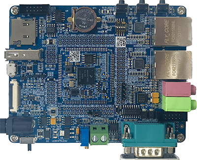

# OK1061-S 开发板 BSP 说明

## 简介

本文档为 RT-Thread 开发团队为飞凌 OK1061-S 开发板提供的 BSP (板级支持包) 说明。

主要内容如下：

- 开发板资源介绍
- BSP 快速上手
- 进阶使用方法

通过阅读快速上手章节开发者可以快速地上手该 BSP，将 RT-Thread 运行在开发板上。在进阶使用指南章节，将会介绍更多高级功能，帮助开发者利用 RT-Thread 驱动更多板载资源。

## 开发板介绍


OK1061-S 开发板基于 NXP 公司 i.MX RT1061 跨界处理器设计，搭载 ARM Cortex -M7 内核，集微控制器的低功耗、易用性与应用处理器的高性能、高扩展性于一体。底板+核心板分离结构，采用邮票孔封装设计，核心板体积小巧仅30×30×3mm，引脚数量100PIN，间距1.0mm，方便嵌入各种尺寸的设备中。


运行频率 528MHz(商业级为600MHz)，1MB片上SRAM多达 512KB 可配置为紧耦合存储器 (TCM)，QSPI-Nor Flash 支持容量4MB。底板+核心板分离结构，采用邮票孔封装设计，核心板体积小巧仅30×30×3mm，引脚数量100PIN，间距1.0mm，方便嵌入各种尺寸的设备中。为了更大限度发挥CPU特性，核心板引出CPU大部分功能，同时配备了一系列特别适合实时应用的功能，例如高速GPIO 、CAN-FD，以及同步并行 NAND/NOR/PSRAM 控制器。工业级设计核心板，运行温宽 -40℃~+85℃；为了更加方便客户评估使用，OK1061-S开发板引出UART、Ethernet*2、USB、CAN、CAN FD、HS_GPIO、PWM、ADC等丰富外设功能；支持裸机，FreeRTOS等实时系统。


开发板外观如下图所示：

<figure>
  
</figure>


该开发板常用**板载资源**如下：

- MCU：MIMXRT1061CVL5B，主频 600MHz，1024KB RAM(512 KB 可配置为 TCM)
- 外部 FLASH：型号 25Q32JVSIQ，4MB
- 常用接口：RS232、SD 卡接口、以太网接口、USB Host、USB OTG等
- 调试接口：SWD

开发板更多详细信息请参考飞凌嵌入式 [OK1061-S 开发板](https://www.forlinx.com/product/rs1061-45.html)。

## 外设支持

本 BSP 目前对外设的支持情况如下：

| **板载外设** | **支持情况** | **备注**             |
| :---------- | :----: | :----------------------- |
| RS232       |  支持    |  UART1                  |
| LED         |  支持    |                          |
| Ethernet    | 暂不支持 |                           |
| SD 卡       | 暂不支持 |                            |
| EEPROM      | 暂不支持 |                            |
| **片上外设** | **支持情况** | **备注**                |
| GPIO        |  支持    |                           |
| UART        |  支持    |   UART1、UART2            |
| SPI         | 暂不支持  |  即将支持                  |
| IIC         | 暂不支持  |  即将支持                  |
| ADC         | 暂不支持  |  即将支持                  |
| RTC         | 暂不支持  |  即将支持                  |
| PWM         | 暂不支持  |  即将支持                  |
| CAN         | 暂不支持  |  即将支持                  |


## Keil IDE 使用说明

使用说明分为如下两个章节：

- 快速上手

    本章节是为刚接触 RT-Thread 的新手准备的使用说明，遵循简单的步骤即可将 RT-Thread 操作系统运行在该开发板上，看到实验效果 。

- 进阶使用

    本章节是为需要在 RT-Thread 操作系统上使用更多开发板资源的开发者准备的。通过使用 ENV 工具对 BSP 进行配置，可以开启更多板载资源，实现更多高级功能。


### 快速上手

本 BSP 为开发者提供 MDK5 和 IAR 工程，并且支持 GCC 开发环境。下面以 MDK5 开发环境为例，介绍如何将系统运行起来。

#### 硬件连接

使用数据线连接开发板到 PC，打开电源开关。

#### 编译下载

首先需要将需要将 RT1061 的 FLASH 下载算法（board目录下的 MIMXRT_QSPIFLASH.FLM 文件）拷贝到 `MDK 安装路径/ARM/Flash` 文件夹中。双击 `project.uvprojx` 文件，打开 MDK5 工程，在调试选项里 `Flash Download` 一栏中按照下图所示选择下载算法并保存设置：

<figure>
  
</figure>

编译工程，工程默认配置使用 CMSIS-DAP 下载程序，在通过 CMSIS-DAP 连接开发板的基础上，点击下载按钮即可下载程序到开发板。

#### 运行结果

下载程序成功之后，系统会自动运行，观察开发板上 LED 的运行效果，蓝色 LED 会周期性闪烁。

连接开发板对应串口到 PC , 在终端工具里打开相应的串口（115200-8-1-N），复位设备后，可以看到 RT-Thread 的输出信息:

```bash
 \ | /
- RT -     Thread Operating System
 / | \     5.0.1 build May  9 2023 15:35:22
 2006 - 2022 Copyright by RT-Thread team
msh >
```
### 进阶使用

此 BSP 默认只开启了 GPIO 和 串口 1 的功能，如果需使用更多高级外设功能，需要利用 ENV 工具对 BSP 进行配置，步骤如下：

1. 在 bsp 下打开 env 工具。

2. 输入 `menuconfig` 命令配置工程，配置好之后保存退出。

3. 输入 `pkgs --update` 命令更新软件包。

4. 输入 `scons --target=mdk5/iar` 命令重新生成工程。

本章节更多详细的介绍请参考 [IMXRT系列BSP外设驱动使用教程](../docs/IMXRT系列BSP外设驱动使用教程.md)。


## 联系人信息

维护人:

- [xym-ee](https://github.com/xym-ee)