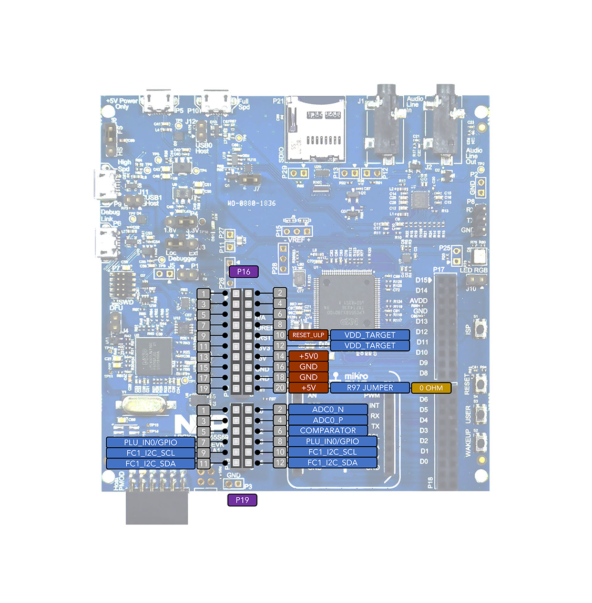
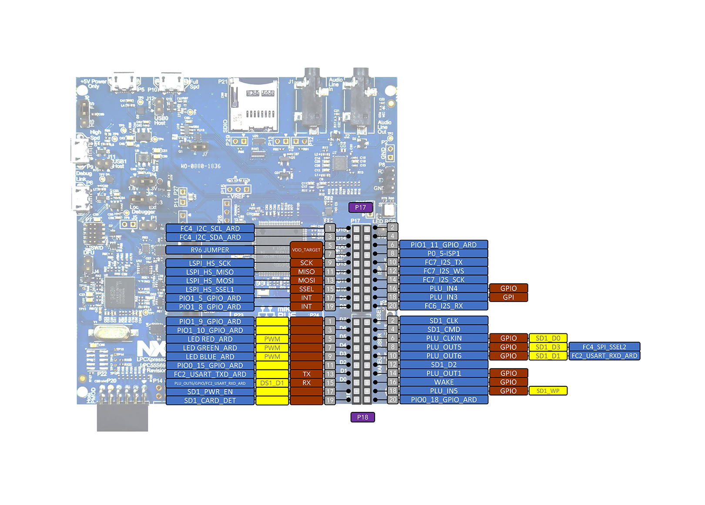

# LPC55s69-nxp-evk开发板的Arduino生态兼容说明

## 1 RTduino - RT-Thread的Arduino生态兼容层

LPC55s69-nxp-evk开发板已经完整适配了[RTduino软件包](https://github.com/RTduino/RTduino)，即RT-Thread的Arduino生态兼容层。用户可以按照Arduino的编程习惯来操作该BSP，并且可以使用大量Arduino社区丰富的库，是对RT-Thread生态的极大增强。更多信息，请参见[RTduino软件包说明文档](https://github.com/RTduino/RTduino)。

### 1.1 如何开启针对本BSP的Arduino生态兼容层

Env 工具下敲入 menuconfig 命令，或者 RT-Thread Studio IDE 下选择 RT-Thread Settings：

```Kconfig
Hardware Drivers Config --->
    Onboard Peripheral Drivers --->
        [*] Compatible with Arduino Ecosystem (RTduino)
```

## 2 Arduino引脚排布

更多引脚布局相关信息参见 [pins_arduino.c](pins_arduino.c) 和 [pins_arduino.h](pins_arduino.h)。





| Arduino引脚编号  | LPC55引脚编号 | 5V容忍 | 备注  |
| ------------------- | --------- | ---- | ------------------------------------------------------------------------- |
| 0 (D0) | P(1,24) | 是/否 | Serial2-RX，默认被RT-Thread的UART设备框架uart2接管 |
| 1 (D1) | P(0,27) | 是/否 | Serial2-TX，默认被RT-Thread的UART设备框架uart2接管 |
| 2 (D2) | P(0,15) | 是/否 |  |
| 3 (D3) | P(1,6) | 是/否 |  |
| 4 (D4) | P(1,7) | 是/否 | PWM2-CH2，默认被RT-Thread的PWM设备框架pwm2接管 |
| 5 (D5) | P(1,4) | 是/否 | PWM2-CH1，默认被RT-Thread的PWM设备框架pwm2接管 |
| 6 (D6) | P(1,10) | 是/否 |  |
| 7 (D7) | P(1,9) | 是/否 | PWM1-CH0，默认被RT-Thread的PWM设备框架pwm1接管 |
| 8 (D8) | P(1,8) | 是/否 |  |
| 9 (D9) | P(1,5) | 是/否 |  |
| 10 (D10) | P(1,1) | 是/否 |  |
| 11 (D11) | P(0,26) | 是/否 |  |
| 12 (D12) | P(1,3) | 是/否 | PWM0-CH3，默认被RT-Thread的PWM设备框架pwm0接管 |
| 13 (D13) | P(1,2) | 是/否 |  |
| 14 (D14) | P(1,21) | 是/否 | I2C4-SDA，默认被RT-Thread的I2C设备框架i2c4接管 |
| 15 (D15) | P(1,20) | 是/否 | I2C4-SCL，默认被RT-Thread的I2C设备框架i2c4接管 |
| 16 (A0) | P(0,16) | 是/否 | ADC0-CH8，默认被RT-Thread的ADC设备框架adc0接管 |
| 17 (A1) | P(0,23) | 是/否 | ADC0-CH0，默认被RT-Thread的ADC设备框架adc0接管 |
| 18 (A2) | -- | 是/否 |  |
| 19 (A3) | P(1,31) | 是/否 |  |
| 20 (A4) | P(0,13) | 是/否 | I2C1-SDA，默认被RT-Thread的I2C设备框架i2c1接管 |
| 21 (A5) | P(0,14) | 是/否 | I2C1-SCL，默认被RT-Thread的I2C设备框架i2c1接管 |
| 22 (A6) | -- |  | 芯片内部参考电压 ADC，默认被RT-Thread的ADC设备框架adc1接管 |
| 23 (A7) | -- |  | 芯片内部温度 ADC，默认被RT-Thread的ADC设备框架adc1接管 |

> 注意：
>
> 1. xxxxxxxxx
> 2. xxxxxxxxx
