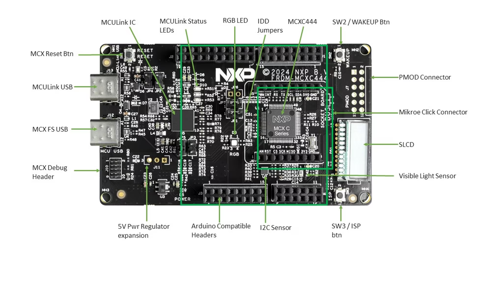
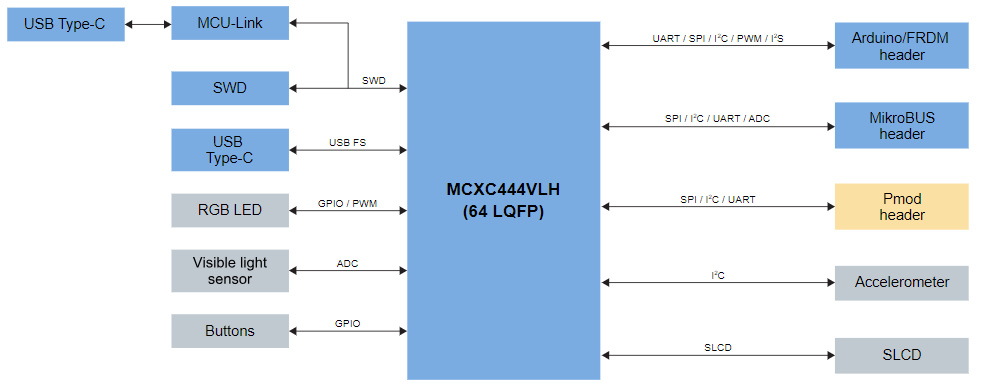
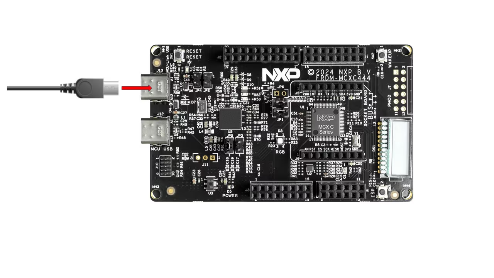
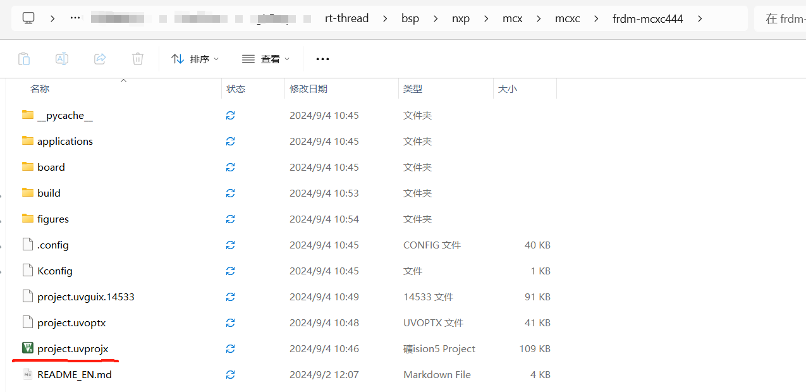
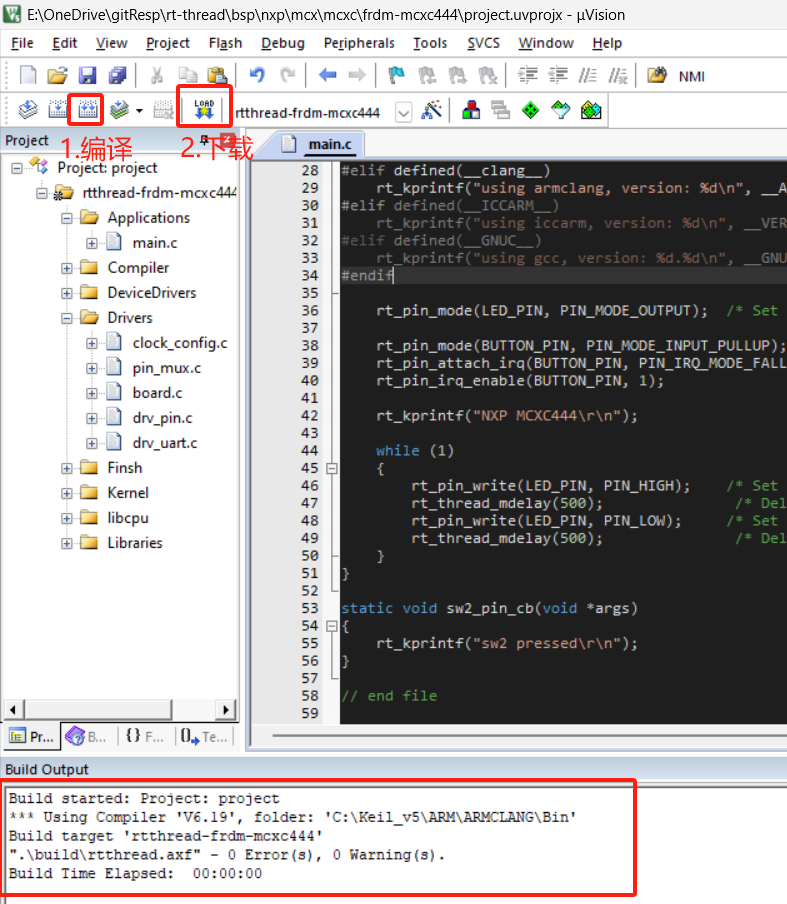
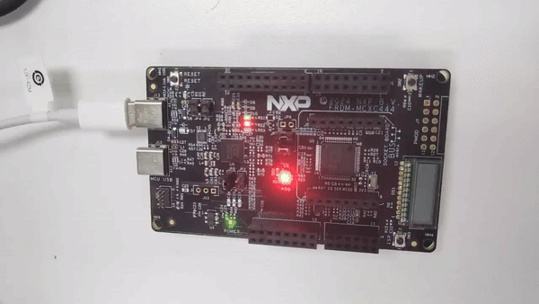

# NXP FRDM-MCXC444 Introduction

## Overview
The FRDM-MCXC444 is NXP's official low-cost evaluation board based on the MCX C444 MCU. It is designed for rapid prototyping and features a compact and scalable form factor. The board provides industry-standard headers for easy access to the MCU's I/O pins and supports the MCUXpresso development environment. 

Key features of the FRDM-MCXC444 include:

- SLCD functionality
- Arduino-compatible expansion headers
- MCUXpresso IDE support

The appearance of the board is shown in the figure below:



The common on-board resources for this board are listed below:



For more details on the development board, please refer to [NXP official website](https://www.nxp.com/products/processors-and-microcontrollers/arm-microcontrollers/general-purpose-mcus/mcx-arm-cortex-m/mcx-c-series-microcontrollers:MCX-C-SERIES)。

## Preparation

To run sample programs on the FRDM-MCXC444 board, you need to make the following preparations:

1. Development Environment

   Keil V5 with MCXC444 package installed.

2. Source Code Acquisition

   Visit https://github.com/RT-Thread/rt-thread and download the latest stable release zip package from the Assets section.

3. Hardware Connection

   Use a USB cable to connect the USB port of the development board to your PC.

> NXP's official hands-on tutorial for the FRDM-MCXC444 can be found at [here](https://www.nxp.com/design/design-center/development-boards-and-designs/general-purpose-mcus/frdm-development-board-for-mcx-c444-mcus:FRDM-MCXC444)




## Run the First Sample Program

### Compile and Download

1. Navigate to the `rt-thread\bsp\nxp\mcxc\frdm-mcxc444` folder.
2. Open the project file in Keil.
3. Compile the project.
4. Click the download button to flash the firmware to the development board.



Execute the compilation. After it, click the download button to download the firmware to the development board. Then, the program will start running automatically, observe the program running status.

> Tip: The default configuration of the project uses CMSIS-DAP to download the program. And then click the Download button to download the program to the development board.



### Run

If it does not run automatically, press the reset button to restart the board and observe the actual effect of the LEDs on the board. After normal operation, the LEDs will blink periodically, as shown in the following figure:



After downloading the program, it should start running automatically. If not, press the reset button on the board.

Connect the board's serial port to your PC and open a serial terminal with the following settings:

- Baud rate: 115200
- Data bits: 8
- Stop bits: 1
- Parity: None

Reset the device, and you should see the RT-Thread startup information in the serial terminal:

```bash
 \ | /
- RT -     Thread Operating System
 / | \     5.2.0 build Sep  4 2024 10:46:13
 2006 - 2024 Copyright by RT-Thread team
using armclang, version: 6190004
NXP MCXC444
msh >
```

## Keep Learning

Completed RT-Thread Quickstart! Click here for [Kernel Learning](../../kernel/kernel-video.md) .

## Additional Information

[NXP FRDM-MCXC444](https://www.nxp.com/design/design-center/development-boards-and-designs/general-purpose-mcus/frdm-development-board-for-mcx-c444-mcus:FRDM-MCXC444)
