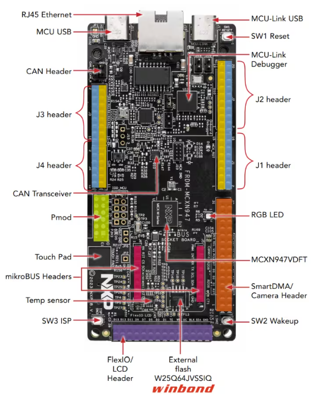
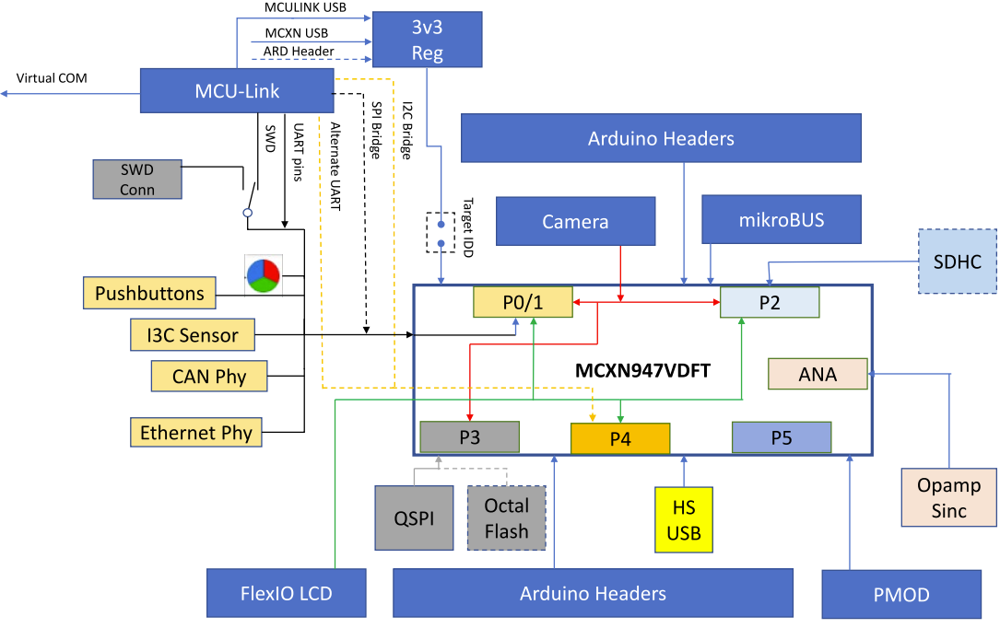
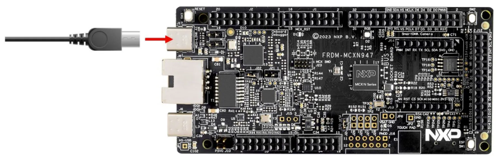
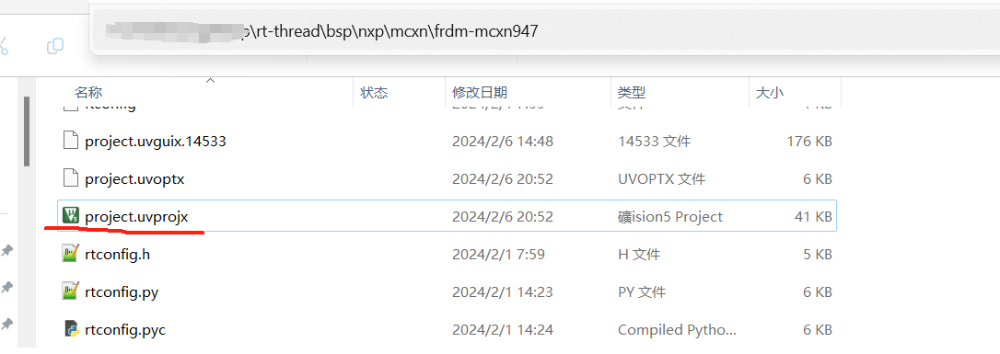
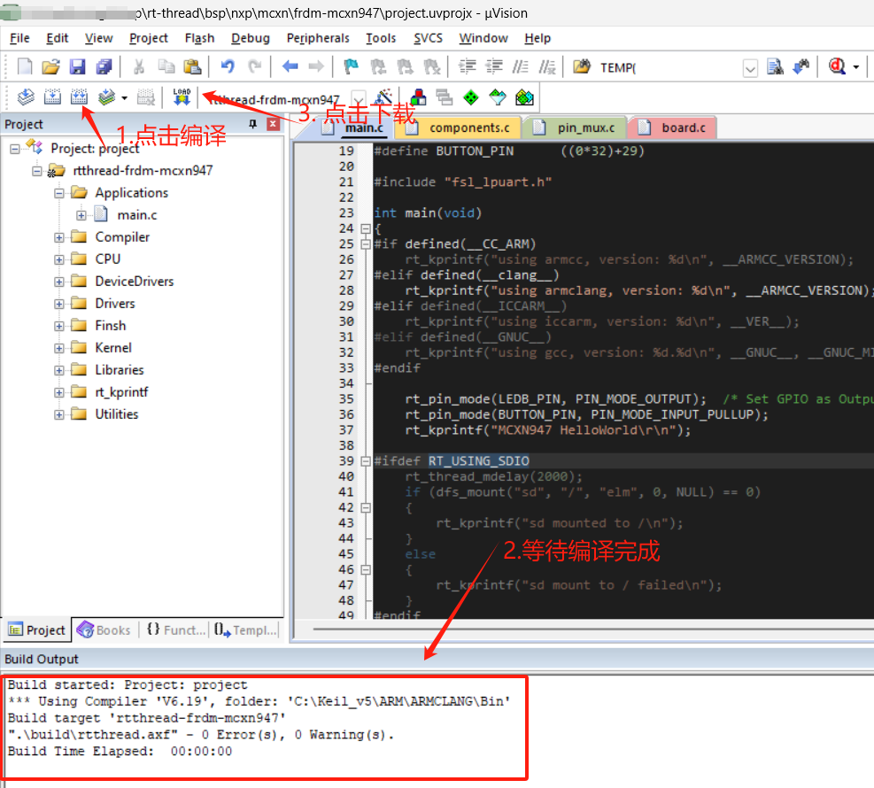
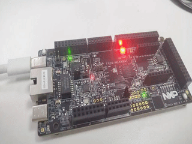

# NXP FRDM-MCXN947 Introduction

## Overview
The FRDM-MCXN947 is NXP's official low-cost evaluation board based on the MCXN947 device, which integrates dual Arm Cortex-M33 microcontrollers and a Neural Processing Unit (NPU). The board also features MCU-Link debugger circuits such as the P3T1755DP I3C temperature sensor, TJA1057GTK/3Z CAN PHY, Ethernet PHY, SDHC circuitry (with DNP slot), RGB LEDs, touchpad, Hi-Speed USB circuitry, and buttons. The board provides Arduino expansion, PMOD expansion, MicroBus expansion. Also, it supports camera module and NXP low-cost LCD module PAR-LCD-S035. The on-board MCU-Link debugger is based on LPC55S69 MCU.

The appearance of the board is shown in the figure below:



The common on-board resources for this board are listed below:



For more details on the development board, please refer to [NXP official website](https://www.nxp.com/design/design-center/development-boards/general-purpose-mcus/frdm-development-board-for-mcx-n94-n54-mcus:FRDM-MCXN947)。

## Preparation

Currently, the FRDM-MCXN947 board-level support package provides MDK5 and supports GCC development environment, so let's take the MDK5 development environment as an example to introduce how to run the sample program. Before running the sample program, you need to do the following preparations:

> NXP's official hands-on tutorial for the FRDM-MCXN947 can be found at [here](https://www.nxp.com/document/guide/getting-started-with-frdm-mcxn947:GS-FRDM-MCXNXX)

 1. MDK Fevelopment Environment

     MDK-ARM 5.38 (or above) is required. The installation method can be found in [Keil MDK Installation](../keil/keil.md).

 2. Source Code Acquisition

     <https://github.com/RT-Thread/rt-thread/releases>, download the zip package in Assets to get the latest stable code.

     [Source Code Directory Description](... /src_code_introduction/rtthread_dir.md)

 3. Use the USB cable to connect the USB to serial port of the development board to the PC.


## Run the First Sample Program

### Compile the Download

Go to the `rt-thread\bsp\nxp\mcxn\frdm-mcxn947` folder and double click on the project.uvprojx file to open the MDK5 project.



Execute the compilation. After it, click the download button to download the firmware to the development board. Then, the program will start running automatically, observe the program running status.

> Tip: The default configuration of the project uses CMSIS-DAP to download the program. And then click the Download button to download the program to the development board.



### Run

If it does not run automatically, press the reset button to restart the board and observe the actual effect of the LEDs on the board. After normal operation, the LEDs will blink periodically, as shown in the following figure:



Connect the corresponding serial port of the development board to the PC, open the corresponding serial port (115200-8-1-N) in the serial port tool, and reset the device. Then the output information of RT-Thread will be shown:


```bash
 \ | /
- RT -     Thread Operating System
 / | \     5.1.0 build Feb 19 2024 16:40:05
 2006 - 2024 Copyright by RT-Thread team
using armclang, version: 6190004
MCXN947 HelloWorld
msh >
```

## Keep Learning

Completed RT-Thread Quickstart! Click here for [Kernel Learning](../../kernel/kernel-video.md) .

## Additional Information

[NXP FRDM-MCXN947 Development Practice Guide](/rt-thread-version/rt-thread-standard/tutorial/make-bsp/NXP-MCX/NXPFRDM-MCX974PracticeGuide.md)
