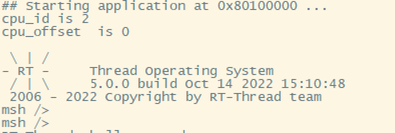

# PHYTIUM BSP 说明

## 简介

本文档为基于 RT-THREAD 的 Phytium 系列 CPU 相关 BSP 说明。

本文的主要内容如下:

- BSP 简介
- 移植支持情况
- 如何在 Ubuntu/Windows 环境下使用此 BSP
- 如何进行编译与实验
- 维护人信息
- 注意事项


## BSP简介

- 飞腾芯片产品具有谱系全、性能高、生态完善、自主化程度高等特点，目前主要包括高性能服务器CPU（飞腾腾云S系列）、高效能桌面CPU（飞腾腾锐D系列）、高端嵌入式CPU（飞腾腾珑E系列）和飞腾套片四大系列，为从端到云的各型设备提供核心算力支撑。

- 本BSP目前支持飞腾派、飞腾腾锐D系列、飞腾腾珑E系列 相关CPU, 基于 Phytium-Standalone-SDK 进行开发。开发者能够使用

- 本BSP 支持Phytium系列CPU 工作在 aarch32/aarch64 两种执行状态 ，开发者能够根据自己的应用场景灵活选择CPU 工作状态。


## 移植支持情况

| **片上外设**      | **支持情况** | **备注**                              |
| :----------------- | :----------: | :------------------------------------- |
| UART              |     支持     | UART1 打印输出 |
| GPIO              |     支持     | GPIO 引脚电平输入输出，中断 |
| XMAC              |     支持     | XMAC 网卡初始化和运行 |
| SDMMC             |     支持     | SD0/SD1 读写 SD 卡或 eMMC 颗粒 |

| **芯片**      | **支持情况** | **备注**                              |
| :----------------- | :----------: | :------------------------------------- |
| Phytium PI          |     支持     | 支持SMP |
| E2000D              |     支持     | 支持SMP |
| E2000Q              |     支持     | 支持SMP |
| E2000S              |     支持     | |


##  如何在Ubuntu/Windows 环境下使用此BSP


### Ubuntu 环境

1. 根据 [Linux x86_64 SDK安装方法](https://gitee.com/phytium_embedded/phytium-standalone-sdk/blob/release/doc/reference/usr/install_linux_x86_64.md) 中1.1  - 1.2 节中介绍，先安装 SDK 编译环境
2. 参考[RT-Thread/env](https://github.com/RT-Thread/env) 中Tutorial 在ubuntu 环境下安装 env 环境
3. 在编译环境下执行 ```source ~/.env/env.sh```
4. 以aarch32 执行状态为例，```cd bsp/phytium/aarch32```


### Windows 环境

1. 根据[Windows 10 SDK安装方法](https://gitee.com/phytium_embedded/phytium-standalone-sdk/blob/release/doc/reference/usr/install_windows.md)，安装 SDK 编译环境，编辑新建 Windows 环境变量 AARCH32_CROSS_PATH 和 AARCH64_CROSS_PATH
2. 参考[RT-Thread/env](https://github.com/RT-Thread/env) 中Tutorial 在 Windows 环境下解压 env 压缩包
3. 以aarch32 执行状态为例，```cd bsp/phytium/aarch32```
4. 使用 export_project.py 导出 BSP 工程到其他目录进行开发
5. 使用 RT-Studio 导入 BSP 工程进行开发


## 如何进行编译与实验

### 编译说明

- [AARCH32](./aarch32/README.md)
- [AARCH64](./aarch64/README.md)

###  烧写及执行

#### Ubuntu 环境配置 tftp 服务

- 在开发环境`host`侧安装`tftp`服务

```
sudo apt-get install tftp-hpa tftpd-hpa
sudo apt-get install xinetd
```

- 新建 tftboot 目录, 以`/mnt/d/tftboot`为例, 此目录应与项目编译脚本makefile中的USR_BOOT_DIR一致, 并确保 tftboot 目录有执行权限`chmod 777 /**/tftboot`

- 配置主机 tftpboot 服务, 新建并配置文件`/etc/xinetd.d/tftp`

```
# /etc/xinetd.d/tftp

server tftp
{
  socket_type = dgram
  protocol = udp
  wait = yes
  user = root
  server =  /usr/sbin/in.tftpd
  server_args = -s /mnt/d/tftboot
  disable = no
  per_source = 11
  cps = 100 2
  flags = IPv4
}
```

- 启动主机`tftp`服务，生成默认配置

```
$ sudo service tftpd-hpa start
```

- 修改主机`tftp`配置，指向`tftboot`目录
  修改/etc/default/tftpd-hpa

```
$ sudo nano /etc/default/tftpd-hpa
# /etc/default/tftpd-hpa

TFTP_USERNAME="tftp"
TFTP_DIRECTORY="/mnt/d/tftboot"
TFTP_ADDRESS=":69"
TFTP_OPTIONS="-l -c -s"
```

- 重启主机`tftp`服务

```
$ sudo service tftpd-hpa restart
```

- 测试主机`tftp`服务的可用性
  > 登录`tftp`服务，获取`tftboot`目录下的一个文件

```
$ tftp 192.168.4.50
tftp> get test1234
tftp> q
```

#### Windows环境下配置 tftp 服务

- 下载Tftpd64 工具 ，并安装Tftpd64 工具


- 之后每次使用前，进入Windows服务，手动将一下服务打开


#### 格式化 SD 卡

- RT-Smart 依赖 SD 卡挂载为 / 目录，要保证插入的卡格式为 FAT32，否则会提示初始化失败的信息

- Phytium PI 固件可能在 SD 卡中，这种情况下需要将 SD 卡分成两个区，第一个分区格式为 RAW 放置固件，第二个分区格式为 FAT32 作为 RT-Thread/RT-Smart 的根目录使用，在编译镜像时，需要调整 CONFIG_SDCARD_OFFSET 配置，避免读写操作影响固件

#### 利用 uboot 上tftp 服务加载镜像

- 进入`u-boot`界面，输入如下指令，配置开发板ip，`host`侧ip和网关地址
  ```
  setenv ipaddr 192.168.4.20  
  setenv serverip 192.168.4.50 
  setenv gatewayip 192.168.4.1 
  ```
- 将编译好的elf 或者bin 文件拷贝至Tftpd64所设置文件夹下
- 随后烧录的文件到开发板，输入以下指令
  
  ```
  tftpboot 0x80080000 rtthread.bin
  go 0x80080000
  ```

### 运行结果




## 维护人信息

- huanghe:  huanghe@phytium.com.cn
- zhugengyu:  zhugengyu@phytium.com.cn