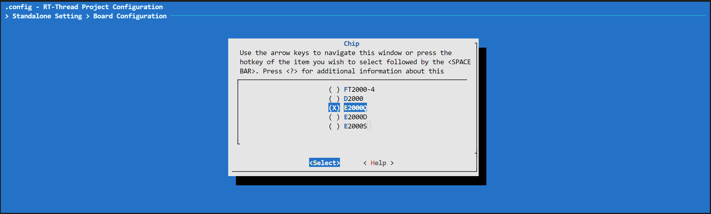

# AARCH32 工作模式使用

- 当开发者需要基于 Phytium 系列芯片进行开发时，可以从以下几个步骤出发配置芯片

## 1. 准备编译环境

```shell
source ./smart_env.sh
```

开发者在bsp根目录下执行smart_env.sh 自动拉取编译编译链，并且输出编译链的环境变量


## 2. 如何选择芯片

- Linux 环境下

```shell
    scons --menuconfig
```

开发者通过以下选择进行配置

```
Standalone Setting > Board Configuration > Chip 
```




## 3. 如何选择驱动

```shell
    scons --menuconfig
```

开发者通过以下选项进行驱动的使能

```
Hardware Drivers > On-chip Peripheral Drivers
```


## 4. 开启SDK中内部调试信息

```shell
    scons --menuconfig
```

开发者通过以下选项进行调试信息等级的设置


## 4. 如何切换至RT-Thread Smart 工作模式

```shell

 scons --menuconfig

```


开发者通过以上配置开启RT-Thread Smart 功能

## 5. 编译程序

```shell
    scons -c
    scons
```

- 完成编译之后目录下将会生成以下几个文件

```
rtthread_a32.bin
rtthread_a32.elf
rtthread_a32.map
```

## 6. 打包导出工程源代码

- 指定工程名和路径，打包RT-Thread内核和Phytium BSP代码，可以导出一个工程工程

```
python ./export_project.py -n=phytium-a32 -o=D:/proj/rt-thread-e2000/phytium-a32
```


- 进入打包工程的目录，修改工程根目录 Kconfig 中的路径 BSP_DIR 和 STANDALONE_DIR

> env 环境中的 menuconfig 不会调用 SConstruct 修改路径环境变量，因此需要手动修改路径

```
config BSP_DIR
    string
    option env="BSP_ROOT"
    default "."

config STANDALONE_DIR
    string
    option env="STANDALONE_DIR"
    default "libraries/standalone"
```

- 输入 menuconfig 和 scons 完成编译

## 7. 将工程导入 RT-Studio

- 在 RT-Studio 使用功能 `RT-Thread Bsp 到工作空间`，导入 5. 中导出的 BSP 工程
- 设置 BSP 工程的交叉编译链后进行后续开发


python get_toolchain.py arm
./smart-env.bat

scons && arm-linux-musleabi-objdump -S rtthread_a32.elf > rtthread_a32.asm && cp rtthread_a32.bin d:/tftboot

scons && arm-linux-musleabi-objdump -S rtthread_a32.elf > rtthread_a32.asm && sudo cp rtthread_a32.bin /mnt/d/tftboot -f

scons && arm-none-eabi-objdump -S rtthread_a32.elf > rtthread_a32.asm && cp rtthread_a32.bin d:/tftboot
