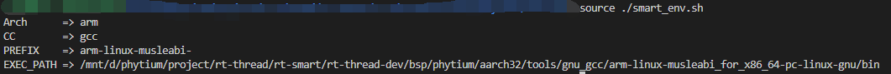
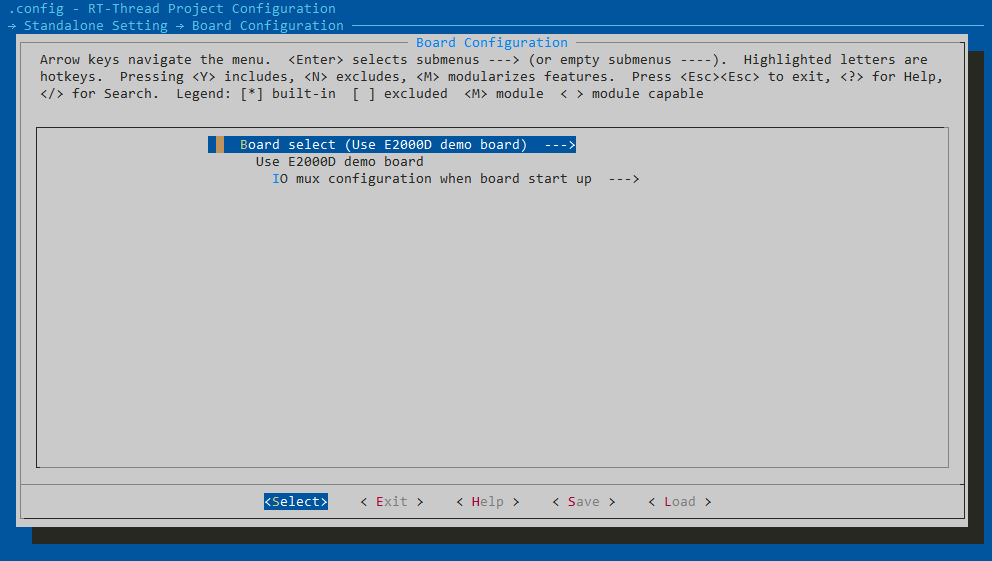
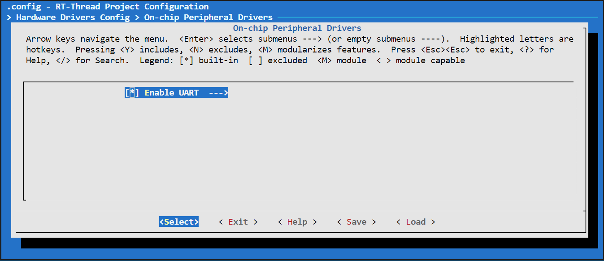
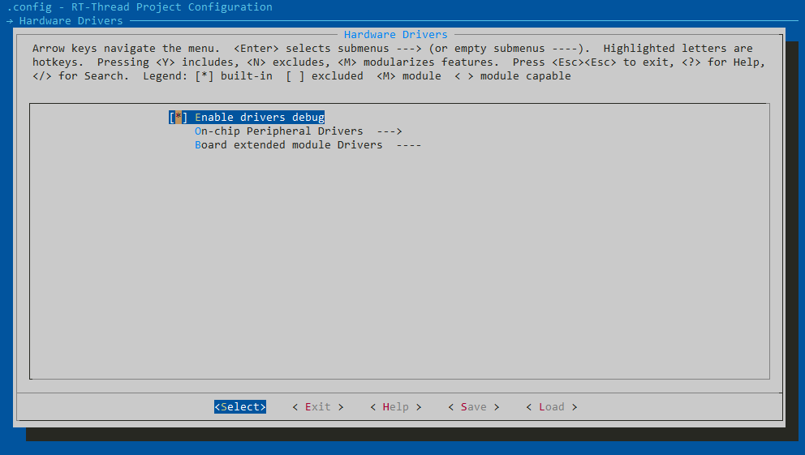
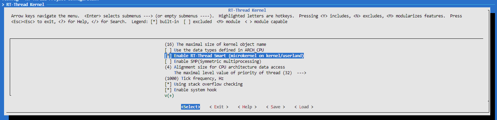
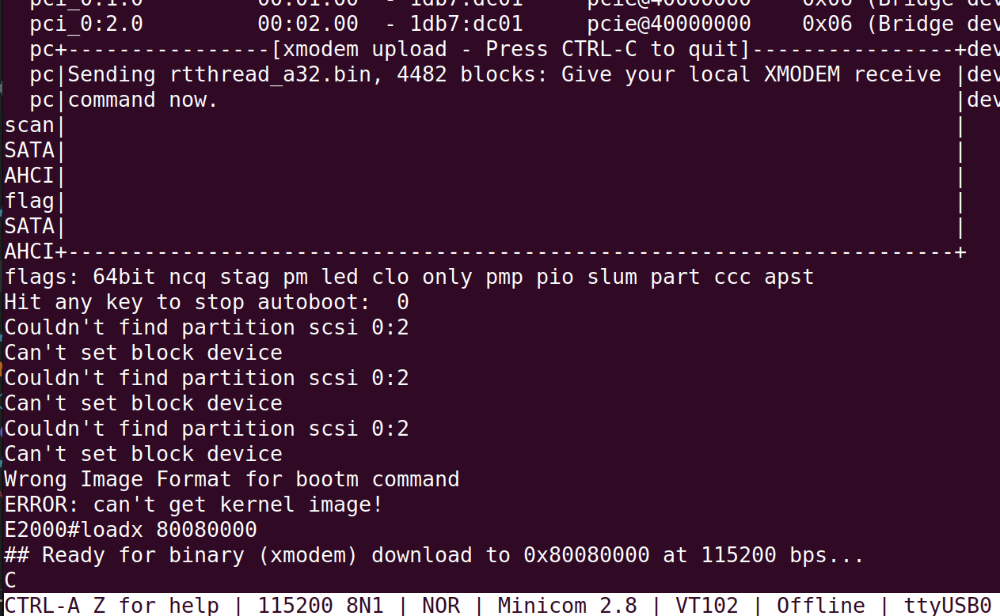
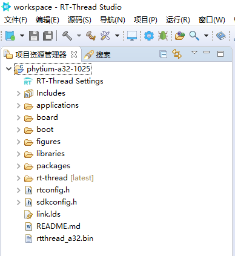

# AARCH32 工作模式使用

- 当开发者需要基于 Phytium 系列芯片进行开发时，可以从以下几个步骤出发配置芯片

## 1. 准备编译环境

- 创建tools目录，在 tools 目录下下载两个python 脚本，get_toolchain.py 和 ci.py，下载完后给两个脚本添加执行权限

```shell
mkdir tools
cd ./tools
wget https://gitee.com/rtthread/ART-Pi-smart/raw/master/tools/get_toolchain.py
wget https://gitee.com/rtthread/ART-Pi-smart/raw/master/tools/ci.py
chmod +x get_toolchain.py ci.py
```

- 运行 get_toolchain.py 脚本，拉取 aarch32 交叉编译链`arm-linux-musleabi_for_x86_64-pc-linux-gnu`

```shell
python3 ./get_toolchain.py arm
```

> RT-Thread 5.0 后必须使用这个带 musl-libc 的编译链，不能使用`arm-none-eabi`

- 在 aarch32 目录下下载脚本 smart-env.sh ，然后运行脚本生效环境变量

```shell
cd ./aarch32
wget https://gitee.com/rtthread/ART-Pi-smart/raw/master/smart-env.sh
source ./smart-env.sh arm
```

- 如下所示是 aarch32 编译相关的环境变量，运行 scons 前要确保环境变量设置正确



## NOTE

以上步骤已在ubuntu20.04开发环境测试，在其他开发环境下若无法下载相关脚本，可使用以下链接手动下载

```shell
    get_toolchain.py下载地址
    https://gitee.com/rtthread/ART-Pi-smart/blob/master/tools/get_toolchain.py

    ci.py下载地址
    https://gitee.com/rtthread/ART-Pi-smart/blob/master/tools/ci.py

    当出现以下提示时，可采用以下链接下载 phytium_standalone_sdk_install.py
    "Please refer to the ./README and manual download phytium_standalone_sdk_install.py, place in current folder"
    phytium_standalone_sdk_install.py下载地址
    https://gitee.com/phytium_embedded/phytium-standalone-sdk/blob/Standalone-Sdk_RT-thread/phytium_standalone_sdk_install.py
```

## 2. 如何选择开发板

- 以 E2000Q RT-Smart为例，Linux 环境下，运行 make load_e2000q_demo_rtsmart 加载默认的 rtconfig, 然后输入下列命令，进入 menuconfig 进一步配置，

```shell
    scons --menuconfig
```

开发者通过以下选择进行配置

```
Standalone Setting > Board Configuration > Chip 
```



## 3. 如何选择驱动

```shell
    scons --menuconfig
```

开发者通过以下选项进行驱动的使能

```
Hardware Drivers > On-chip Peripheral Drivers
```



## 4. 开启SDK中内部调试信息

```shell
    scons --menuconfig
```

开发者通过以下选项进行调试信息等级的设置




## 5. 如何切换至RT-Thread Smart 工作模式

```shell

 scons --menuconfig

```



开发者通过以上配置开启RT-Thread Smart 功能

## 6. 编译程序

```shell
    scons -c
    scons
```

- 完成编译之后目录下将会生成以下几个文件

```
rtthread_a32.bin
rtthread_a32.elf
rtthread_a32.map
```

## 7. 启动镜像程序

- 可以用串口通过 XMODEM 协议将 bin/elf 文件上传到开发板，然后启动，

- 如果使用 SD-1 控制器

```
mw.l 0x32b31178 0x1f
```

- 首先在 Phytium 开发板上输入，上传 bin 文件

```
loadx 80080000
```



- 加载 bin 文件完成后，输入下列命令启动

```
go 80080000
```

## 8. 打包导出工程源代码

- 指定工程名和路径，打包RT-Thread内核和Phytium BSP代码，可以导出一个工程工程

```
python ./export_project.py -n=phytium-a32 -o=D:/proj/rt-thread-e2000/phytium-a32
```


- 进入打包工程的目录，修改工程根目录 Kconfig 中的路径 BSP_DIR 和 STANDALONE_DIR

> env 环境中的 menuconfig 不会调用 SConstruct 修改路径环境变量，因此需要手动修改路径

```
config BSP_DIR
    string
    option env="BSP_ROOT"
    default "."

config STANDALONE_DIR
    string
    option env="STANDALONE_DIR"
    default "libraries/standalone"
```

- 输入 menuconfig 和 scons 完成编译

## 9. 将工程导入 RT-Studio

- 在 RT-Studio 使用功能 `RT-Thread Bsp 到工作空间`，导入 5. 中导出的 BSP 工程
- 设置 BSP 工程的交叉编译链后进行后续开发



python get_toolchain.py arm
./smart-env.bat
