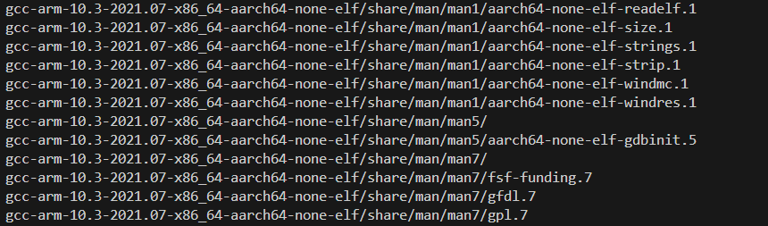
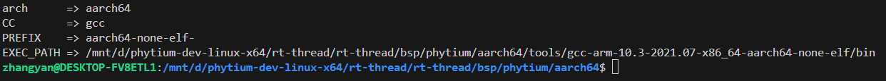
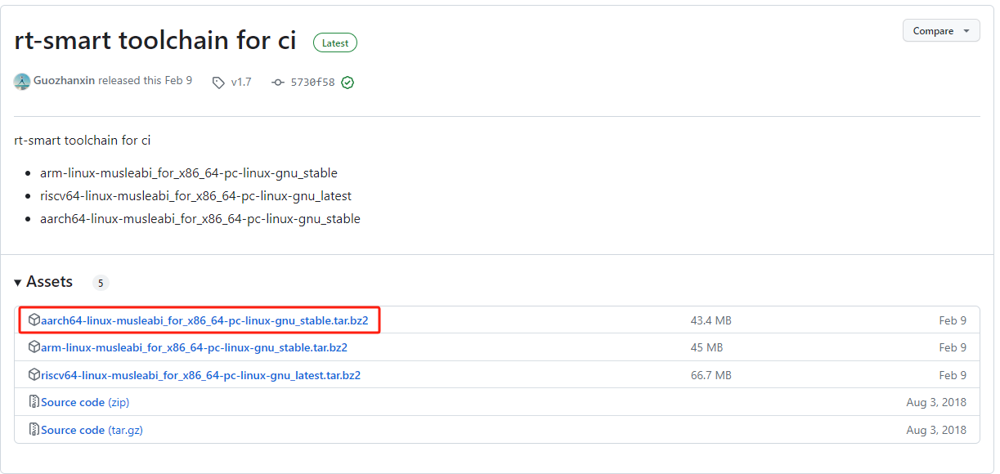
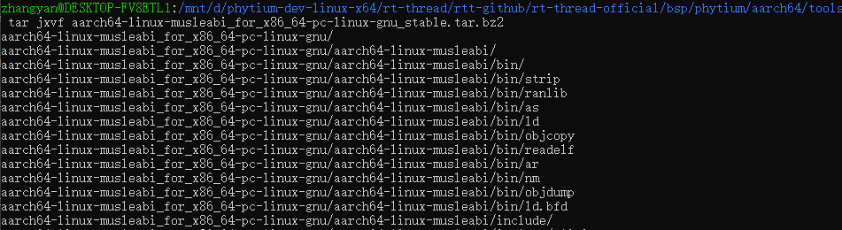
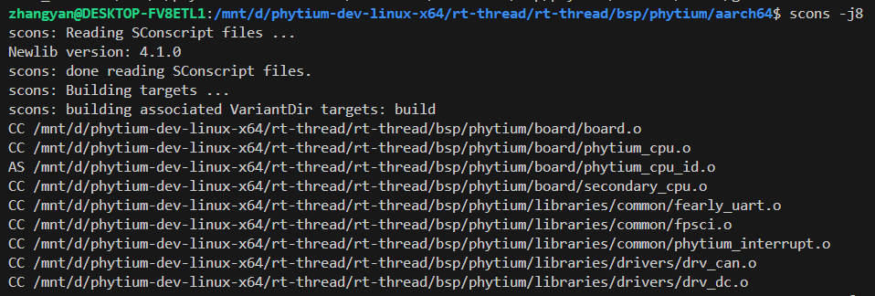
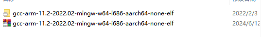
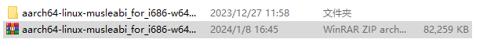
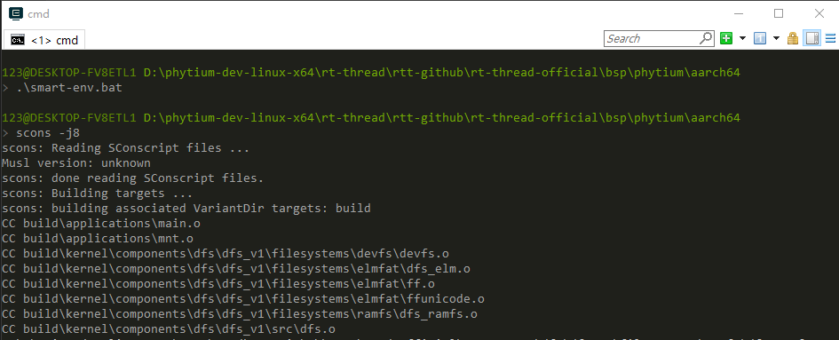
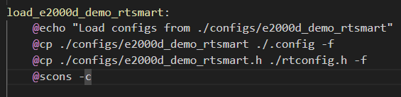

# AARCH64 工作模式使用

- 当开发者需要基于 Phytium 系列芯片进行开发时，可以从以下几个步骤出发配置芯片

## 1. 准备编译环境

- 在aarch64目录下创建tools文件夹，用于存放编译链，目前支持在以下两种环境进行开发
```shell
mkdir tools
```
注：使用RT-Smart编译链也可编译RT-Thread，但当前不支持C++

### Ubuntu 环境

#### RT-Thread

- 点击[下载编译链工具](https://armkeil.blob.core.windows.net/developer/Files/downloads/gnu-a/10.3-2021.07/binrel/gcc-arm-10.3-2021.07-x86_64-aarch64-none-elf.tar.xz)压缩包，放置在tools目录下

- 在tools目录下，使用tar命令解压缩
```shell
tar xvf gcc-arm-10.3-2021.07-x86_64-aarch64-none-elf.tar.xz
```



- 返回`aarch64`目录，运行`thread-env.sh脚本`，生效环境变量
```shell
source ./thread-env.sh
```

- 如下所示是`aarch64`编译相关的环境变量，运行`scons`前要确保环境变量设置正确



#### RT-Smart

- 点击[下载编译链工具](https://github.com/RT-Thread/toolchains-ci/releases/tag/v1.7)压缩包，放置在tools目录下



- 在tools目录下，使用tar命令解压缩
```shell
tar jxvf aarch64-linux-musleabi_for_x86_64-pc-linux-gnu_stable.tar.bz2
```



- 返回`aarch64`目录，运行`smart-env.sh`脚本，生效环境变量
```shell
source ./smart-env.sh
```

- 如下所示是`aarch64`编译相关的环境变量，运行`scons`前要确保环境变量设置正确


- 输入以下指令进行编译，初次编译会拉取`phytium_standalone_sdk工具包`，请确保当前环境下网络畅通
```shell
scons -j8
```


- 完成编译之后目录下将会生成以下几个文件
```
rtthread_a64.bin
rtthread_a64.elf
rtthread_a64.map
```

### RT-Thread env 环境

#### RT-Thread

- 点击[下载编译链工具](https://developer.arm.com/-/media/Files/downloads/gnu/11.2-2022.02/binrel/gcc-arm-11.2-2022.02-mingw-w64-i686-aarch64-none-elf.zip)压缩包，放置在tools目录下

- 在tools目录下，将下载好的编译链工具压缩包解压


- 返回`aarch32`目录，运行`thread-env.bat`脚本，生效环境变量
```shell
./thread-env.bat
```

- 如下所示是`aarch32`编译相关的环境变量，运行`scons`前要确保环境变量设置正确



#### RT-Smart

- 点击[下载编译链工具](https://download.rt-thread.org/download/rt-smart/toolchains/aarch64-linux-musleabi_for_i686-w64-mingw32_latest.zip
)压缩包

- 在tools目录下，将下载好的编译链工具压缩包解压



- 运行脚本smart-env.bat脚本，脚本生效环境变量
```shell
.\smart-env.bat
```

- 输入以下指令进行编译，初次编译会拉取`phytium_standalone_sdk工具包`，请确保当前环境下网络畅通
```shell
scons -j8
```


- 完成编译之后目录下将会生成以下几个文件
```
rtthread_a64.bin
rtthread_a64.elf
rtthread_a64.map
```

## 2. 如何选择开发板

>注：在 RT-Thread env 环境下使用`menuconfig`指令即可打开配置菜单，在Ubuntu下需要使用`scons --menuconfig`

- 以 E2000Q RT-Thread为例，Linux 环境下，运行`make load_e2000d_demo_rtthread`加载默认的 rtconfig, 然后输入下列命令，进入 menuconfig 进一步配置

```shell
scons --menuconfig
```

开发者通过以下选择进行配置

```
Standalone Setting > Board Configuration
```


## 3. 如何选择驱动

```shell
scons --menuconfig
```

开发者通过以下选项进行驱动的使能
```
Hardware Drivers Config > On-chip Peripheral Drivers
```


## 4. 开启SDK中内部调试信息

```shell
scons --menuconfig
```

开发者通过以下选项开启调试信息


## 5. 如何切换至 RT-Thread Smart 工作模式

### Ubuntu环境下可使用以下指令加载RT-Smart默认配置

- 以E2000D_DEMO开发板为例
```shell
make load_e2000d_demo_rtsmart
```
### RT-Thread env环境不方便安装make工具，可按照以下步骤加载RT-Smart默认配置

1. 查看`makefile`文件，找到`make load_e2000d_demo_rtsmart`



2. 输入以下指令
```shell
cp ./configs/e2000d_demo_rtsmart ./.config -f
cp ./configs/e2000d_demo_rtsmart.h ./rtconfig.h -f
scons -c
```

## 6. 启动镜像程序

1. 完成配置后，使用以下指令进行clean和重新编译
```shell
scons -c
scons -j8
```
2. 按照指导[启动镜像程序](../doc/how_to_flashed_binary.md)
