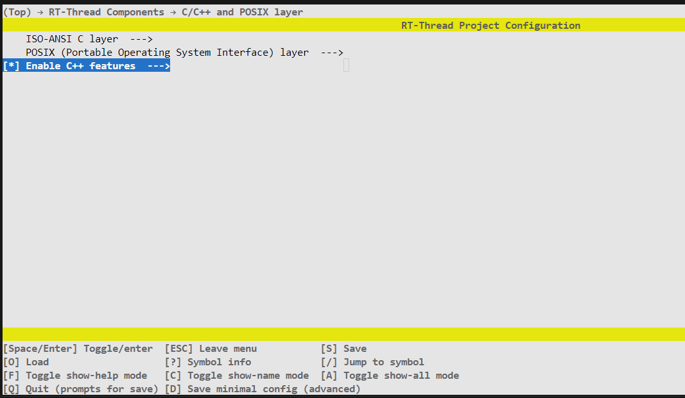
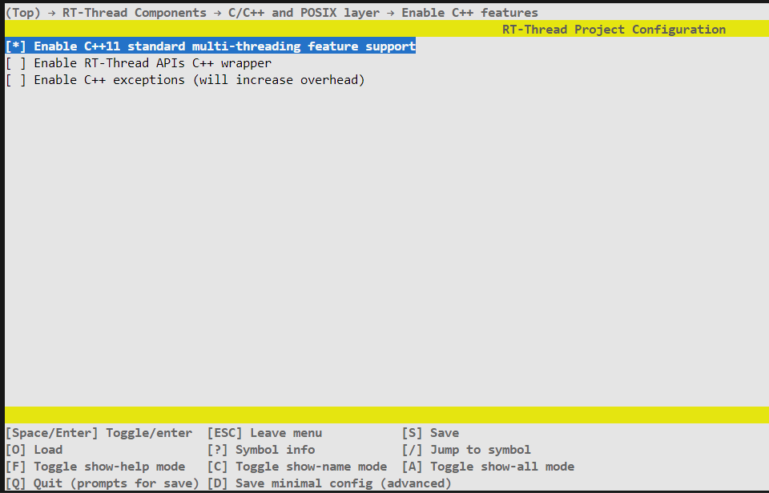
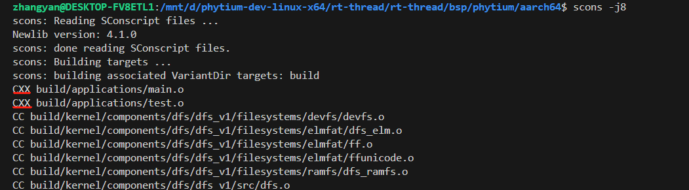

# 如何编译C++文件

- 目前C++仅支持在`RT-Thread`模式下使用，`RT-Smart`模式暂不支持。环境配置请参考[aarch64_README](../aarch64/README.md)，[aarch32_README](../aarch32/README.md)

## Ubuntu环境
- aarch64模式编译链选择`gcc-arm-10.3-2021.07-x86_64-aarch64-none-elf`
- aarch32模式编译链选择`gcc-arm-10.3-2021.07-x86_64-arm-none-eabi`

## RT-Thread Env环境
- aarch64模式编译链选择`gcc-arm-11.2-2022.02-mingw-w64-i686-aarch64-none-elf`
- aarch32模式编译链选择Env环境自带`mingw`编译链

## 编译步骤

- 在`SConscript`文件中添加需要编译的.cpp文件，以`aarch64/applications/SConscript`文件为例，其他文件夹请按照需求自行修改


- 输入下列命令，进入 menuconfig 进一步配置

```shell
scons --menuconfig
```

- 勾选`Enable C++ features`，可进入菜单勾选`Enable C++11 standard multi-threading feature support`





- 使用`scons -j8`指令进行编译，C++文件被正常编译


