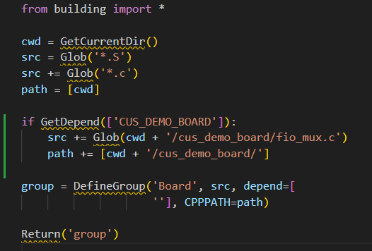
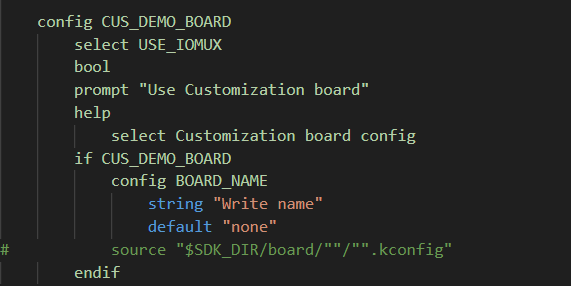
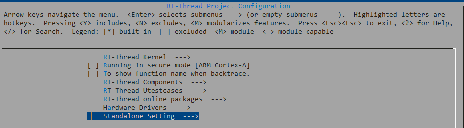
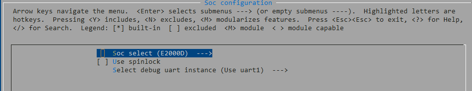
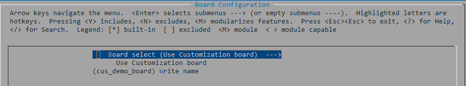

# 添加开发板至PHYTIUM BSP

>注:BSP已适配E2000Q_DEMO，E2000D_DEMO，PHYTIUMPI开发板，若需填加系列其他开发板，请按以下步骤进行

## 以cus_demo_board(E2000D系列)开发板为例进行说明

1. 在bsp/phytium/board下创建cus_demo_board文件夹
```
$ cd bsp/phytium/board
$ cd mkdir cus_demo_board
```

2. 创建文件fio_mux.c和fio_mux.h，添加引脚复用函数
```
$ touch fio_mux.c
$ touch fio_mux.c
```
可参考bsp/phytium/standalone/board/e2000d_demo 目录下的fio_mux.c和fio_mux.h文件

3. 在bsp/phytium/board 目录下SConscript文件中添加如下内容，用来将fio_mux.c和fio_mux.h文件加入编译



4. 修改 bsp/phytium/board 目录下board.kconfig文件，如下图所示



>注：示例中以上述基本框架已填充，只需填充函数，并按需求对`cus_demo_board`重命名

5. 打开menuconfig进行如下配置

- 进入Standalone Setting目录下



- 进入Soc configuration选择E2000D




- 进入board_configuration选择cus_board_demo




6. 在bsp/libraries/drivers中，具体驱动实例开启受Kconfig控制，如有更多需求，请自行修改相关.c文件和Kconfig文件

7. 编译测试


