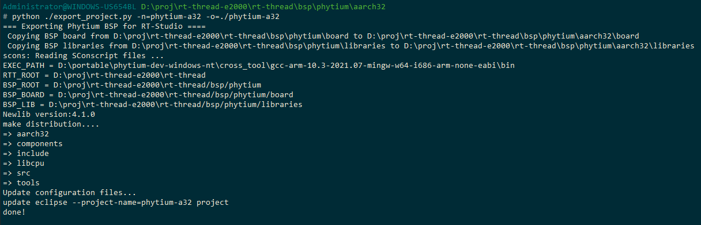
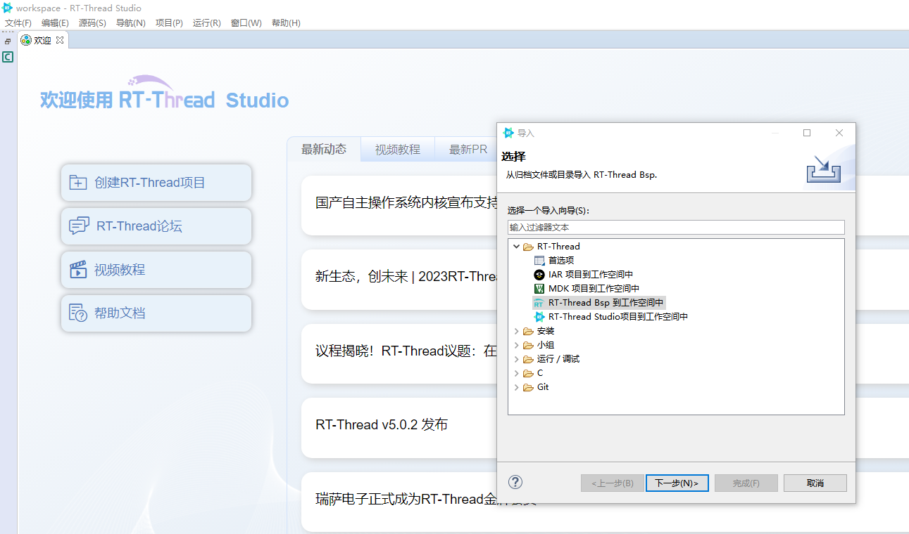

# 如何在RT-Thread Studio下使用BSP

- 很多开发者会使用RT-Thread官方提供的IDE(RT-Thread Studio)进行开发，与其他方式略有不同

## 安装RT-Thread Studio

1. 进入RT-Thread官网，[下载RT-Thread Srudio](https://www.rt-thread.org/download.html)，按步骤安装即可

## 打包导出工程源码

1. 进入`aarch32`或`aarch64`目录，使用`export_project.py`脚本，指定工程名和路径，打包导出工程代码
```
python ./export_project.py -n=phytium-a64 -o=D:/proj/rt-thread-e2000/phytium-a64
```


2. 进入打包工程的目录，修改工程根目录 Kconfig 中的路径 BSP_DIR 和 STANDALONE_DIR

> 注：env 环境中的 menuconfig 不会调用 SConstruct 修改路径环境变量，因此需要手动修改路径

```
config BSP_DIR
    string
    option env="BSP_ROOT"
    default "."

config SDK_DIR
    string
    option env="SDK_DIR"
    default "./libraries/phytium_standalone_sdk"
```
## 将工程导入RT-Thread Studio
1. 打开RT-Thread Studio，点击左上角文件菜单-->导入-->RT-Thread Bsp到工作空间中




