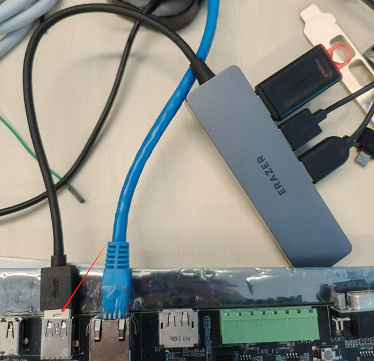
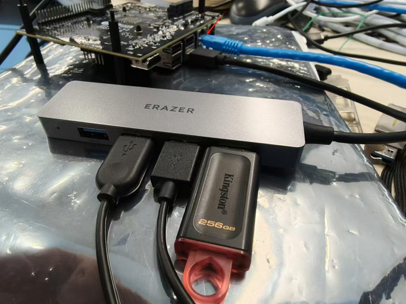
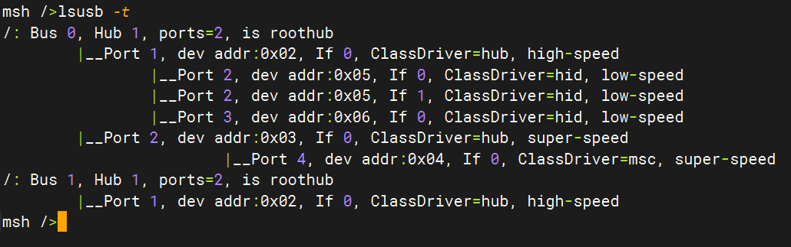
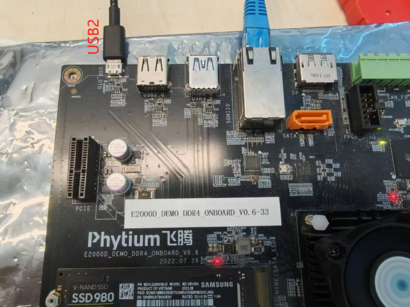
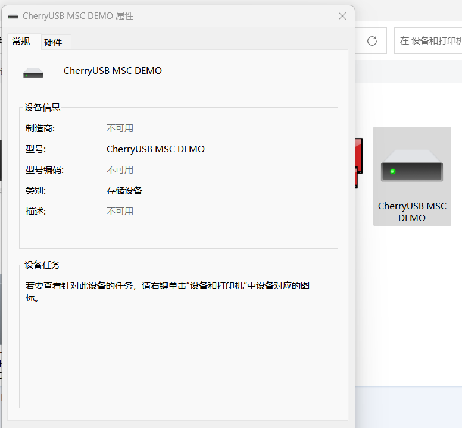
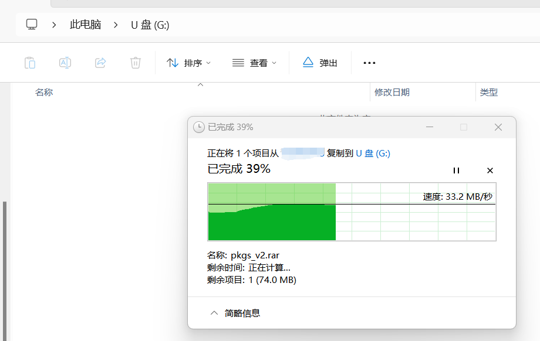
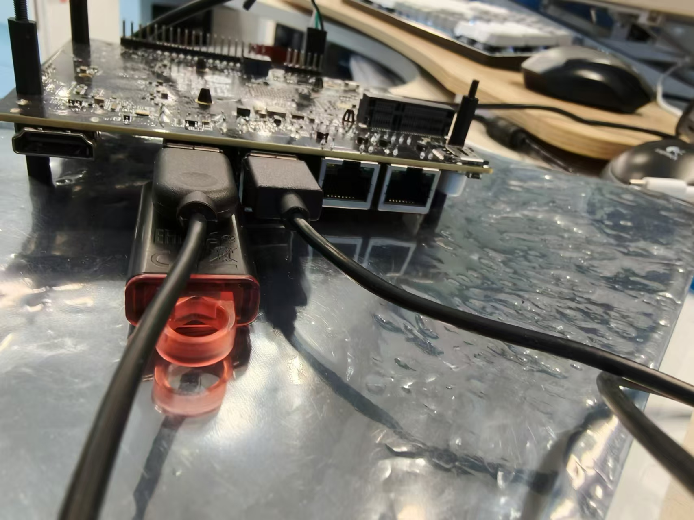
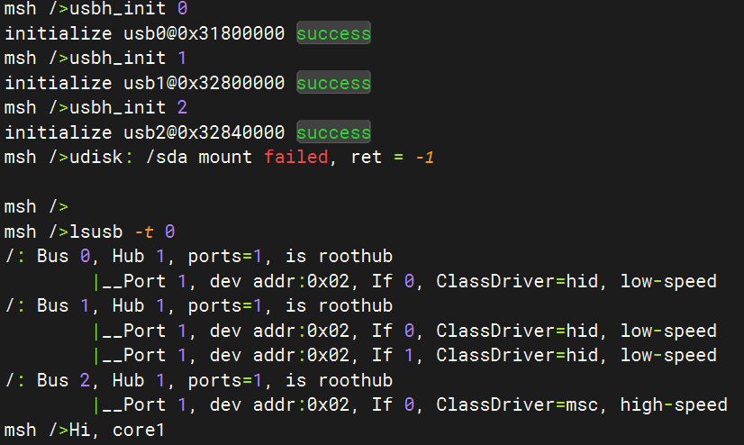

# CherryUSB 的使用

- CherryUSB 是一个小而美的、可移植性高的、用于嵌入式系统(带 USB IP)的 USB 主从协议栈
- Phytium 系列 CPU 相关 BSP 通过 CherryUSB 支持下列功能
- 1. USB 主机（XHCI）, 可以识别 U 盘/鼠标/键盘等设备，但是设备需要插在主机侧的 USB 插槽上，暂不支持通过 HUB 扩展连接设备
- 2. USB 主机 (PUSB2), 可以识别 U 盘/鼠标/键盘等设备
- 3. USB 从机 (PUSB2), 可以将开发板作为一个 USB 设备（U 盘）运行，连接 Windows/Ubuntu 等主机进行识别和访问

> Note: 目前 CherryUSB 没有适配 RT-Smart, 只能在 RT-Thread 模式下使用

> Note: CherryUSB 不支持同时使用不同类型的控制器，PUSB2 和 XHCI 只能选择一种工作

## 使用 USB 3.0 控制器 (XHCI)

> Note: 飞腾派上只有CPU 正面侧靠网口的插槽是 USB 3.0 XHCI 接口，飞腾派中只引出了 USB 3.0 0 号控制器

> Note: 飞腾派上 USB 3.0 控制器引脚和 PWM 及 GPIO 有复用关系，不能同时使用，具体的可以查阅数据手册

- 如果是在 E2000 D/Q Demo 板上，如下图所示连接 USB 设备



- 如果是在飞腾派上，如下图所示连接 USB 设备




- 加载默认配置 `make load_phytium_pi_rtthread`，或者使能下面的配置，USB 3.0 控制器可以识别键盘鼠标、U盘和外扩HUB

```
RT_USING_CHERRYUSB
RT_CHERRYUSB_HOST
RT_CHERRYUSB_HOST_XHCI
RT_CHERRYUSB_HOST_HID
RT_CHERRYUSB_HOST_MSC
```

- 编译镜像后加载到开发板中启动，然后输入下面的命令启动 CherryUSB

```
usb_host_init 0
```

> 如果需要使用 1 号控制器，输入 `usb_host_init 1`

- 之后输入命令可以看到挂载的设备，可以看到 0 号 bus 和 1 号 bus 上通过 Hub 挂载了若干设备

```
lsusb -t
```



- 具体的 USB 设备使用可以参考 CherryUSB 使用说明，以及 [Phytium FreeRTOS SDK 的使用键盘、鼠标和U盘](https://gitee.com/phytium_embedded/phytium-free-rtos-sdk/blob/master/example/peripheral/usb/xhci_platform)，以及[在 LVGL 中使用鼠标键盘](https://gitee.com/phytium_embedded/phytium-free-rtos-sdk/tree/master/example/peripheral/media/lvgl_indev)


## 使用 USB 2.0 控制器（PUSB2 Device 模式）

> Note: 固件会配置 USB 2.0 控制器的的工作模式，默认地，E2000 D/Q Demo 板工作为 Device 模式，飞腾派工作为 Host 模式，本例程不支持切换工作模式，修改默认工作模式需要联系 FAE 更换固件或修改电路

- 如图所示将 E2000 D/Q Demo 板的 USB_OTG 接口和一台 Windows PC 连接

> E2000 D/Q Demo 板只引出 USB 2.0 0 号控制器，使用其它控制器需要修改代码



- 使能下面的配置，USB 2.0 控制器会模拟出一个 MSC 设备（U 盘）给连接的上位机识别

> U 盘的存储空间用开发板的内存空间实现，所以掉电之后 U 盘中的数据就没有了，如果有需要持久保存数据的需要，可以修改例程用 SD 卡或者 Flash 存储空间实现 U 盘

```
RT_USING_CHERRYUSB
RT_CHERRYUSB_DEVICE
RT_CHERRYUSB_DEVICE_SPEED_HS
RT_CHERRYUSB_DEVICE_PUSB2
RT_CHERRYUSB_DEVICE_MSC
RT_CHERRYUSB_DEVICE_TEMPLATE_MSC
```

- 编译镜像后加载到开发板中启动，然后输入下面的命令启动 CherryUSB

```
usb_device_init
```

- 之后会在 PC 端识别出一个 U 盘，之后可以对 U 盘进行读写





> 如果需要修改 U 盘的容量，可以在 msc_ram_template.c 中指定 BLOCK_COUNT 的值

## 使用 USB 2.0 控制器 （PUSB2 Host 模式）

> Note: USB 2.0 控制器 Host 模式硬件上不支持使用 Hub 扩展插槽

- 如图所示，在飞腾派引出的三个 USB 2.0 插槽上接上鼠标、键盘和 U 盘，注意 CPU 正面侧靠网口的插槽是 USB 3.0 XHCI 接口，其余 USB 接口是 USB 2.0 接口



- 加载配置 `make load_phytium_pi_rtthread_pusb2_hc` ，或者使能下面的配置，USB 2.0 控制器作为 Host 工作，能够识别 HID 和 MSC 设备

```
RT_USING_CHERRYUSB
RT_CHERRYUSB_HOST
RT_CHERRYUSB_HOST_PUSB2
RT_CHERRYUSB_HOST_HID
RT_CHERRYUSB_HOST_MSC
```

- 编译镜像后加载到开发板中启动，随后输入命令，初始化三个 USB 2.0 控制器，初始化完成后可以看到枚举到的三个设备，两个 HID 设备对应鼠标和键盘，一个 MSC 设备对应 U 盘，由于 U 盘没有文件系统，udisk 尝试挂载 U 盘失败

```
usb_host_init 0
usb_host_init 1
usb_host_init 2
```

