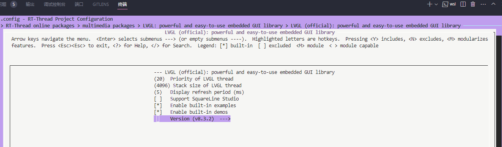
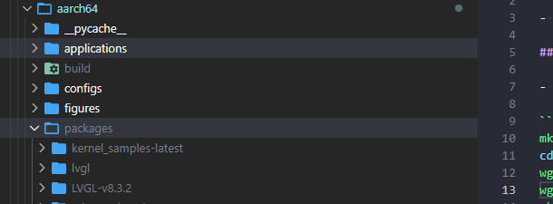
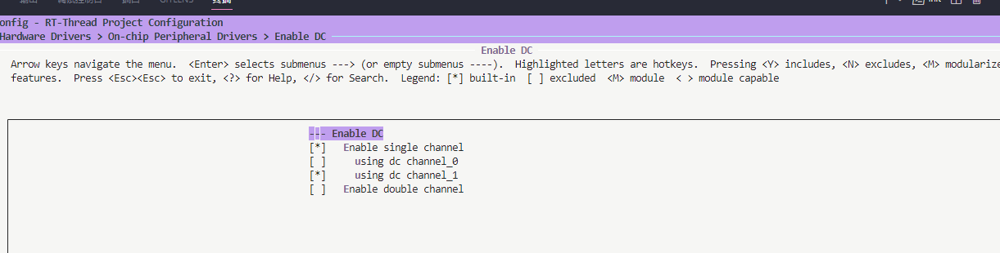
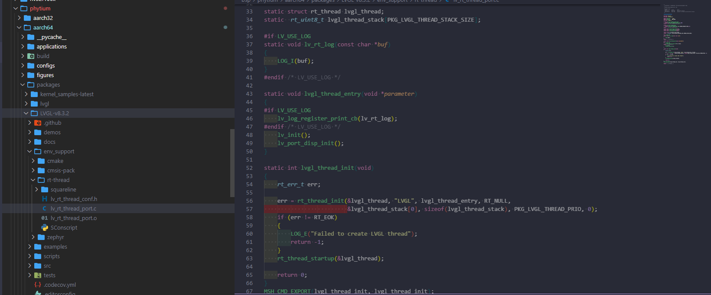
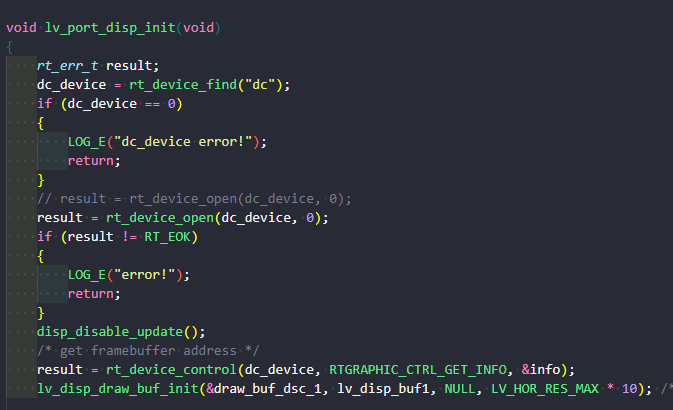
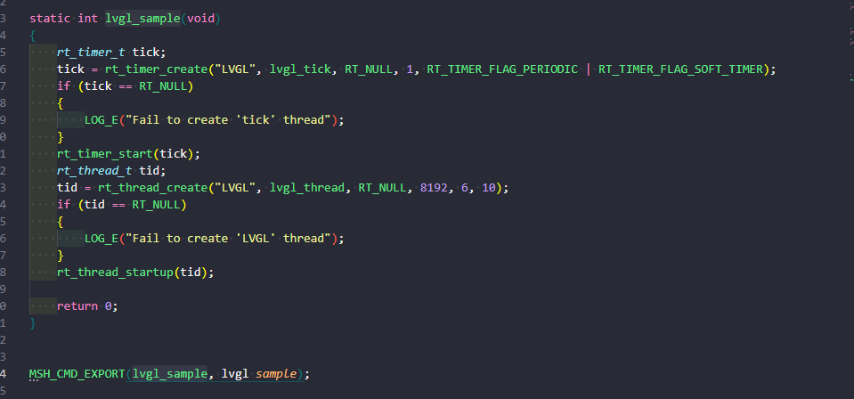

# 基于飞腾BSP包开发lvgl应用程序

> 本文主要介绍如何利用飞腾BSP包中DC驱动开发lvgl应用程序

- DC 是一个显示控制器，主要完成将 CPU/GPU/VPU 处理后的图像数据，按照 Display 协议处理后送给 DP PHY 接入显示器。飞腾DC主要具有以下特性：
 支持两路 Display，两路 Display 互相独立，支持的 size 有 640×480、 800×600、 1024×768、 1152×864、 1280×720、 1280×960、 1366×768 、 1440×900、 1600×90、 1920×1080 ， 最 大 帧 率 为5.4Gbps/(size*32bit);输出支持像素格式：RGB2101010，RGB888，RGB666，RGB555;兼容 DisplayPort1.4/Embedded DisplayPort1.4 协议等。

- lvgl集成了占用小、多平台使用、移植简单、操作简单、开源免费等一系列特点，是当前最流行的免费开源嵌入式图形库，可为任何 MCU、MPU 和显示类型创建漂亮的 UI。

## 在bsp/phytium 下拉取lvgl package包

- rt-thread 仓库已包含lvgl在线包，在实际开发时，使用者可按照需求拉取多种版本的仓库代码，下面以lvgl-8.3.2为例，其他版本与此类似。

-1.在rt-thread menuconfig中选中lvgl,在ENV环境或ubuntu中使用pkgs --update 更新 packages：

## 在bsp/phytium 下选择DC驱动

## lvgl与 DC驱动交互

-1.lvgl仓库支持适配rt-thread环境,在static void lvgl_thread_entry(void *parameter)中，用户可根据自身需要，添加或裁剪lvgl组件，其中    lv_init(); lv_port_disp_init()必须初始化后才能使用。

-2.在lvgl例程中找到并使用DC驱动

在void lv_port_disp_init(void)设备注册函数中利用device接口，找到并打开dc驱动，请确保此时在rt-thread中DC设备已成功注册，否则将无法使用

-3 创建一个lvgl demo线程

利用rt-thread time组件给lvgl 提供心跳，并创建一个demo线程，在线程中，用户可根据自身开发情况，选择demo或者利用lvgl提供的接口创建合适的UI界面。

以上步骤已在E2000D demo板上进行测试，lvgl版本为lvgl-8.3.2，测试验证通过。