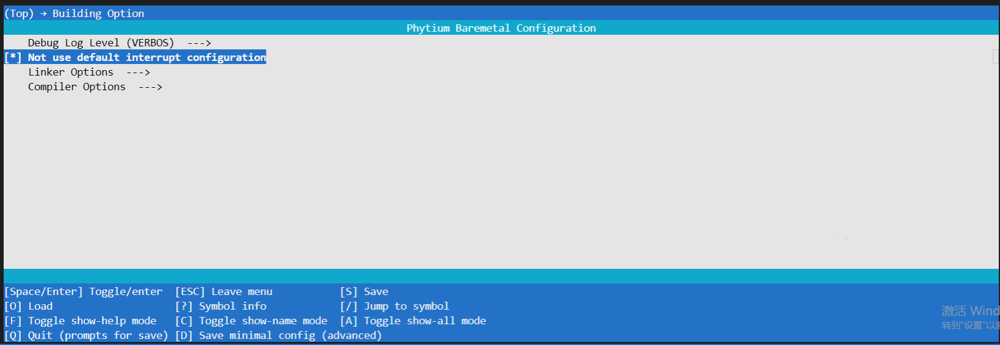
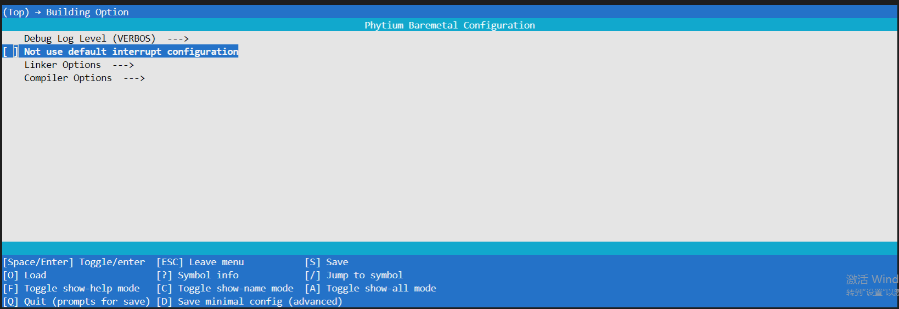

<!--
 * Copyright : (C) 2022 Phytium Information Technology, Inc. 
 * All Rights Reserved.
 *  
 * This program is OPEN SOURCE software: you can redistribute it and/or modify it  
 * under the terms of the Phytium Public License as published by the Phytium Technology Co.,Ltd,  
 * either version 1.0 of the License, or (at your option) any later version. 
 *  
 * This program is distributed in the hope that it will be useful,but WITHOUT ANY WARRANTY;  
 * without even the implied warranty of MERCHANTABILITY or FITNESS FOR A PARTICULAR PURPOSE.
 * See the Phytium Public License for more details. 
 *  
 * 
 * FilePath: interrupt.md
 * Date: 2022-04-14 23:39:11
 * LastEditTime: 2022-04-14 23:39:11
 * Description:  This file is for 
 * 
 * Modify History: 
 *  Ver   Who        Date         Changes
 * ----- ------     --------    --------------------------------------
-->

# finterrupt

## 1概述

此处提到的中断，主要是面向与Armv8 架构中异步异常IRQ 这个中断这个概念进行对齐，本模块主要为开发者提供软件层面管理中断相关接口，具体实现了以下这些特性：
1.基于中断id 的开关功能
2.中断生命周期中需要使用到的，模式切换函数。（sdk 自动调用，一般不需要开发者操作）
3.核间中断触发接口
4.中断优先级相关接口（优先级设置、优先级掩码、优先级抢占分组设置）
5.提供两种角色选择初始化中断

## 2驱动功能

驱动组成由以下所示
.
├── finterrupt.c
└── finterrupt.h

为用户提供两种初始化中断的方式：
1.不使用默认初始化的方式，在参数配置项选择“Not use default interrupt configuration”，参数配置如下：



用户在这种模式下手动编写初始化代码，具体可以参考 /baremetal/example/peripheral/gic/fgic_test 下例程

2.使用默认初始化的方式，此时默认以CORE0 作为主核，默认会初始化中断驱动中的所有组件，非0核 将只会初始化与多核特性相关的部分组件。具体配置如下：



## 3数据结构

```
typedef void (*IrqHandler)(s32 vector, void *param); /* IRQ 中断回调函数的类型 */

```

```
struct IrqDesc
{
        IrqHandler handler;	 /* IRQ 中断回调函数的指针 */
        void *param;		/* IRQ 中断回调函数的变量 */
};
```

```
#define INTERRUPT_CPU_ALL_SELECT 0xffffffffffffffffULL /* 当进行核间，发送给所有核心时需要用到的参数 */
#define INTERRUPT_CPU_TARGET_ALL_SET 0xffffffffUL  /* 设置SPI 中断亲和度时，此值默认SPI 中断发送给所有人 */

#define IRQ_MODE_TRIG_LEVEL (0x00)	  /* Trigger: level triggered interrupt */
#define IRQ_MODE_TRIG_EDGE (0x01)  /* Trigger: edge triggered interrupt */
```

```
typedef enum
{
 INTERRUPT_ROLE_MASTER = 0 , /* 作为主核模式进行中断初始化，会初始化中断驱动中的所有组件  */
 INTERRUPT_ROLE_SLAVE,  	  /* 作为从核模式进行中断初始化，会初始化与多核特性相关的部分组件  */
}INTERRUPT_ROLE_SELECT; /* 此枚举应用于手动初始化中断的接口中 */
```

```
#define IRQ_GROUP_PRIORITY_3    3 /* group priority valid mask is bit[7:3],subpriority valid mask is bit[4:0] */
#define IRQ_GROUP_PRIORITY_4    4 /* group priority valid mask is bit[7:4],subpriority valid mask is bit[3:0] */
#define IRQ_GROUP_PRIORITY_5    5 /* group priority valid mask is bit[7:5],subpriority valid mask is bit[4:0] */
#define IRQ_GROUP_PRIORITY_6    6 /* group priority valid mask is bit[7:6],subpriority valid mask is bit[5:0] */
#define IRQ_GROUP_PRIORITY_7    7 /* group priority valid mask is bit[7],subpriority valid mask is bit[6:0] */
```

IRQ_GROUP_PRIORITY_* 用于定义组优先级的有效位。 当存在抢占中断时，group priority 为抢占优先级，subpriority  为子优先级，如果某个中断的组优先级的值比当前正在运行中断的组优先级要小，则此中断将会抢占当前运行的优先级 。

```
#define IRQ_PRIORITY_VALUE_0    0
#define IRQ_PRIORITY_VALUE_1    0x10
#define IRQ_PRIORITY_VALUE_2    0x20
#define IRQ_PRIORITY_VALUE_3    0x30
#define IRQ_PRIORITY_VALUE_4    0x40
#define IRQ_PRIORITY_VALUE_5    0x50
#define IRQ_PRIORITY_VALUE_6    0x60
#define IRQ_PRIORITY_VALUE_7    0x70
#define IRQ_PRIORITY_VALUE_8    0x80
#define IRQ_PRIORITY_VALUE_9    0x90
#define IRQ_PRIORITY_VALUE_10   0xa0
#define IRQ_PRIORITY_VALUE_11   0xb0
#define IRQ_PRIORITY_VALUE_12   0xc0
#define IRQ_PRIORITY_VALUE_13   0xe0
#define IRQ_PRIORITY_VALUE_14   0xf0
```

IRQ_PRIORITY_VALUE_* 中断优先级一共支持以上这16个挡位，优先级的值越低优先级越高。

```
#define IRQ_PRIORITY_MASK_0    0
#define IRQ_PRIORITY_MASK_1    0x10
#define IRQ_PRIORITY_MASK_2    0x20
#define IRQ_PRIORITY_MASK_3    0x30
#define IRQ_PRIORITY_MASK_4    0x40
#define IRQ_PRIORITY_MASK_5    0x50
#define IRQ_PRIORITY_MASK_6    0x60
#define IRQ_PRIORITY_MASK_7    0x70
#define IRQ_PRIORITY_MASK_8    0x80
#define IRQ_PRIORITY_MASK_9    0x90
#define IRQ_PRIORITY_MASK_10   0xa0
#define IRQ_PRIORITY_MASK_11   0xb0
#define IRQ_PRIORITY_MASK_12   0xc0
#define IRQ_PRIORITY_MASK_13   0xe0
#define IRQ_PRIORITY_MASK_14   0xf0
```

IRQ_PRIORITY_MASK_* 中断优先级掩码一共支持以上这16个挡位，当设置掩码之后，中断优先级的值必须比此值小，才能被CPU进行响应

## 4错误码定义

#define FINT_SET_TARGET_ERR    /* 涉及到CPU id 的配置时，CPU 不具有此ID 信息 */
#define FINT_INT_NUM_NOT_FIT  /* 使用中断号不符合当前实际情况 */

## 5应用示例

/baremetal/example/peripheral/gic/fgic_test  gic与interrupt 特性例程

## 6API使用步骤

1. 初始化中断模块,根据当前使用此核心角色的定位（主核、从核），进行初始化

```
InterruptInit(&interrupt_instance,INTERRUPT_DRV_INTS_ID,INTERRUPT_ROLE_MASTER);
```

2. 全局设置组优先级 ，此接口影响中断嵌套过程中的抢占优先级有效位

```
InterruptSetPriorityGroupBits(IRQ_GROUP_PRIORITY_*);
```

3. 全局设置中断优先级掩码，此参数设置之后,CPU响应中断优先级的值必须比此值小

```
InterruptSetPriorityMask(IRQ_PRIORITY_MASK_*);
```

4. 设置具体中断的优先级。此优先级由抢占优先级与子优先级组成，具体优先级的划分由 InterruptSetPriorityGroupBits 决定。

```
InterruptSetPriority(INT_NUM,priority);
```

5. 设置中断路由至特定CPU

```
InterruptSetTargetCpus(INT_NUM,CPU_ID) 
```

6. 中断回调函数注册,当中断事件出现时，回调此注册函数

```
InterruptInstall(INT_NUM,int_handler,int_args,"int_name")
```

7. 使能具体中断号的中断

```
InterruptUmask(INT_NUM)
```

8. 如果是使用核间中断，使用以下接口进行触发

```
InterruptCoreInterSend(INT_NUM,CPU_MASK)
```

9. 关闭具体中断号的中断

```
InterruptMask(INT_NUM)
```

## 7API介绍

### 1. InterruptInit

```
void InterruptInit(InterruptDrvType * int_driver_p,u32 instance_id,INTERRUPT_ROLE_SELECT role_select)
```

#### 介绍

初始化中断模块的接口函数

#### 参数

- InterruptDrvType * int_driver_p ： 指向中断驱动实例的指针
- u32 instance_id: 驱动实例的标号
- INTERRUPT_ROLE_SELECT role_select ：初始化中断接口时的角色选择。INTERRUPT_ROLE_MASTER 作为主核角色，INTERRUPT_ROLE_SLAVE 作为从核角色。具体特点参照数据结构中的描述

#### 返回

无

### 2. InterruptMask

```
void InterruptMask(int int_id)
```

#### 介绍

基于中断ID关闭对应的中断

#### 参数

- int int_id ：中断的id 编号

#### 返回

无

### 3. InterruptUmask

```
void InterruptUmask(int int_id)
```

#### 介绍

基于中断ID开启对应的中断

#### 参数

- int int_id ：中断的id 编号

#### 返回

无

### 4. InterruptSetTargetCpus

```
FError InterruptSetTargetCpus(int int_id,u32 cpu_id)
```

#### 介绍

将中断路由给特定的CPU,或者路由给所有的CPU

#### 参数

- int int_id  ：中断的id 编号 ，中断优先级范围为 32-1019
- u32 cpu_id :  需要路由给CPU的编号，如果值为INTERRUPT_CPU_TARGET_ALL_SET 则路由给芯片中所有可以接收此中断的CPU

#### 返回

FError  FINT_SUCCESS：设置成功，FINT_INT_NUM_NOT_FIT：使用中断号不符合当前实际情况 ，FINT_SET_TARGET_ERR： 涉及到CPU id 的配置时，CPU 不具有此ID 信息

### 5. InterruptGetTargetCpus

```
FError InterruptGetTargetCpus(int int_id,u32 *cpu_p)
```

#### 介绍

基于中断ID 获取中断的路由信息

#### 参数

- int int_id  ：中断的id 编号
- u32 *cpu_p :  它的值为：需要路由给CPU的编号，如果值为INTERRUPT_CPU_TARGET_ALL_SET 则路由给芯片中所有可以接收此中断的CPU

#### 返回

FError  FINT_SUCCESS：设置成功，FINT_INT_NUM_NOT_FIT：使用中断号不符合当前实际情况 ，FINT_SET_TARGET_ERR： 涉及到CPU id 的配置时，CPU 不具有此ID 信息

### 6. InterruptSetTrigerMode

```
void InterruptSetTrigerMode(int int_id, unsigned int mode)
```

#### 介绍

基于中断ID 设置中断的触发方式

#### 参数

- int int_id  ：中断的id 编号
- unsigned int mode :  IRQ_MODE_TRIG_LEVEL ：(0x00) /* Trigger: level triggered interrupt */
- IRQ_MODE_TRIG_EDGE ：(0x01)  /* Trigger: edge triggered interrupt */

#### 返回

无

### 7. InterruptGetTrigerMode

```
unsigned int InterruptGetTrigerMode(int int_id)
```

#### 介绍

基于中断ID 获取中断的触发方式

#### 参数

- int int_id  ：中断的id 编号

#### 返回

- unsigned int mode :  IRQ_MODE_TRIG_LEVEL ：(0x00) /* Trigger: level triggered interrupt */
- IRQ_MODE_TRIG_EDGE ：(0x01)  /* Trigger: edge triggered interrupt */

### 8. InterruptSetPriority

```
void InterruptSetPriority(int int_id, unsigned int priority)
```

#### 介绍

基于中断ID 设置中断的触发方式

#### 参数

- int int_id  ：中断的id 编号
- unsigned int priority ：中断优先级的值 ，采用IRQ_PRIORITY_VALUE_*的值作为输入

#### 返回

无

### 9. InterruptGetPriority

```
 unsigned int InterruptGetPriority(int int_id)
```

#### 介绍

基于中断ID获取中断的触发方式

#### 参数

- int int_id ：中断的id 编号
- unsigned int priority ：中断优先级的值

#### 返回

无

### 10. InterruptSetPriorityMask

```
void InterruptSetPriorityMask(unsigned int priority)
```

#### 介绍

设置中断优先级掩码

#### 参数

- unsigned int priority ：中断掩码值，当设置此掩码之后，各个中断优先级的值必须小于此值，才能被CPU 承认，并且转为激活态 。采用IRQ_PRIORITY_MASK_* 参数作为输入

#### 返回

无

### 11. InterruptGetPriorityMask

```
void InterruptGetPriorityMask(void)
```

#### 介绍

获取中断优先级掩码

#### 参数

#### 返回

- unsigned int priority ：中断掩码值，当设置此掩码之后，各个中断优先级的值必须小于此值，才能被CPU 承认，并且转为激活态

### 12. InterruptSetPriorityGroupBits

```
void InterruptSetPriorityGroupBits(unsigned int bits)
```

#### 介绍

设置中断优先级分组位

#### 参数

- unsigned int bits ：该字段的值控制如何将8位中断优先级字段拆分为组优先级字段与子优先级字段，采用IRQ_GROUP_PRIORITY_*参数作为输入。 分组关系如下：

* |bits 取值      ----------------0-------1--------2------3-------4------5-------6-------7
* |组 优先级有效值取值------[---]----[7:1]---[7:2]--[7:3]---[7:4]--[7:5]--[7:6]---[7]
* |子 优先级有效值取值------[---]-----[0]----[1:0]--[2:0]---[3:0]---[4:0]--[5:0]--[6:0]

#### 返回

无

### 13. InterruptInstall

```
IrqHandler InterruptInstall(int int_id, IrqHandler handler,void *param, const char *name)
```

#### 介绍

本函数将自定义的中断回调函数与回调参数注册至对应中断id数据结构中

#### 参数

- int int_id：中断的id 编号
- IrqHandler handler：中断回调函数
- void *param：中断回调参数
- const char *name：中断函数的命名

#### 返回

无

### 14. InterruptCoreInterSend

```
void InterruptCoreInterSend(int ipi_vector, u64 cpu_mask)
```

#### 介绍

核心间中断触发函数

#### 参数

- int int_id：中断的id 编号 ,中断范围 0~15
- u64 cpu_mask：cpu_mask表示每一位代表所选CPU，例如，0x3代表core0和CORE1。

#### 返回

无

### 15. InterruptEarlyInit

```
void InterruptEarlyInit(void)
```

#### 介绍

中断提前初始化函数，此函数一般在汇编代码时被调用，当用户设置默认初始化模式时，本函数将会使用CORE0为主核心并且初始化中断驱动中所有组件，其他CORE为从属核心将初始化中断驱动中必备的组件。

#### 参数

无

#### 返回

无

### 16. InterruptGetPriorityConfig

```
u8 InterruptGetPriorityConfig(void)
```

#### 介绍

根据uboot差异，返回是否需要对ICC_PMR和ICC_RPR的值进行转换。

#### 参数

无

#### 返回

u8 需要转换返回1，不需要转换返回0