# libmetal 

## 1. 概述

- libmetal 是一个用于处理嵌入式系统中硬件访问和共享资源的库，其提供了一套简单易用的 API 接口，可以用于开发各种类型的嵌入式系统应用程序。

- 在本例程中，采用的APU与RPU的简称来模拟。

## 2. 功能

ARM 处理器可以分为两种类型：Application Processing Unit（APU）和 Real-time Processing Unit（RPU）。

APU 是系统中的主要处理器，它运行 Linux 或其他操作系统，用于执行应用程序和高层次的系统功能。APU 具有更高的性能和功能，可以支持多任务、多线程、虚拟化等复杂的应用场景。

RPU 是系统中的实时处理器，它专门用于处理实时任务和低延迟的操作，例如实时控制、数据采集和处理等。RPU 具有更低的延迟和更可靠的性能，可以保证实时任务的及时响应和稳定性。

## 3. 配置方法

在使用 libmetal 库时，可以针对不同的处理器核心和应用场景选择合适的 API 接口和驱动程序。例如，在 APU 上运行 Linux 操作系统时，可以使用 libmetal 提供的 Linux 驱动程序和 API 接口，以实现对硬件资源的访问和管理；而在 RPU 上运行裸机程序时，可以使用 libmetal 提供的裸机驱动程序和 API 接口，以实现对硬件资源的低延迟访问和控制。

但是本例程APU也采用裸机程序去运行。

## 4. 应用示例

"baremetal/example/system/amp/libmetal_test"

## 5. API参考设计

- 流程图解

### 5.1 用户定义

- 主要使用的结构体

在common文件夹的sys_init.c文件中，我们定义了三种metal_device，并对其进行了实例化，特别是shm的内存分配，需要根据实际需要进行配置。

- TTC（Time-Triggered Communication）是一种基于时间触发的通信机制，用于实时系统和分布式系统中的通信和同步。在 Libmetal 库中，TTC API 提供了时间触发机制和通信机制，用于周期性地触发事件和实现处理器之间的数据共享、通信和同步等操作。

- SHM（Shared Memory）是一种共享内存机制，用于在不同的处理器之间共享数据。在 Libmetal 库中，SHM API 提供了共享内存管理功能，包括创建共享内存区域、映射共享内存区域等。

- IPI（Inter-Processor Interrupt）是一种处理器之间的中断机制，用于实现处理器之间的通信和同步。在 Libmetal 库中，IPI API 提供了处理器之间的中断管理功能，包括注册中断处理函数、发送中断等。

其中结构体成员 '.regions' 可以根据自己的实际需求进行定义。如果您有多个物理地址空间需要描述，可以更改sys.h文件中的METAL_MAX_DEVICE_REGIONS来扩展多个地址空间，物理地址区域可以用于地址映射和访问设备的寄存器和内存空间。

结构体成员 ' metal_bus ' 在libmetal/metal/device.c中进行实例化 struct metal_bus metal_weak metal_generic_bus，采用弱符合定义的方式，也可根据自己的需求进行修改，决定后续的设备打开参数传递，后续初始化会进行说明。

### 5.2 初始化

#### 5.2.1 libmetal环境初始化

在shell下运行libmetalapu 后执行 FLibmetalSysInit() 函数：

- FLibmetalSysInit -> ' metal_init(&metal_param); ' 初始化libmetal环境，首先进行log日志的打印初始化，然后执行metal_sys_init()，进行总线的注册，注意上述两个文件虽然都采用init.c的命名方式，但是其结构作用是单向依赖的关系，我们将上述metal_generic_bus的实例注册到链表中，方便后续查找打开设备。

- ' FRegisterMetalDevice() ' 进行设备的注册，将实例化的设备参数进行注册，将bus实例的指针指向初始化设备中的bus成员（其中static struct metal_device metal_dev_table[]与后面在实际例程中关系紧密，成员.regions是主要的操作对象）。

- ' FOpenMetalDevice() ' 根据bus的名字以及设备名称查找对应的内存空间以及操作，bus->ops.dev_open 可以在 metal_generic_bus实例中找到对应操作metal_generic_dev_open，直到找到并设置内存属性。

初始化完成后，我们就可以进行实例的演示。

#### 5.2.2 构建例程（以ipi_latency_demo.c、ipi_latency_demod.c为例）

- 首先申明metal_device、metal_io_region的结构体指针，用于临时储存通过bus_name和设备名字查询到得设备.（环境初始化注册的metal_dev_table[]）
- 然后打开三种设备SHM、TTC、IPI，也可以根据需要使用部分设备，获取到已经注册的设备结构体地址.
- 进行中断绑定、原子标志位初始化（用于休眠等待，中断服务函数中结束休眠）和使能操作， 因为本项目并未使用ipi来绑定中断控制器得地址，所以采用软中断的操作来控制中断触发和绑定。
- 运行measure_ipi_latency示例
- 中断失能，关闭打开的设备

#### 5.2.3 关闭libmetal环境

- 如果不再使用libmetal环境可以使用 FLibmetalSysCleanup()关闭.