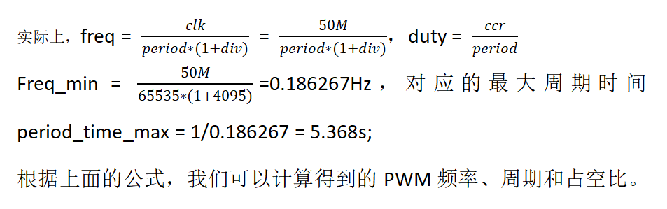

# FPWM 驱动程序

## 1. 概述

PWM（Pulse Width Modulation）简称脉宽调制，是利用微处理器的数字输出来对模拟电路进行控制的一种非常有效的技术，广泛应用在测量、通信、工控等方面。

## 2. 功能

pwm控制器驱动提供了pwm的控制访问方法，
- 初始化pwm控制器，配置相关参数，如时钟分频，周期，占空比，输出极性等
- 计数中断与FIFO_EMPTY中断的触发等
- E2000共有8个PWM模块(控制器)，每个模块集成了两个子模块pwm0和pwm1，我们习惯性的称为channel0和channel1，在死区输出模式配置为bypass时，这两个channel可以作为两路独立的pwm输出使用，在非bypass模式下，则输出为死区配置，此时需要选择输入源是channel0还是channel1，然后配置对应项即可

驱动相关的源文件包括
```
.
├── fpwm_g.c
├── fpwm_hw.c
├── fpwm_hw.h
├── fpwm_intr.c
├── fpwm_sinit.c
├── fpwm.c
└── fpwm.h
```

## 3. 配置方法

以下部分将指导您完成 fpwm 驱动的软件配置:

- 初始化pwm控制器
- 配置pwm的两个通道的输出模式，以及是否死区输出等
- 注册中断处理函数，使能中断
- pwm的周期，频率，占空比设置方法如下：


e2000的参考时钟是50M，freq为频率，duty为占空比，1/freq就是周期；
perioad对应寄存器FPWM_PERIOD_OFFSET，div对应FPWM_TIM_CTRL_OFFSET寄存器中的DIV，ccr对应寄存器FPWM_CCR_OFFSET；

## 4 应用示例

### [pwm波形输出](../../../baremetal/example/peripheral/pwm)

## 5. API参考

### 5.1. 用户数据结构

- fpwm控制数据

```c
typedef struct
{
    FPwmConfig config;/* Pwm配置 */
    u32 is_ready;/* Pwm初始化完成标志 */

	u8 channel_ctrl_enable[2];	/* pwm channel ctrl enable state */

	FPwmIntrEventHandler event_handler[FPWM_INTR_EVENT_NUM];  /* event handler for interrupt */
    void *event_param[FPWM_INTR_EVENT_NUM];   /* parameters ptr of event handler */
	
} FPwmCtrl;
```

- fpwm配置数据，FPwmConfig主要是pwm控制器id、基地址和中断号，FPwmDbVariableConfig主要包括用户可配置的死区参数，包括死区输出模式、输出极性、输入源选择、上下沿延迟等，FPwmVariableConfig主要包含pwm的输出参数，包括分频、周期、占空比、极性等

```c
typedef struct 
{	
  	u8 instance_id;/* pwm id */
	uintptr db_base_addr;
	uintptr pwm_base_addr;
	
	u64 base_clk;
	u32 irq_num;    	/* pwm irq num*/
    u32 irq_prority;	/* pwm irq priority */
  	const char *instance_name;/* instance name */

}FPwmConfig;/* Pwm配置 */; 

typedef struct 
{
	FPwmDbPolarity db_polarity_sel;
	FPwmDbOutMode db_out_mode;
	FPwmDbInMode db_in_mode;
	u16 db_fall_cycle;
	u16 db_rise_cycle;
}FPwmDbVariableConfig; 

typedef struct 
{
	u8 tim_ctrl_enable;/* pwm time ctrl enable state */
	FPwmTimCtrlMode tim_ctrl_mode;
	u16 tim_ctrl_div;
	u16 pwm_period;
	FPwmCtrlMode pwm_mode;
	FPwmPolarity pwm_polarity;
	FPwmDutySourceMode pwm_duty_source_mode;
	u16 pwm_pulse;

}FPwmVariableConfig;
```

- 死区输出模式
```c
typedef enum
{
	FPWM_DB_OUT_MODE_BYPASS = 0b00,
	FPWM_DB_OUT_MODE_FORBID_RISE = 0b01,
	FPWM_DB_OUT_MODE_FORBID_FALL = 0b10,
	FPWM_DB_OUT_MODE_ENABLE_RISE_FALL = 0b11,
	FPWM_DB_OUT_MODE_NUM
} FPwmDbOutMode;
```

- fpwm duty比较值来源选择
```c
typedef enum
{
	FPWM_DUTY_CCR = 0,
	FPWM_DUTY_FIFO = 1,

	FPWM_DUTY_SEL_MODE_NUM
	
} FPwmDutySourceMode;;
```

- fpwm中断事件类型
```c
typedef enum
{
    FPWM_INTR_EVENT_COUNTER = 0,    /**< Handler type for counter interrupt */
    FPWM_INTR_EVENT_FIFO_EMPTY = 1, /**< Handler type for fifo empty interrupt*/
    FPWM_INTR_EVENT_NUM
} FPwmIntrEventType;

```

### 5.2  错误码定义

- FPWM_SUCCESS                执行成功 
- FPWM_ERR_INVAL_PARM         参数无效
- FPWM_ERR_NOT_READY          驱动未初始化
- FPWM_ERR_TIMEOUT            超时
- FPWM_ERR_NOT_SUPPORT        不支持
- FPWM_ERR_CMD_FAILED         执行失败

### 5.3. 用户API接口

#### FPwmLookupConfig

- 获取Fata控制器默认配置

```c
const FPwmConfig *FPwmLookupConfig(u32 instance_id);
```

Note:

- 获取默认配置参数，包括基地址、中断号等

Input:

- {u32} instance_id，pwm控制器id号

Return:

- {const FPwmConfig *} pwm默认配置，返回NULL如果找不到默认配置

#### FPwmCfgInitialize

- 初始化fpwm控制器, 使之可以使用

```c
FError FPwmCfgInitialize(FPwmCtrl *pctrl, const FPwmConfig *input_config_p);
```

Note:

- 输入配置通过FPwmLookupConfig获取，用户按照需要修改后传入此函数

Input:

- {FPwmCtrl} *pctrl，pwm驱动控制数据
- {FPwmConfig} *input_config_p，pwm用户输入配置

Return:

- {FError} 驱动初始化的错误码信息，FPWM_SUCCESS 表示初始化成功，其它返回值表示初始化失败

#### FPwmDbVariableSet

- 设置pwm死区输出的配置参数

```c
FError FPwmDbVariableSet(FPwmCtrl *pctrl, FPwmDbVariableConfig *db_cfg);
```

Note:

- 设置指定pwm控制器的死区可配置参数，包括死区输出模式、输出极性、输入源选择、上下沿延迟等

Input:

- {FPwmCtrl} *pctrl，pwm驱动控制数据
- {FPwmDbVariableConfig} *db_cfg，pwm死区参数配置

Return:

- {FError} 驱动初始化的错误码信息，FPWM_SUCCESS 表示初始化成功，其它返回值表示初始化失败

#### FPwmVariableSet

- 设置pwm通道的参数，使能该通道

```c
FError FPwmVariableSet(FPwmCtrl *pctrl, u32 channel, FPwmVariableConfig *pwm_cfg);
```

Note:

- 设置指定pwm控制器的指定通道的分频、周期、占空比、极性，使能该通道

Input:

- {FPwmCtrl} *pctrl，pwm驱动控制数据
- {u32} channel，pwm通道号
- {FPwmVariableConfig} *pwm_cfg，pwm通道配置

Return:

- {FError} 驱动初始化的错误码信息，FPWM_SUCCESS 表示初始化成功，其它返回值表示初始化失败


#### FPwmPulseSet

- 设置pwm通道的占空比比较值

```c
FError FPwmPulseSet(FPwmCtrl *pctrl, u32 channel, u16 pwm_ccr);
```

Note:

- 设置指定pwm控制器的指定通道的占空比比较值

Input:

- {FPwmCtrl} *pctrl，pwm驱动控制数据
- {u32} channel，pwm通道号
- {u16} pwm_ccr，占空比比较值

Return:

- {FError} 驱动初始化的错误码信息，FPWM_SUCCESS 表示初始化成功，其它返回值表示初始化失败

#### FPwmEnable

- 使能pwm控制器

```c
void FPwmEnable(FPwmCtrl *pctrl, u32 channel);
```

Note:

- 使能指定pwm控制器的指定通道

Input:

- {FPwmCtrl} *pctrl，pwm驱动控制数据
- {u32} channel，pwm通道号

Return:

- {FError} 驱动初始化的错误码信息，FPWM_SUCCESS 表示初始化成功，其它返回值表示初始化失败

#### FPwmRegisterInterruptHandler

- 注册pwm中断事件函数

```c
void FPwmRegisterInterruptHandler(FPwmCtrl *instance_p, FPwmIntrEventType event_type, 
                                    FPwmIntrEventHandler handler, void *param);
```

Note:
- 无

Input:
- {FPwmCtrl} *instance_p，fpwm驱动控制数据
- {FPwmIntrEventType} event_type，中断事件类型
- {FPwmIntrEventHandler} handler，中断事件回调函数
- {void} *param，回调函数参数

Return:
- 无

#### FPwmIntrHandler

- pwm中断处理函数入口

```c
void FPwmIntrHandler(s32 vector, void *args);
```

Note:
- 根据中断类型，设置对应的回调函数和参数传入

Input:
- {s32} vector
- {void} *param, 输入参数，指向fpwm驱动控制数据

Return:
- 无
