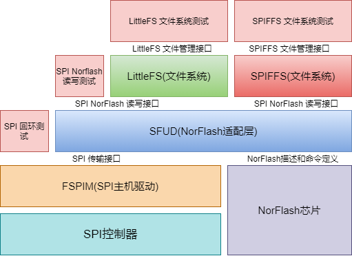

# FSPIM 驱动程序

## 1. 概述


- SPI 总线是一种4线总线，提供了一种高速、高效率的串行通信技术。SPI 通信通常有一个主设备和一个或多个从设备，需要至少4根线，它们是 MISO（主设备数据输入）、MOSI（主设备数据输出）、SCLK（时钟）、CS（片选）

- 其中，CS是从芯片是否被主芯片选中的控制信号，SCLK提供时钟脉冲，SDI，SDO则基于此脉冲完成数据传输

- 本驱动程序提供了FT2000/4、D2000平台的SPI主设备功能

- FT2000/4、D2000上包含 2 个通用 SPI 接口，仅作为通用 SPI 主设备使用，外部最多挂载 4 个 SPI 从设备


## 2. 功能


- 驱动相关的源文件如下，
- drivers/spi/fspim

```
.
├── fspim.c
├── fspim.h
├── fspim_g.c
├── fspim_hw.c
├── fspim_hw.h
├── fspim_intr.c
├── fspim_options.c
└── fspim_sinit.c
```

- FSPIM 常用于读写Nor-flash，其应用可以参考以下结构，最底层的硬件是 SPI 主机控制器和 Nor-flash, 其上由 FSPIM 驱动和 SFUD 提供 Spi Nor-flash的读写接口，面向SPI文件系统，如 LittleFS 和 SPIFFS，文件系统提供负载均衡、坏块检测和断电保护等特性，并为上层应用提供文件创建/读写等接口，使用方法参考`4 应用示例` 



## 3. 配置方法


以下部分将指导您完成 FSPIM 驱动的软件配置:

### 3.1 使用 SFUD 通用SPI协议框架

- 使能 CONFIG_USE_FSPIM 和 CONFIG_USE_SFUD 配置
- 初始化 SFUD 框架
- 调用 SFUD 提供的 API 读写 SPI 从设备

关于 SFUD 框架的使用，可以参考[sfud.md](./sfud.md)

### 3.2 不使用 SFUD 通用SPI协议框架

- 使能 CONFIG_USE_FSPIM 配置
- 初始 FSPIM 驱动
- 调用 FSPIM 提供的 API 读写 SPI 从设备，需要按照 SPI 从设备的手册实现相关的命令和协议

## 4 应用示例

### [SPI 回环测试](../../../baremetal/example/peripheral/spi/fspim_loopback/README.md)

### [SPI Norflash读写测试](../../../baremetal/example/storage/spi_sfud/README.md)

### [SPI Norflash文件系统测试-LittleFS](../../../baremetal/example/storage/littlefs_test/README.md)

### [SPI Norflash文件系统测试-SPIFFS](../../../baremetal/example/storage/spiffs_test/README.md)

## 4. API参考

### 4.1 用户数据结构

- SPIM 驱动配置数据
```c
typedef struct
{
    u32                  instance_id;  /* Device instance id */
    uintptr              base_addr;    /* Device base address */
    u32                  irq_num;      /* Device intrrupt id */
    u32                  irq_prority;  /* Device intrrupt priority */    
    FSpimSlaveDevice     slave_dev_id; /* Slave device id */
    u32                  max_freq_hz;  /* Clock frequency in Hz */
    FSpimTransByte       n_bytes;      /* Bytes in transfer */
    FSpimCpolType        cpol;         /* Polarity of the clock */
    FSpimCphaType        cpha;         /* Phase of the clock */
    boolean              en_test;      /* Enable test mode */
} FSpimConfig;
```

- SPIM 驱动控制数据
```c
typedef struct
{
    FSpimConfig         config;      /* Current active configs */
    u32                 is_ready;    /* Device is initialized and ready */
    u32                 length;      /* Data length in transfer */
    const void          *tx_buff;    /* Tx buffer beg */
    void                *rx_buff;    /* Rx buffer beg */
    const void          *tx_buff_end; /* Tx buffer end */
    void                *rx_buff_end; /* Rx buffer end */
    u32                 tx_fifo_len;  /* Depth of tx fifo */
    u32                 rx_fifo_len;  /* Depth of rx fifo */
    FSpimEvtHandler     evt_handler[FSPIM_INTR_EVT_NUM];  /* event handler for interrupt */
    void                *evt_param[FSPIM_INTR_EVT_NUM];   /* parameters ptr of event handler */
} FSpim;
```

- SPI 从设备ID，最多支持4个从设备
```c
enum
{
    FSPIM_SLAVE_DEV_0 = 0,
    FSPIM_SLAVE_DEV_1,
    FSPIM_SLAVE_DEV_2,
    FSPIM_SLAVE_DEV_3,

    FSPIM_NUM_OF_SLAVE_DEV
};
```

- 一次 SPI 传输的数据量，一个字节或者两个字节
```c
enum
{
    FSPIM_1_BYTE = 1,
    FSPIM_2_BYTE = 2,

    FSPIM_MAX_BYTES_NUM
};
```

- SPI传输，选择接收/发送
```c
enum
{
    FSPIM_TRANS_MODE_RX_TX = 0x0,
    FSPIM_TRANS_MODE_TX_ONLY = 0x1,
    FSPIM_TRANS_MODE_RX_ONLY = 0x2,
    FSPIM_TRANS_MODE_READ_EEPROM = 0x3,

    FSPIM_TRANS_MODE_MAX
};
```

- SPI的时钟极性和相位
```c
enum
{
    FSPIM_CPOL_LOW  = 0,
    FSPIM_CPOL_HIGH
};

enum
{
    FSPIM_CPHA_1_EDGE = 0,
    FSPIM_CPHA_2_EDGE
};
```

### 4.2 错误码定义

- 模块错误码编号：0x1060000
- [0x0] FSPIM_SUCCESS : fspim success
- [0x1060000] FSPIM_SUCCESS : fspim success
- [0x1060001] FSPIM_ERR_INVAL_STATE : fspim invalid state
- [0x1060002] FSPIM_ERR_NOT_READY : fspim driver not ready
- [0x1060003] FSPIM_ERR_INVAL_PARAM : fspim invalid input parameters
- [0x1060004] FSPIM_ERR_BUS_BUSY : fspim bus is busy
- [0x1060005] FSPIM_ERR_NOT_SUPPORT : fspim not support operation
- [0x1060006] FSPIM_ERR_TIMEOUT : fspim wait timeout

### 4.3 用户API接口

#### FSpimLookupConfig

- 获取FSPIM驱动的默认配置参数

```c
const FSpimConfig *FSpimLookupConfig(u32 instance_id)
```

Note:

- 用户可以通过此接口获取驱动默认配置的副本，进行修改后，作为`FSpimCfgInitialize`函数的入参使用

Input:

- u32 instance_id, 选择的FSPIM控制器实例号

Return:

- const FSpimConfig *, 返回的默认驱动配置，返回NULL表示失败


#### FSpimCfgInitialize

- 完成FSPIM驱动实例的初始化，使之可以使用

```c
FError FSpimCfgInitialize(FSpim *instance_p, const FSpimConfig *cofig_p);
```

Note:

- 此函数会重置FSPIM控制器和FSPIM控制数据

Input:

- FSpim *instance_p, FSPIM驱动控制数据

- const FSpimConfig *input_config_p, FSPIM驱动配置数据

Return:

- FError, 驱动初始化的错误码信息，FSPIM_SUCCESS 表示初始化成功，其它返回值表示初始化失败

#### FSpimDeInitialize

- 完成FSPIM驱动实例去初始化，之后不能使用

```c
void FSpimDeInitialize(FSpim *instance_p)
```

Note:

- 此函数会重置FSPIM控制数据

Input:

- FSpim *instance_p, FSPIM驱动控制数据

Return:

无

#### FSpimTransferPollFifo
- 先发送后接收数据 (阻塞处理)，利用Fifo进行处理

```c
FError FSpimTransferPollFifo(FSpim *instance_p, const void *tx_buf, void *rx_buf, fsize_t len);
```

Note:

- 使用此函数前需要确保FSPIM驱动初始化成功
- 从函数不会使用中断，会按照TX FIFO的深度进行传输，每次发送填满TX FIFO后触发发送/接收动作

Input:

- FSpim *instance_p, FSPIM驱动控制数据

- const void *tx_buf, 写缓冲区，可以为空，为空时表示只关注读数据，此时驱动会发送0xff读数据

- void *rx_buf, 读缓冲区, 可以为空，为空时表示值关注写数据，此时SPI总线上返回的数据会被抛弃

- fsize_t len, 进行传输的长度，如果tx_buf或者rx_buf不为空，则两个buf的长度必须为len

Return:

- FError, 驱动初始化的错误码信息，FSPIM_SUCCESS 表示数据交换成功，其它返回值表示交换失败

#### FSpimTransferByInterrupt

- 先发送后接收数据 (中断处理)，利用Fifo进行处理

```c
FError FSpimTransferByInterrupt(FSpim *instance_p, const void *tx_buf, void *rx_buf, fsize_t len);
```

Note:

- 使用此函数前需要确保FSPIM驱动初始化成功
- 此函数会安装TX FIFO的深度进行传输，每次发送填满TX FIFO后在中断中处理发送/接收动作，用户需要注册FSPIM_INTR_EVT_RX_DONE事件，传输过程中用户处理其它任务，等待传输完成后从tx_buf和rx_buf中读数据

Input:

- FSpim *instance_p, FSPIM驱动控制数据

- const void *tx_buf, 写缓冲区，可以为空，为空时表示只关注读数据，此时驱动会发送0xff读数据

- void *rx_buf, 读缓冲区, 可以为空，为空时表示值关注写数据，此时SPI总线上返回的数据会被抛弃

- fsize_t len, 进行传输的长度，如果tx_buf或者rx_buf不为空，则两个buf的长度必须为len

Return:

- FError, 驱动初始化的错误码信息，FSPIM_SUCCESS 表示数据交换成功，其它返回值表示交换失败

#### FSpimInterruptHandler

- SPIM中断处理函数 

```c
void FSpimInterruptHandler(s32 vector, void *param);
```

Note:

- 此函数给用户注册在中断处理模块中，从而在中断触发时进行处理
- 使用此函数前，用户需要打开部分中断屏蔽位

Input:

- s32 vector, 中断向量号，此处不关心此参数

- void *param, 中断输入参数, 指向FSPIM的驱动控制实例

Return:

无

#### FSpimRegisterIntrruptHandler
- SPIM中断事件注册函数

```c
void FSpimRegisterIntrruptHandler(FSpim *instance_p, u32 evt, FSpimEvtHandler handler, void *param)
```

Note:

- 此函数与FSpimInterruptHandler配套使用，为中断处理注册事件回调函数

Input:

- FSpim *instance_p, FSPIM驱动控制数据

- u32 evt, 中断事件号码，参考FSPIM_INTR_EVT_NUM

- FSpimEvtHandler handler, 中断事件回调函数

- void *param, 中断事件回调函数的入参，取决于中断事件回调函数的实现

Return:

无

#### FSpimErrorToMessage

- 获取FSPIM驱动错误码 

```c
const char *FSpimErrorToMessage(FError error);
```

Note:

无

Input:

- FError error, FSPIM模块错误码

Return:

const char *, FSPIM模块错误码对应的信息

#### FSpimSetChipSelection

- 获取FSPIM驱动错误码 

```c
void FSpimSetChipSelection(FSpim *instance_p, boolean on);
```

Note:

无

Input:

- {FSpim} *instance_p, 驱动控制数据
- {boolean} on, TRUE: 片选打开, FALSE: 片选关闭

Return:

- 无
