# 工程编译构建软件使用文档

## 一、概述

本节例程主要向开发者介绍如何利用SDK 自带脚本与构建工具一步一步完成工程的搭建

## 二、单核工程构建

### 1. 编写makefile文件

在工程目录下创建一个新的 `makefile`文件，并按照下列步骤进行编辑：

- 设置 `PROJECT_DIR`变量，该变量应指向当前工程的路径,需要使用绝对路径。
- 设置 `SDK_DIR`变量，该变量用于指定使用的sdk的路径，如需更换sdk，只需修改此变量，需要使用绝对路径。
- 设置 `USER_CSRC`变量，该变量应包含开发者需要添加并且参与编译的C语言源代码的名称，应使用相对于 `PROJECT_DIR`的相对路径名。
- 设置 `USER_CXXSRC`变量，该变量应包含开发者需要添加并且参与编译的C++语言源代码的名称，应使用相对于 `PROJECT_DIR`的相对路径名。
- 设置 `USER_ASRC`变量，该变量应包含开发者需要添加并且参与编译的汇编语言源代码的名称，应使用相对于 `PROJECT_DIR`的相对路径名。
- 设置 `EXTEND_CSRC`变量，该变量应包含开发者需要添加并且参与编译的C语言源代码的名称，该变量为外部扩展的源代码，请使用绝对地址。
- 设置 `EXTEND_CXXSRC`变量，该变量应包含开发者需要添加并且参与编译的C++语言源代码的名称，该变量为外部扩展的源代码，请使用绝对地址。
- 设置 `EXTEND_ASRC`变量，该变量应包含开发者需要添加并且参与编译的汇编语言源代码的名称，该变量为外部扩展的源代码，请使用绝对地址。
- 设置 `USER_INCLUDE`变量，该变量应包含开发者需要引用的自定义头文件的绝对路径。
- 引用 `include $(SDK_DIR)/tools/build/makeall.mk`。

```makefile
PROJECT_DIR = $(CURDIR)
SDK_DIR = $(CURDIR)/../../../..


USER_CSRC := main.c
USER_CSRC += $(wildcard  src/*.c)
USER_CSRC += $(wildcard  ../common/*.c)

USER_ASRC := 
USER_CXXSRC := 

USER_INCLUDE := $(PROJECT_DIR)	\
				$(PROJECT_DIR)/inc \
				$(PROJECT_DIR)/../common


include $(SDK_DIR)/tools/build/makeall.mk
```

### 2. 编写kconfig文件

在工程目录下创建一个新的 `kconfig`文件，并按照下列步骤进行编辑：

- 添加一个顶级菜单 `mainmenu`。
- 添加一个kconfig配置项的依赖 `source "$(SDK_DIR)/standalone.kconfig"`。

```c
mainmenu "Phytium Baremetal Configuration"

source "$(SDK_DIR)/standalone.kconfig"
```

### 3. 添加sdkconfig文件

在工程目录下添加一个新的、空白的 `sdkconfig`文件。

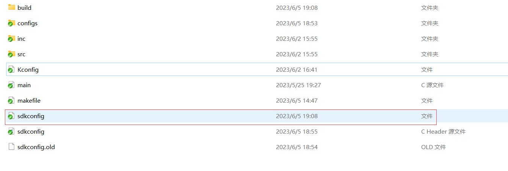

    图1. 添加 sdkconfig

### 4. 配置工程

运行 `make menuconfig`命令，按照下列步骤进行配置：

- 在 `Arch Configuration`中选择目标架构，例如 `armv8`。
- 在 `Arm architecture configuration`中选择对应的执行状态。
- 在 `Soc configuration`中选择对应soc，并选择调试uart。
- 在 `Sdk common configuration`中选择 `Debug log level`，确定调试打印的等级。
- 在 `Drivers configuration`中选择需要参与编译的外设。
- 在 `Third-party configuration`中选择第三方仓库的配置。
- 在 `User configuration`设置board和project的命名，这两个命名将会影响kconfig备份以及镜像输出的命名。
- 在 `Build setup`中的 `Linker Options`中选择”Use sdk default linker script“，并根据实际情况配置。


   图2. make menuconfig 效果图

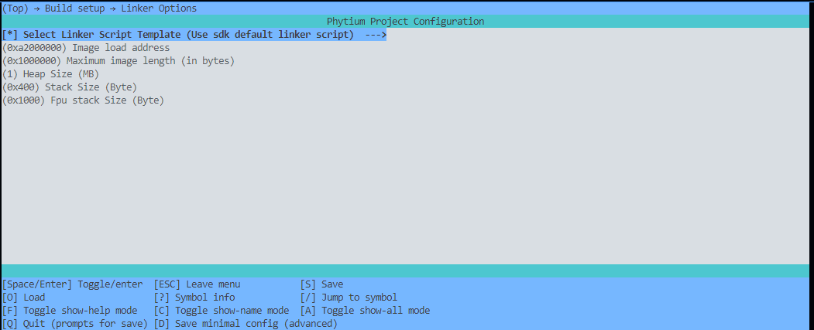

 图3. 链接脚本配置效果图

### 5. 编译和调试

完成基础配置后，可以使用以下命令对代码进行编译和调试：

- 使用 `make + 'table'`按键可以查看支持哪些目标。
- 使用 `make backup_kconfig`备份已经完成的配置项。
- 使用 `make list_kconfig`查看当前工程支持哪些已经备份好的配置项，kconfig配置项的命名方式为 `soc名称_执行状态_板子命名_项目命名`。
- 使用 `make load_kconfig l=<kconfig configuration files>`加载已经备份好的配置项。
- 使用 `make xxx.a`，单独编译某个特定的模块，例如 `libarch.a`。
- 使用 `make`指令，完整编译一个工程。

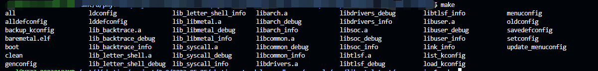

    图4. make +'table' 效果图

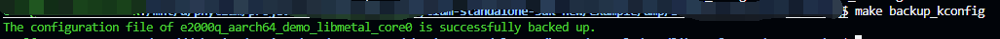

    图5. make`backup_kconfig` 备份现有配置效果图

### 6. 编译调试

当编译过程出现问题时，可以使用以下方式进行调试：

- 使用 `make `libuser_debug，对用户模块进行预编译。
- 使用 `make xxx_info`，对模块编译条件进行打印。

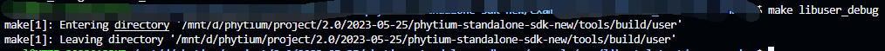

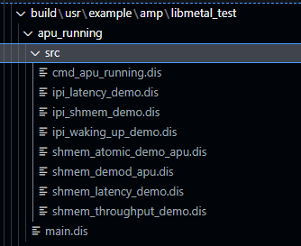

  图6. make `libuser_debug` 对用户的代码进行预编译

## 三、多核工程构建

若需要构建一个多核工程，可以按照以下的步骤进行：

### 1. 编写makefile文件

在一个独立的目录下创建一个新的 `makefile`文件，并进行如下配置：

- 设置 `PROJECT_DIR`变量，该变量应指向当前工程的路径,需要使用绝对路径。
- 设置 `SDK_DIR`变量，该变量用于指定当前引导程序会使用的sdk的路径，如需更换sdk，只需修改此变量，需要使用绝对路径。
- 设置 `AMP_PATH`变量，该变量表示需要参与多核构建的工程路径
- 引用 `include $(SDK_DIR)/tools/build/amp_makeall.mk`。

```makefile
PROJECT_DIR = $(CURDIR)

SDK_DIR = $(CURDIR)/../../..


AMP_PATH += $(PROJECT_DIR)/apu_running
AMP_PATH += $(PROJECT_DIR)/rpu_running

include $(SDK_DIR)/tools/build/amp_makeall.mk

USR_BOOT_DIR	?= /mnt/d/tftboot
```

如图5 所示，如果需要建立多核异构工程，可以按照图中的结构构建

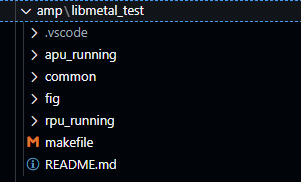

图5. 多核异构程序文件结构

### 2. 配置工程

多核工程会引入一个boot 程序会根据每个多核工程中配置信息自动将工程加载至指定的核心之上,多核工程的配置需要按照以下几个步骤进行：

    1. 在每个参与构建的工程中，使用make menuconfig ，配置当前工程工作的核心位置，以及当前工程特定的链接加载地址

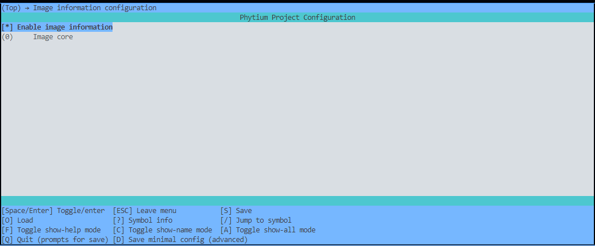

图6. 镜像工作核心配置

    2. 在每个参与构建的工程中，使用make menuconfig ,将所有参与构建的工程的soc 内容进行统一

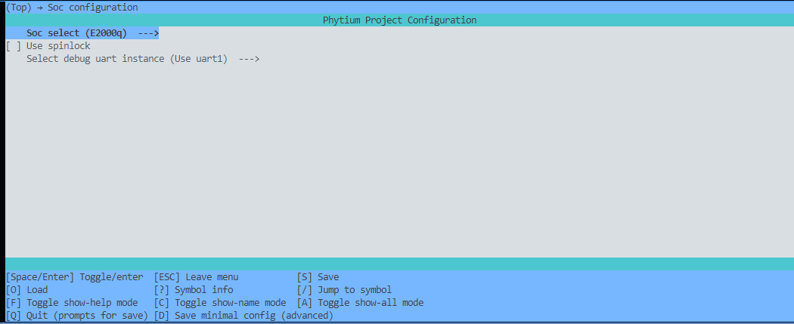

图7. 镜像soc配置

3. 在每个参与构建的工程中，使用make menuconfig ,将所有参与构建的工程的cpu 架构 内容进行统一

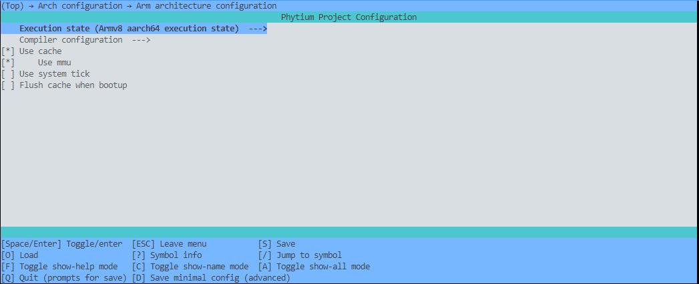

图8. 执行架构配置

    4. 在多核工程的根目录下通过,make menuconfig 配置boot 程序,要求与其他参与构建的工程在soc 与 cpu架构方面保持一致

### 3. 编译调试过程

    多核构建工具具备工程镜像检查功能,会对soc\cpu架构 和 链接加载地址方面的问题进行检查,本节将会从一些具体的问题现象上指导开发者,如何调整自己多核异构的方案

Q : 当出现下图问题时

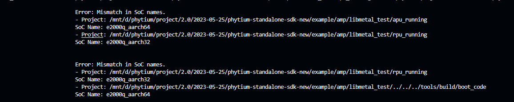

A: 此问题为soc 对应的执行状态不一致导致,其中rpu_runing 工程的执行状态为aarch32 ,需要将其与其他工程进行统一

Q: 当出现下图问题时

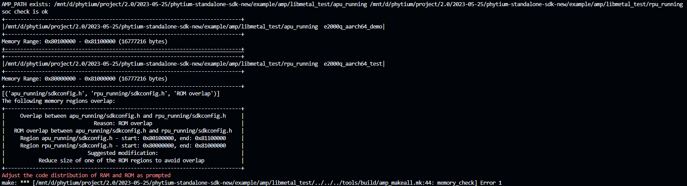

A:  此问题的原因是 apu_runing 与 rpu_runing 的工程中加载地址存在重叠的情况,请调整两个工程,以达到合适的区间

Q: 当出现下图问题时

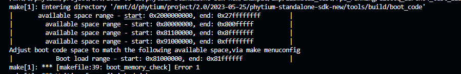

A: 此问题的原因是,boot 的加载地址与其他工程的地址存在冲突,此时在多核的根目录下通过make menuconfig 指令重新调整boot 程序的链接地址，以保证链接地址能够在上图的范围之内。

# 四、结语

完成以上步骤后，即可成功构建单核或多核工程。如果在使用过程中遇到问题，可以查阅相关文档或者与我们的技术团队联系。
