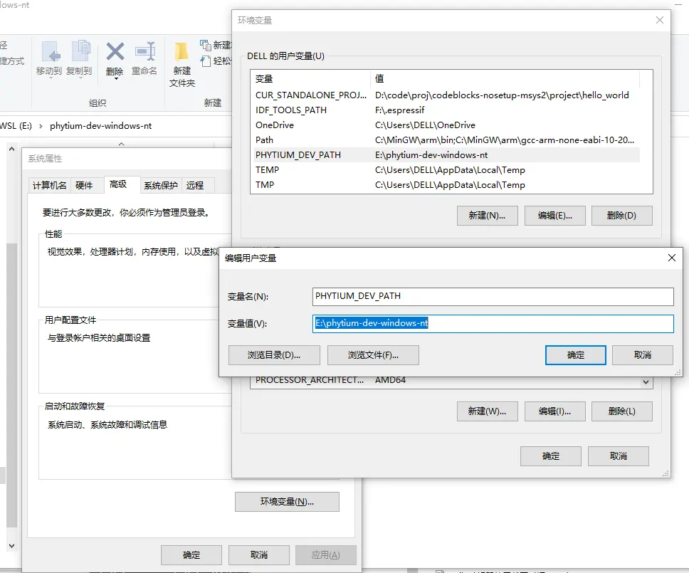
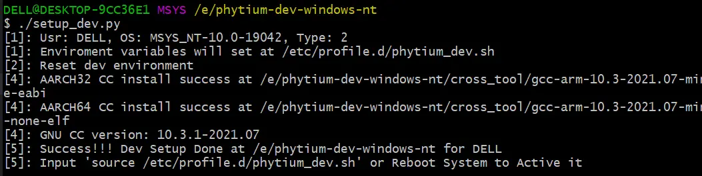
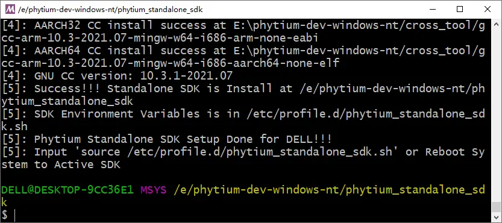
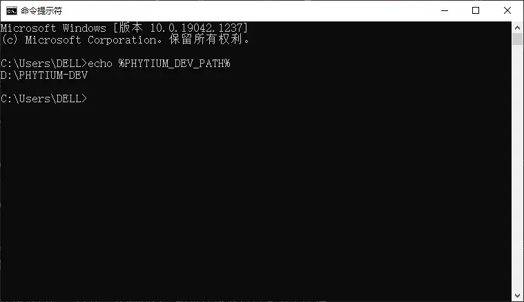
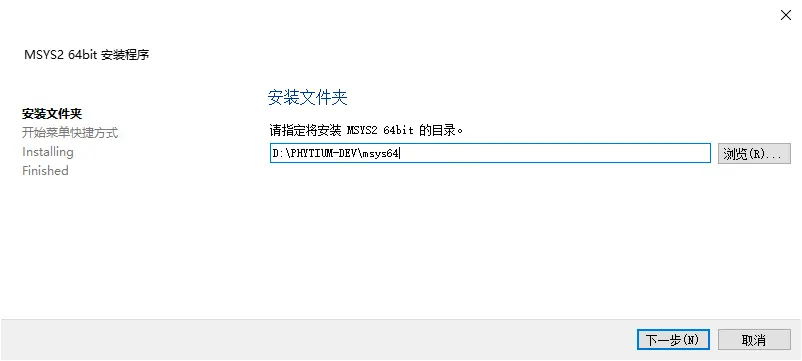
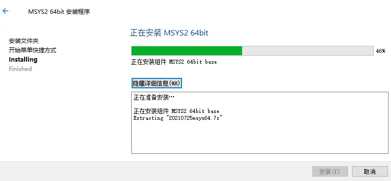
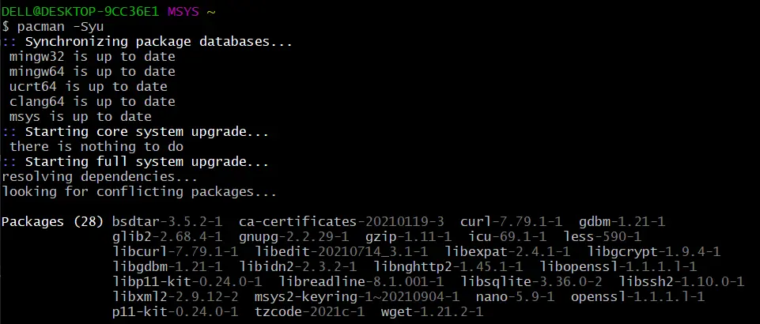

# 1. Windows10 SDK安装方法

Windows 10 SDK开发环境集成了，
- `msys64`，Msys2 portable环境, 主要提供Windows上的shell命令行开发环境，包括了Cygwin （POSIX 兼容性层） 和 MinGW-w64（从"MinGW-生成"）
- `setup_dev.py`, 安装脚本，主要的功能包括创建sdk的profile文件，创建`PHYTIUM_DEV_PATH`环境变量，通过git拉取SDK源码，以及完成SDK安装
- `gcc-arm-10.3-2021.07-mingw-w64-i686-aarch64-none-elf.tar.xz`和`gcc-arm-10.3-2021.07-mingw-w64-i686-arm-none-eabi.tar.xz`, mingw64交叉编译链, SDK安装过程中会被解压到DEV目录的`cross_tool`目录下
- `tftp`, tftp工具, 提供tftp服务，用于开发板下载二进制镜像文件，主要的功能包括安装tftp32服务和配置tftp目录
- `run_msys2.cmd`，用于打开和配置msys2 shell的脚本，需要设置`PHYTIUM_DEV_PATH`后才能使用
- `run_tftd.cmd`，用于打开tftpd工具的脚本，需要设置`PHYTIUM_DEV_PATH`后才能使用
- `tftp/reinstall.cmd`, 用于安装和配置tftpd服务的脚本
- `tftp/uninstall.cmd`, 用于卸载tftpd服务的脚本

## 1.1 获取SDK的开发环境

- [Windows10](https://pan.baidu.com/s/1V96isNcPq4F7nKi3_8GoGg) 
>提取码：WX64

- Windows环境下可以用通用的unzip工具解压，如7zip和winrar

## 1.2 安装SDK开发环境

- (1). 添加Windows环境变量，`PHYTIUM_DEV_PATH`(环境变量名**不能自定义**)，例如，指向文件夹`E:\phytium-dev-windows-nt`（可以自定义）



- (2). 进入DEV目录，双击脚本`run_msys2.cmd`, 进入msys2控制台, 运行`./setup_dev.py`，注册开发环境



-（3). DEV目录注册完成后，通过git拉取Phytium Standalone SDK的代码，如

```
git clone https://gitee.com/phytium_embedded/phytium-standalone-sdk.git ./phytium-standalone-sdk
```

- (4). 进入Phytium Standalone SDK代码目录，运行`./install.py`

```
cd ./phytium-standalone-sdk
./install.py
```



- (5). 安装完成后重启系统

### Q: 如果当前环境无法连接互联网

- 在执行第（2）步前，需要手动下载Phytium Standalone SDK，放置在DEV目录下
- https://gitee.com/phytium_embedded/phytium-standalone-sdk


## 1.3 检查安装是否成功

- 打印下列环境变量，观察各变量是否存在，指向的目录是否正确
> `PHYTIUM_DEV_PATH`指向DEV目录

> `STANDALONE_SDK_ROOT`指向SDK源文件目录

> `AARCH32_CROSS_PATH`指向32位交叉编译链目录

> `AARCH64_CROSS_PATH`指向64位交叉编译链目录

```
echo $PHYTIUM_DEV_PATH $STANDALONE_SDK_ROOT $AARCH32_CROSS_PATH $AARCH64_CROSS_PATH 
```

- 环境变量打印正确无误，表示**安装成功**
## 1.4 Windows 10安装Msys2（可选）

- (1). 获取[Windows环境安装包](https://pan.baidu.com/s/17WX5hec7t8_ubAKzFCwQAA)

> 提取码：MGW6

- msys2, `msys2-x86_64-20210725.exe`
- mingw64-arm交叉编译链, `gcc-arm-10.3-2021.07-mingw-w64-i686-arm-none-eabi.tar.xz`, `gcc-arm-10.3-2021.07-mingw-w64-i686-aarch64-none-elf.tar.xz`
- tftp工具，`tftp.zip`

- (2). 创建Windows集成开发环境（DEV目录），如`D:/phytium-dev`, 将DEV目录添加在Windows环境变量中，变量名为`PHYTIUM_DEV_PATH`，如下图所示，保存环境变量，

> 对于Windows 10，在桌面左下角系统搜索框中输入“环境变量”即可进入环境变量编辑界面

> DEV目录中不要留空格


- (3). 保存DEV环境变量后，打开一个控制台，输入`echo %PHYTIUM_DEV_PATH%`，检查环境变量是否设置成功，



- (4). 双击`msys2-x86_64-20210725.exe`，设置`Msys2`的安装路径在DEV路径下，其余设置按默认安装，注意安装完成后不要马上启动，最后一步取消勾选“马上启动Msys2”





- (5). `Msys2`安装完成后，需要添加国内软件源，否则下载速度会很慢，进入`D:\phytium-dev\msys64\etc\pacman.d`目录下，找到以下三个文件，在文件末尾分别添加对应的软件源

- mirrorlist.mingw32
```
Server = https://mirrors.tuna.tsinghua.edu.cn/msys2/mingw/i686
```

- mirrorlist.mingw64
```
Server = https://mirrors.tuna.tsinghua.edu.cn/msys2/mingw/x86_64
```

- mirrorlist.msys
```
Server = https://mirrors.tuna.tsinghua.edu.cn/msys2/msys/$arch
```

- (6). 进入`D:\phytium-dev\msys64`目录，双击`msys2_shell.cmd`启动运行`Msys2`，输入以下命令，更新`Msys2`软件，安装必要组件

> 如果执行失败，可以多次尝试，直到没有报错

> 安装过程全部选用默认方式`default`或选择`y`，注意如果没有`default = all`，需要输入`y`

```
$ pacman -Syu
$ pacman -S  mingw-w64-x86_64-toolchain
$ pacman -S  base-devel git python3 python3-pip
```



- (7). 运行以下命令，检查组件是否安装完全
```
$ pacman -Q make git wget python3 python3-pip
```

## 1.5 卸载开发环境

- 在DEV目录下双击`run_msys2.cmd`, 启动`Msys2`控制台，在控制台输入`./uninstall.py`完成SDK卸载

- 在`Msys2`控制台运行`rm /etc/profile.d/phytium_standalone_sdk.sh`，删除SDK配置文件

- 在DEV目录`D:\phytium-dev\tftp`下以**管理员权限**打开Windows命令行中断，运行`uninstall.cmd`完成Tftd卸载

- 重启系统完成卸载