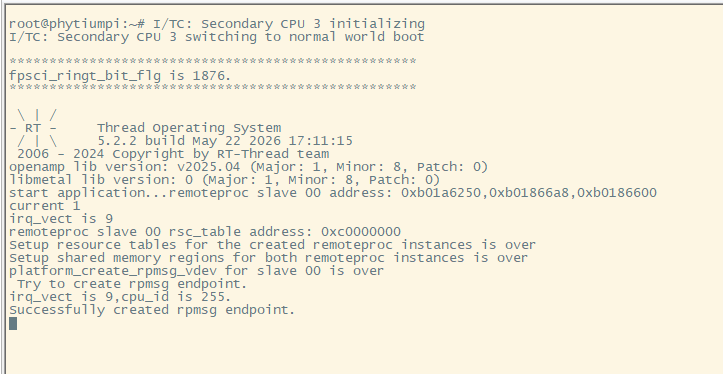
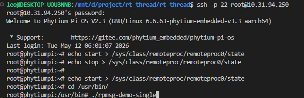
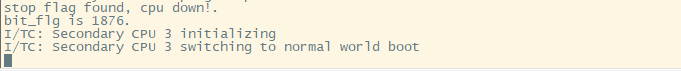
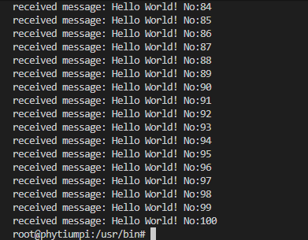
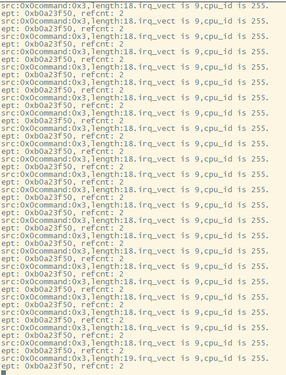
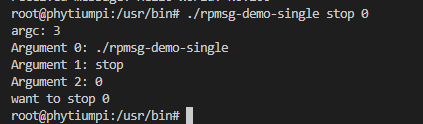
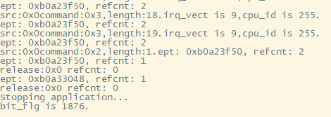

# 飞腾E2000Q开发板上运行RT-Thread OpenAMP应用（方案采用3个核心运行Linux + 1个核心运行RT-Thread）

## 1. 前提条件

### master core(linux端)

- 关于飞腾嵌入式linux的内核配置和测试代码，请参考[open-amp](https://gitee.com/phytium_embedded/phytium-embedded-docs/tree/master/open-amp)

1. 编译Linux内核文档参考《飞腾嵌入式OpenAMP技术解决方案与用户操作手册v1.7.1.pdf》

### slaver core(rt-thread端)

- 实现方式为linux端通过动态加载elf文件的方法，将编译出含rt-thread的elf文件加载到指定核心中运行，实现rt-thread与linux在飞腾E2000Q上同时运行并且实现信息交互，其中linux可以动态控制rt-thread核心运行和停止等操作，并且可以重复加载elf文件实现核心功能的热插拔，无需断电烧录。

1. 异构核rt-thread的编译依赖，依据本例程文档，替换《飞腾嵌入式OpenAMP技术解决方案与用户操作手册v1.7.1.pdf》中描述的裸机standalone的源码，编译生成rtthread_a64.elf文件。

> 注：因为rt-thread的openamp的版本与飞腾嵌入式linux内核已经适配的openamp版本存在差异问题，考虑到飞腾后续修改适配工作量和可维护性，本例程并未采用rt-thread的第三方openamp版本，而是采用飞腾裸机standalone使用openamp移植版本。具体参阅[多元异构系统部署 V1.1](https://gitee.com/phytium_embedded/phytium-standalone-sdk/tree/master/example/system/amp)

## 2. 运行效果

- 编译完成后，将编译生成的rtthread_a64.elf（目前rt-thread只进行了aarch64适配）文件拷贝到linux端的/lib/firmware目录下并改名为openamp_core0.elf文件，使用命令将其加载到slaver core中运行。

如下图(串口工具打印)：



- 通过网络ssh登录linux端(rt-thread会占用串口)，使用命令强制停止rt-thread的核心运行：





- 停止后我们再次运行加载elf文件运行rt-thread，此时我们通过ssh登录linux端，使用命令查看是否创建rpmsg设备：

```bash
ls /sys/bus/rpmsg/devices/
```

如果存在`virtio0.rpmsg-openamp-demo-channel.-1.0`文件，则表示建立了rpmsg设备,再使用命令绑定。

```bash
echo rpmsg_chrdev > /sys/bus/rpmsg/devices/virtio0.rpmsg-openamp-demo-channel.-1.0/driver_override
modprobe rpmsg_char
```

### 交互测试：

- 绑定成功后，我们可以使用[open-amp](https://gitee.com/phytium_embedded/phytium-embedded-docs/tree/master/open-amp)目录下的例子程序进行测试，以rpmsg-demo-single.c为例(通过gcc编译出rpmsg-demo-single文件，目前暂时只支持rt-thread单核,aarch64架构)测试结果如下图：

1.交互消息测试

```bash
./rpmsg-demo-single
```

linux端：



rt-thread端：



2.停止消息测试

```bash
./rpmsg-demo-single stop 0
```

linux端：



rt-thread端：



> 注：通过发送消息使rt-thread的核心停止运行后，linux端仍然需要使用命令回收资源：

```bash
echo stop > /sys/class/remoteproc/remoteproc0/state
```

- 可以重复加载elf文件实现核心功能的热插拔，无需断电烧录。
