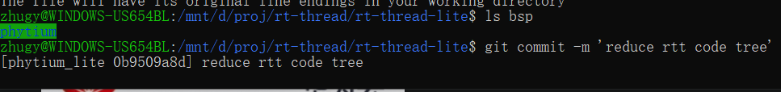
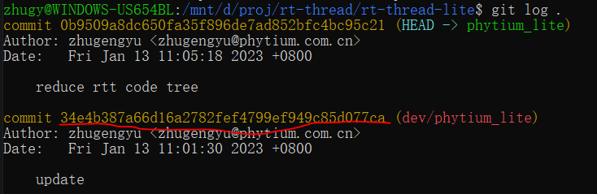
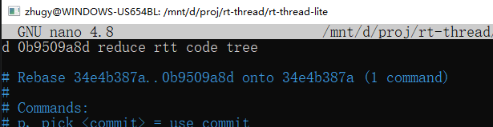
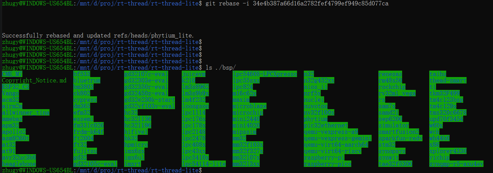

# 背景

- RT-Thread 中有大量代码平常是不需要使用的，这里使用脚本将不使用的代码临时删除，后面又提供了一种方法在需要时恢复

# 精简 RT-Thread 代码

- 首先运行 reduce_rtt_code.py 脚本，用 -i 指定 RT-Thread 完整版代码路径，用 -o 指定输出

```
./reduce_rtt_code.py -i=/mnt/d/proj/rt-thread/rt-thread-base -o=/mnt/d/proj/rt-thread/rt-thread-lite
```


- 进入 rt-thread-lite 目录，然后提交删除动作，记录删除动作前一个 commit 号 

```
git add .
git commit -m 'reduce rtt code tree'
```





# 恢复 RT-Thread 代码

- 需要同步 RT-Thread 基线仓库时，可能需要完整版的代码
- 用 git rebase 撤销删除动作，在交互界面里将 pick 修改为 d，表示删除指定 commit, 然后保存修改

```
git rebase -i <commit-id>
```



- 等待一段时间可以看到原来删除的文件都恢复了




# 删除 tools 文件夹

- lite 工具所在的文件夹在上传社区的时候可能不需要，要收到删除本文件夹