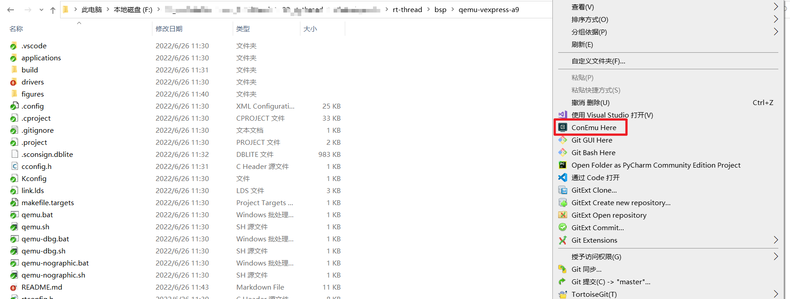
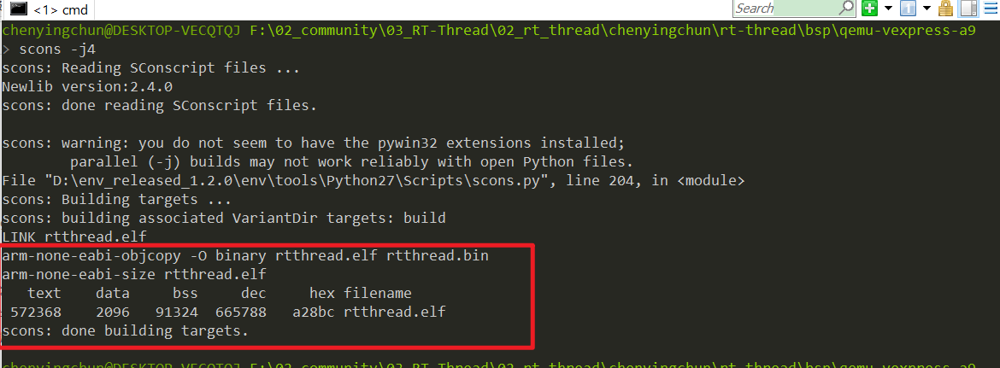
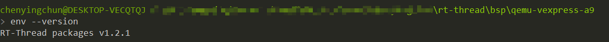
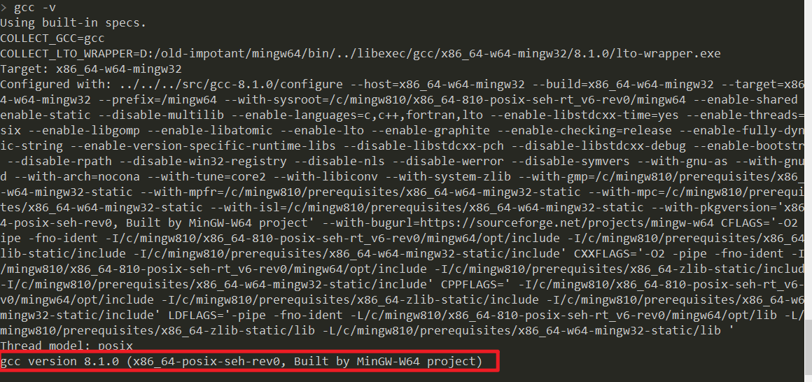
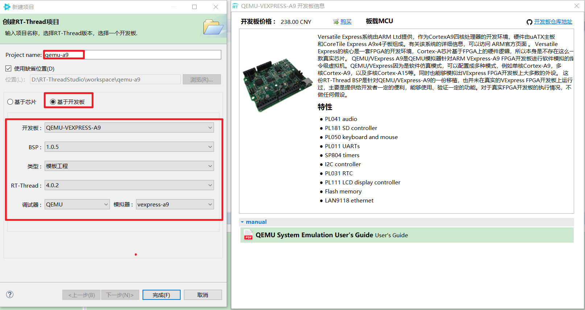
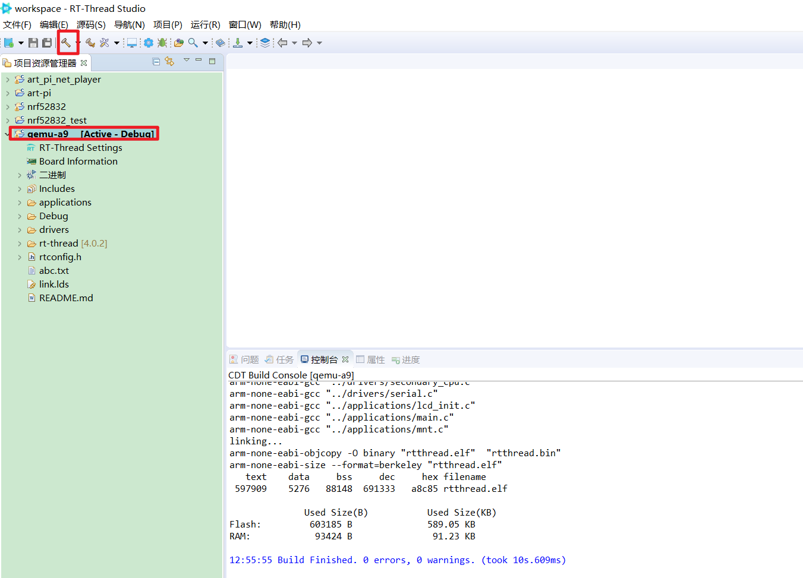
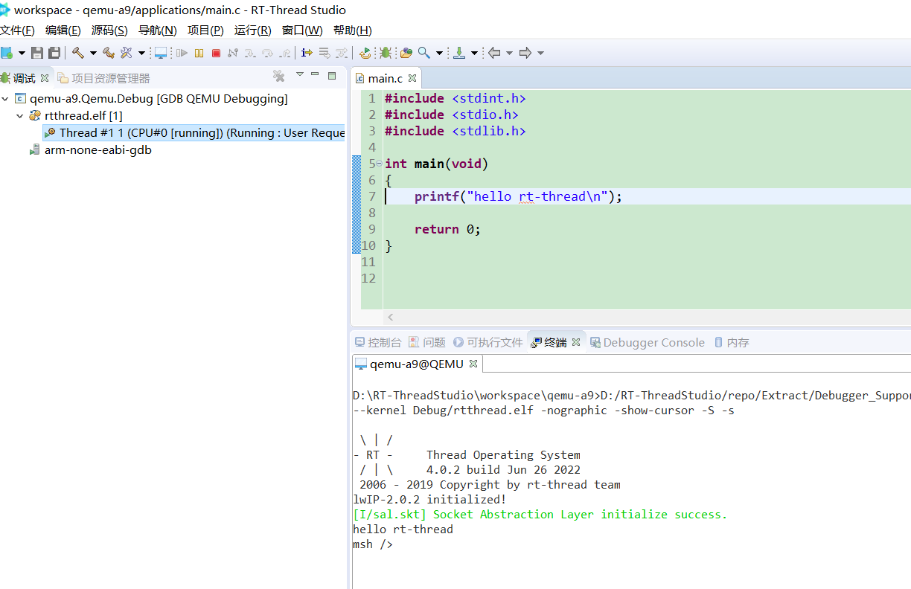
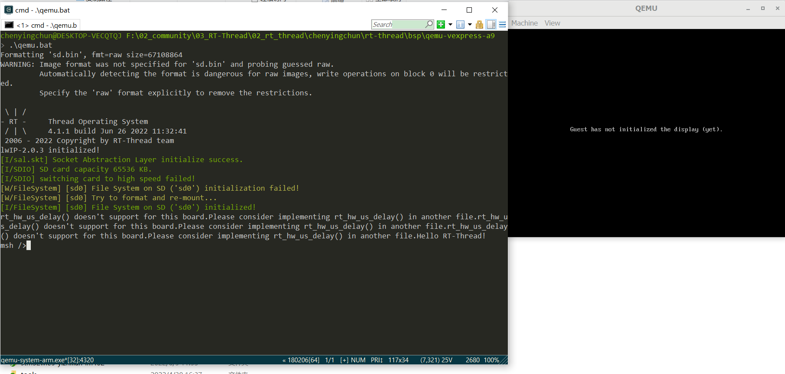
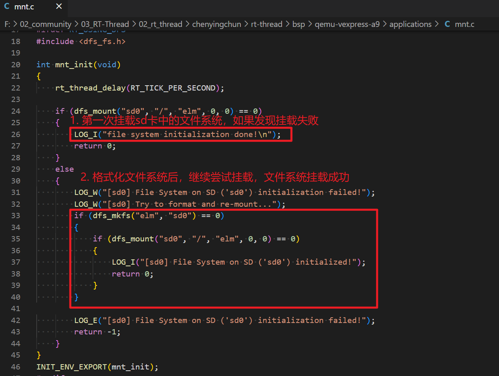
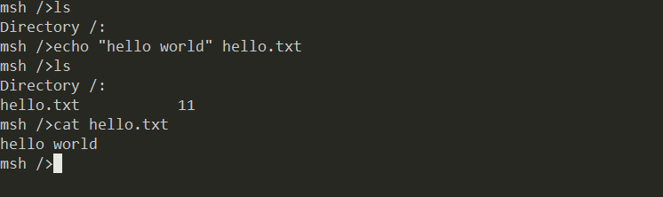

# QEMU VExpress A9板级支持包说明

## 1 简介

- Versatile Express系统由ARM Ltd提供，作为CortexA9四核处理器的开发环境，硬件由uATX主板和CoreTile Express A9x4子板组成。有关该系统的详细信息，可以访问 [ARM官方页面][1] 。

- Versatile Express的核心是一套FPGA的开发环境，Cortex-A芯片基于FPGA上的硬件逻辑，所以本身是不存在这么一款真实芯片。

- QEMU/VExpress A9是QEMU模拟器针对ARM VExpress-A9 FPGA开发板进行软件模拟的指令级虚拟机。QEMU/VExpress因为是软件仿真模式，可以配置成多种模式，例如单核Cortex-A9，多核Cortex-A9，以及多核Cortex-A15等。同时也能够模拟出VExpress FPGA开发板上大多数的外设。

- 这份RT-Thread BSP是针对QEMU/VExpress-A9的一份移植，也并未在真实的VExpress FPGA开发板上运行过，主要是提供给开发者一定的便利，能够使用、验证一定的功能。对于真实FPGA开发板的执行情况，不做任何假设。

当前QEMU/VExpress-A9对应的硬件特性：

| 硬件 | 描述 |
| -- | -- |
| CPU | ARM Cortex-A9（单核） |
| 主频 | NA |
| Memory | 128MB(0x60000000 - 0x68000000) |

## 2 编译说明

- 推荐使用[env工具][2]编译工程，在`bsp/qemu-vexpress-a9`目录中打开env环境，运行命令`scons -j4`




- 如果编译正确无误，会产生rtthread.elf、rtthread.bin文件。在QEMU中一般使用elf方式来运行，所以只需要使用rtthread.elf文件即可。

  


- 当前测试使用的RT-Thread Env版本

  

- 当前测试使用的GCC 交叉编译工具链版本

  

- 如果在Linux下使用，请自行下载[GNU GCC工具链][3]。

## 3 执行和退出

### 3.1 执行脚本文件说明

在这个bsp目录下已经提供了下面几个执行脚本文件，具体的说明如下表所示：

| 执行脚本文件 | 运行平台  |  备注  |
| ------ | ----  | :------:  |
| qemu.bat | Windows | 普通模式启动运行 |
| qemu.sh | Linux | 同上 |
| qemu-dbg.bat | Windows | 调试模式启动运行 |
| qemu-dbg.sh | Linux | 同上 |
| qemu-nographic.bat | Windows | 以不带界面的模式启动运行 |
| qemu-nographic.sh | Linux | 同上 |

### 3.2 RT-Studio IDE下运行RT-Thread

推荐使用该方式进行学习，简单易用

- 创建QEMU工程，创建RT-Thread项目，选择基于开发板，选择QEMU-VEXPRESS-A9

  

- 创建好工程后，点击完成，选中qemu-a9工程，编译工程

  

- 调试工程，发现程序停在了main函数开头处

  

- 点击全速运行，发现程序正常运行起来

  


###  3.3 Windows ENV下运行RT-Thread

#### 3.3.1 启动QEMU运行

- 当要运行编译好的RT-Thread时，可以在bsp目录下运行env，在env中敲入qemu.bat即可直接运行。这个执行脚本默认把串口输出到stdio（即控制台）上，所以直接执行脚本后就可以输出结果了。

- 默认情况下，我们发现已经成功挂载SD卡

  > 注意一下，默认情况下，由于SD中没有文件系统存在，因此挂载失败，程序中检测到文件系统挂载失败后，会自动执行mkfs对文件系统进行格式化操作，格式化完后，再次执行mount操作，文件系统挂载成功

  

  

- 文件系统操作，测试文件系统是否可以正常读写

  

- 当然你也可以尝试使用其他两个**.bat**文件启动运行。

#### 3.3.2 退出QEMU运行

在msh提示输入的状态下，按下 **CTRL+C** ，有以下提示之后，按下 **y** ，即可退出 QEMU 。

```shell
hello rt-thread
msh />
msh />
msh />Terminate batch job (Y/N)? y
```

### 3.4 Windows VSCode 中运行RT-Thread

参考文档：[使用VS Code开发RT-Thread](https://www.rt-thread.org/document/site/#/rt-thread-version/rt-thread-standard/application-note/setup/qemu/vscode/an0021-qemu-vscode?id=%e4%bd%bf%e7%94%a8-vs-code-%e5%bc%80%e5%8f%91-rt-thread)


###  3.5 Linux下执行RT-Thread

#### 3.5.1 安装QEMU工具包

在Linux下调试启动与Windows下稍微有点点区别，由于Windows下安装了**env**工具就自带了**qemu-system-arm**，而Linux下默认是没有这个工具的，所以执行执行`./qemu.sh`会报错：

```shell
bsp/qemu-vexpress-a9$ ./qemu-nographic.sh
./qemu-nographic.sh: line 5: /usr/bin/qemu-system-arm: No such file or directory
```

这个时候需要在Linux平台安装**qemu-system-arm**工具包，以**Linux Ubuntu**平台为例，使用以下命令即可安装对应的工具包：

```shell
bsp/qemu-vexpress-a9$ sudo apt-get install qemu-system-arm
Reading package lists... Done
Building dependency tree       
Reading state information... Done
The following package was automatically installed and is no longer required:
  tinyproxy-bin
Use 'sudo apt autoremove' to remove it.
Suggested packages:
  vde2
The following NEW packages will be installed:
  qemu-system-arm
0 upgraded, 1 newly installed, 0 to remove and 168 not upgraded.
Need to get 0 B/7,722 kB of archives.
After this operation, 36.6 MB of additional disk space will be used.
Selecting previously unselected package qemu-system-arm.
(Reading database ... 159586 files and directories currently installed.)
Preparing to unpack .../qemu-system-arm_1%3a4.2-3ubuntu6.17_amd64.deb ...
Unpacking qemu-system-arm (1:4.2-3ubuntu6.17) ...
Setting up qemu-system-arm (1:4.2-3ubuntu6.17) ...
Processing triggers for man-db (2.9.1-1) ...
```

提示安装成功后，输入查看**qemu-system-arm**版本信息的命令，如果可以看到对应的版本信息，证明它可以正常使用。

```shell
/bsp/qemu-vexpress-a9$ qemu-system-arm --version
QEMU emulator version 4.2.1 (Debian 1:4.2-3ubuntu6.17)
Copyright (c) 2003-2019 Fabrice Bellard and the QEMU Project developers
```

#### 3.5.2 启动QEMU运行

由于Linux平台一般都是不带界面的服务器，所以推荐使用`qemu-nographic.sh`脚本来启动运行，参考运行示例如下：

```shell
bsp/qemu-vexpress-a9$ ./qemu-nographic.sh
WARNING: Image format was not specified for 'sd.bin' and probing guessed raw.
         Automatically detecting the format is dangerous for raw images, write operations on block 0 will be restricted.
         Specify the 'raw' format explicitly to remove the restrictions.
ALSA lib confmisc.c:767:(parse_card) cannot find card '0'
ALSA lib conf.c:4732:(_snd_config_evaluate) function snd_func_card_driver returned error: No such file or directory
ALSA lib confmisc.c:392:(snd_func_concat) error evaluating strings
ALSA lib conf.c:4732:(_snd_config_evaluate) function snd_func_concat returned error: No such file or directory
ALSA lib confmisc.c:1246:(snd_func_refer) error evaluating name
ALSA lib conf.c:4732:(_snd_config_evaluate) function snd_func_refer returned error: No such file or directory
ALSA lib conf.c:5220:(snd_config_expand) Evaluate error: No such file or directory
ALSA lib pcm.c:2642:(snd_pcm_open_noupdate) Unknown PCM default
alsa: Could not initialize DAC
alsa: Failed to open `default':
alsa: Reason: No such file or directory
ALSA lib confmisc.c:767:(parse_card) cannot find card '0'
ALSA lib conf.c:4732:(_snd_config_evaluate) function snd_func_card_driver returned error: No such file or directory
ALSA lib confmisc.c:392:(snd_func_concat) error evaluating strings
ALSA lib conf.c:4732:(_snd_config_evaluate) function snd_func_concat returned error: No such file or directory
ALSA lib confmisc.c:1246:(snd_func_refer) error evaluating name
ALSA lib conf.c:4732:(_snd_config_evaluate) function snd_func_refer returned error: No such file or directory
ALSA lib conf.c:5220:(snd_config_expand) Evaluate error: No such file or directory
ALSA lib pcm.c:2642:(snd_pcm_open_noupdate) Unknown PCM default
alsa: Could not initialize DAC
alsa: Failed to open `default':
alsa: Reason: No such file or directory
audio: Failed to create voice `lm4549.out'

 \ | /
- RT -     Thread Operating System
 / | \     4.1.0 build Nov 24 2021 19:49:17
 2006 - 2021 Copyright by rt-thread team
lwIP-2.1.2 initialized!
[I/sal.skt] Socket Abstraction Layer initialize success.
[I/SDIO] SD card capacity 65536 KB.
[I/SDIO] switching card to high speed failed!
[W/POSIX.delay] Please consider implementing rt_hw_us_delay() in another file.
[W/POSIX.delay] Please consider implementing rt_hw_us_delay() in another file.
[W/POSIX.delay] Please consider implementing rt_hw_us_delay() in another file.
hello rt-thread
msh />
msh />
msh />
```

**注意**： 前面的错误信息可以忽略，能看到RT-Thread的启动logo输出，以及msh能正常输入输出，即可进行代码调试了。

#### 3.5.3 退出QEMU运行

Linux下退出QEMU的方式与Windows下有些不一样；在msh提示输入的状态下，按下 **CTRL+A** ，再按下 **X** ，即可退出 QEMU 。

```shell
hello rt-thread
msh />
msh />
msh />QEMU: Terminated
```


## 4 支持情况

| 驱动 | 支持情况  |  备注  |
| ------ | ----  | :------:  |
| UART | 支持 | UART0/1 |
| SD/MMC | 支持 |  |
| CLCD | 支持 |  |
| Key | 支持 |  |
| Mouse | 支持 |  |
| EMAC | 支持 |  |


## 5 联系人信息

维护人：[bernard][4]  [recan-li][5]

[1]: http://infocenter.arm.com/help/index.jsp?topic=/com.arm.doc.subset.boards.express/index.html
[2]: https://www.rt-thread.org/download.html#download-rt-thread-env-tool
[3]: https://launchpad.net/gcc-arm-embedded/5.0/5-2016-q3-update/+download/gcc-arm-none-eabi-5_4-2016q3-20160926-linux.tar.bz2
[4]: https://github.com/BernardXiong
[5]: https://github.com/recan-li
