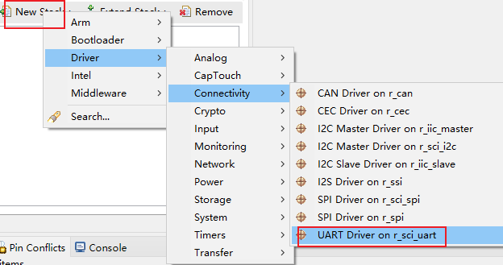
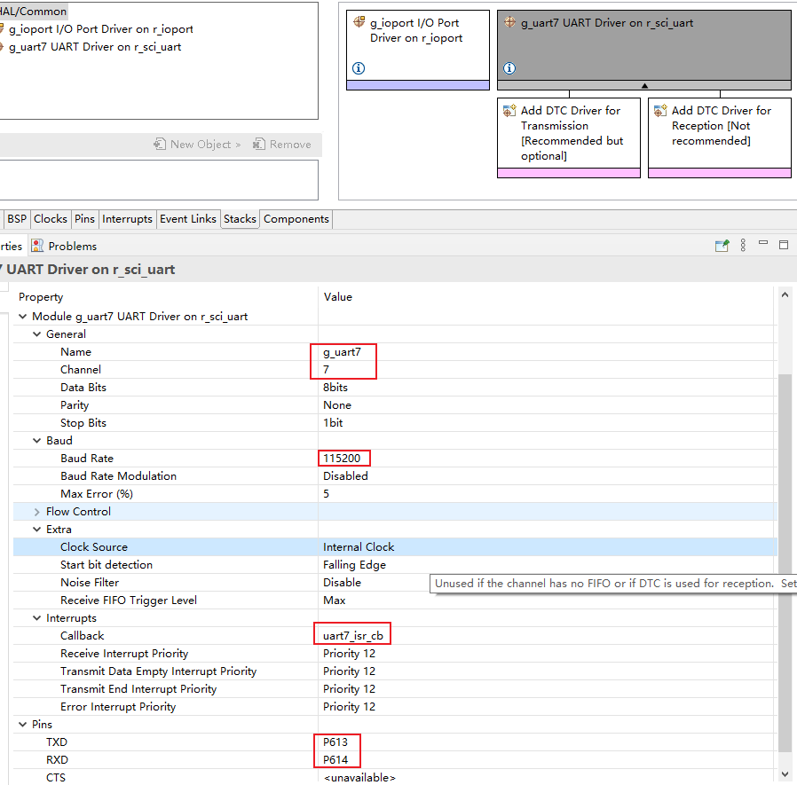
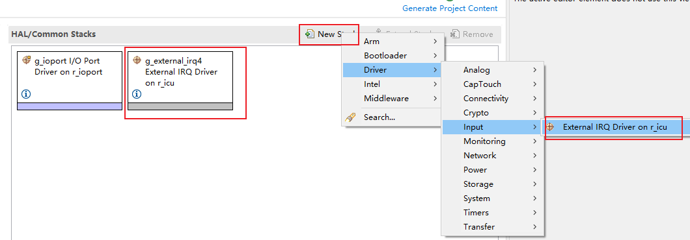
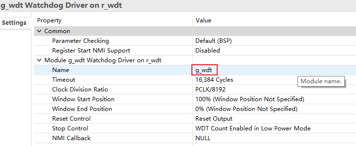
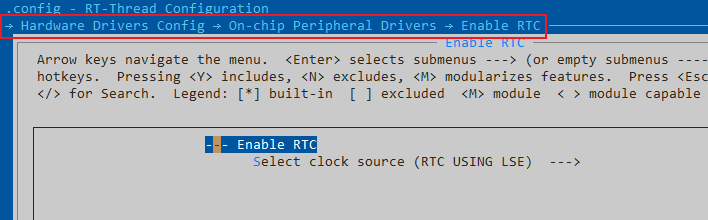
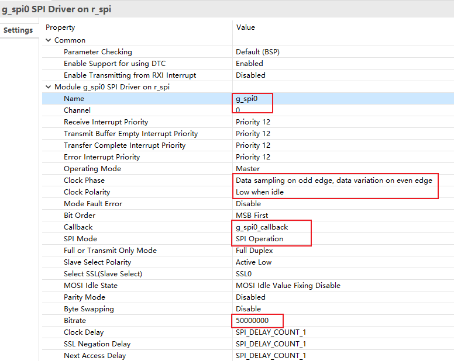
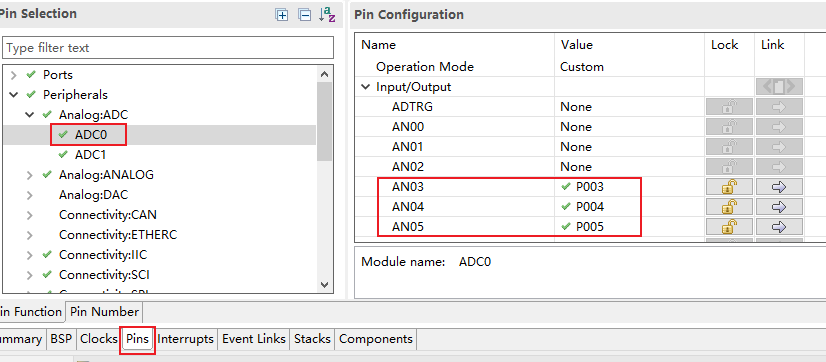

## 在 MDK 中使用 FSP

1. 打开 MDK，选择 “Tools -> Customize Tools Menu…”
2. 点击 “new” 图标，添加一条自定义命令: RA Smart Configurator
3. Command 输入工具的安装路径， 点击“…”找到安装路径下的“rasc.exe”文件并选中 (setup_fsp_v3_1_0_rasc_ 安装目录下)
4. Initial Folder 输入参数: $P
5. Arguments 输入参数: --device $D --compiler ARMv6 configuration.xml
6. 点击 OK 保存命令“Tools -> RA smart Configurator”


7. 点击添加的命令打开配置工具：RA Smart Config


## UART

如何添加一个 UART 端口外设配置？

1. 选择 Stacks 配置页，点击 New Stack 找到 UART。



2. 配置 UART 参数，因为需要适配 RT-Thread 驱动中使用的命名，所以需要修改命名，设置 **name** 、**channel**  、**callback** 是一致的标号。



## GPIO 中断

如何添加一个 IO 中断？

1. 选择引脚编号，进入配置，比如选择 P402 做为中断引脚。


  2. 打开 ICU 中断通道 IRQ4


  3. 创建 stack 并进入配置。因为需要适配 RT-Thread 驱动中使用的命名，所以需要修改命名，设置 **name** 、**channel**  、**callback** 是一致的标号。选择你希望的触发方式。最后保存配置，生成配置代码。




4. 测试中断是否能够成功开启

   ```c
   
   void irq_callback_test(void *args)
   {
       rt_kprintf("\n Irq4 triggered \n");
   }
   
   void icu_sample(void)
   {
       /* 初始化P*/
       rt_uint32_t pin = rt_pin_get("P402");
       rt_kprintf("\n pin number : 0x%04X \n", pin);
       rt_err_t err = rt_pin_attach_irq(pin, PIN_IRQ_MODE_RISING, irq_callback_test, RT_NULL);
       if(RT_EOK != err)
       {
           rt_kprintf("\n attach irq failed. \n");
       }
       err = rt_pin_irq_enable(pin, PIN_IRQ_ENABLE);
       if(RT_EOK != err)
       {
           rt_kprintf("\n enable irq failed. \n");
       }
   }
   MSH_CMD_EXPORT(icu_sample, icu sample);
   ```

## WDT

1. 创建 WDT 


2. 配置 WDT，需要注意在 RT-Thread 中只是用了一个 WDT 设备，所以没有对其进行编号，如果是新创建的 WDT 设备需要注意 name 字段，在驱动中默认使用的是 `g_wdt` 。



3. 如何在 ENV 中打开 WDT 以及 [WDT 接口使用说明](https://www.rt-thread.org/document/site/#/rt-thread-version/rt-thread-standard/programming-manual/device/watchdog/watchdog)


## RTC

1. 添加 RTC 设备


2. 配置 RTC，需要注意在 RT-Thread 中只是用了一个 RTC 设备，所以没有对其进行编号，如果是新创建的 RTC 设备需要注意 name 字段，在驱动中默认使用的是 `g_rtc` 。


3.  如何在 ENV 中打开 RTC 以及[ RTC 接口使用说明](https://www.rt-thread.org/document/site/#/rt-thread-version/rt-thread-standard/programming-manual/device/rtc/rtc) 




## Flash

1. 创建 Flash


2. 配置 Flash，需要注意在 RT-Thread 中只使用了一个 flash 设备，所以没有对其进行编号，如果是新创建的 flash 设备需要注意 name 字段，在驱动中默认使用的是 `g_flash` 。


3. 如何在 ENV 中打开 Flash


## SPI

1. 添加一个 SPI 外设端口


2. 配置 channel、name、Clock Phase、Clock Polarity、Callback、 SPI Mode 等参数，波特率在代码中可通过 API 修改，这里可以设置一个默认值。



3. 如何在 ENV 中打开 SPI 以及 [SPI 接口使用说明](https://www.rt-thread.org/document/site/#/rt-thread-version/rt-thread-standard/programming-manual/device/spi/spi)

   


## ADC/DAC

创建 ADC/DAC


- ADC

1. 配置 name、unit、mode，选择扫描的通道编号


2. 配置扫描通道对应的引脚



- DAC

1. 需要先关闭 P014 的默认 mode


2. 开启 DAC0 通道


3. 修改通道号为 0，与 DAC0 对应


