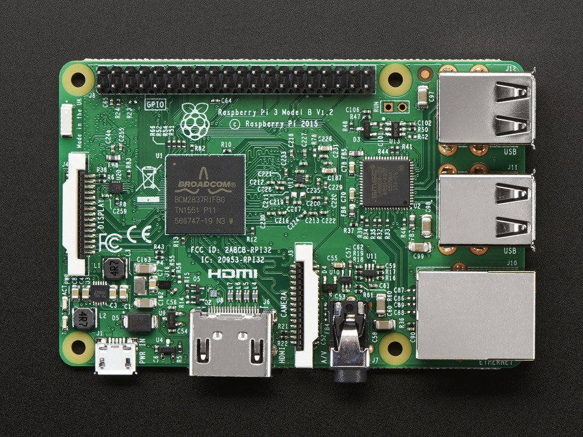
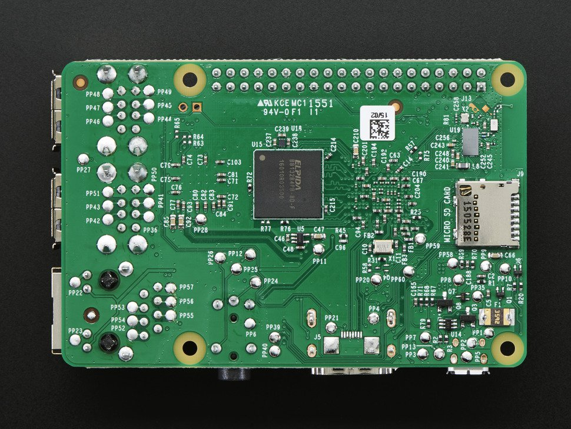
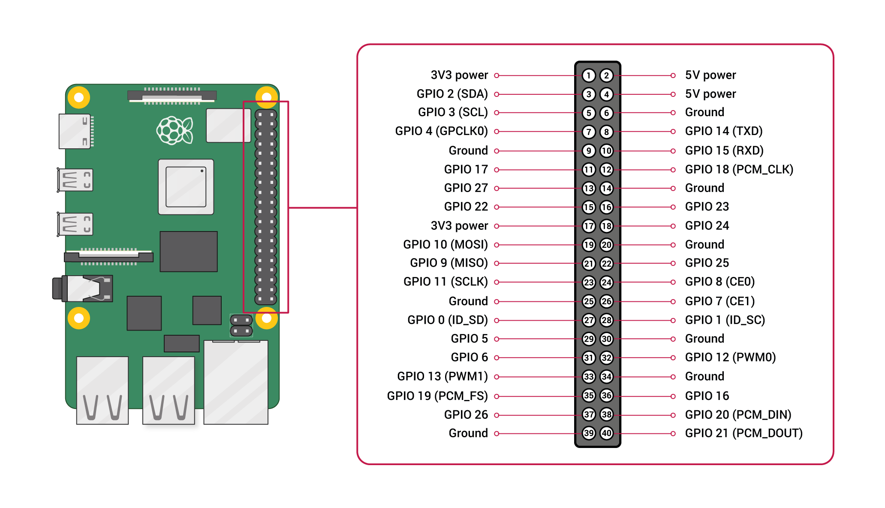

# Raspberry PI 3B(32位)板级支持包说明

## 1. 简介

树莓派由注册于英国的慈善组织“Raspberry Pi 基金会”开发，莓派3采用4核Broadcom BCM2837 (ARMv8)芯片、双核VideoCore IV GPU和1GB内存。

这份RT-Thread BSP是针对 Raspberry Pi 3B （32位）的一份移植，树莓派价格便宜, 使用者甚众，是研究和运行RT-Thread的可选平台之一。

随着RT-Thread的发展，它越来越多的向一些Cortex-A等AP类处理器提供支持，例如全志的ARM9、Cortex-A处理器，Xilinx的Zynq处理器等。

而RT-Thread也是一套高度社区化发展的操作系统，所以在一些方向推进上希望以社区化方式，大家一起来推动的方式向前发展，在这个过程中RT-Thread得到了不同开发者、不同领域的应用，一步步把RT-Thread推向成熟。而在Cortex-A平台上，目前最流行的硬件平台是树莓派，分树莓派[2B](https://www.raspberrypi.org/products/raspberry-pi-2-model-b/)、[3B](https://www.raspberrypi.org/products/raspberry-pi-3-model-b/)以及最新的[4B](https://www.raspberrypi.org/products/raspberry-pi-4-model-b/)等。

RT-Thread对树莓派的支持主要从树莓派2B开始，它是一个四核Cortex-A7的平台，以32位单核的模式运行。后续将推动着RT-Thread向树莓派3，四核Cortex-A53 64位模式发展（中间当然也可能出现四核Cortex-A7模式执行的过渡性版本）。





当前Raspberry Pi 3B对应的硬件特性：

| 硬件   | 描述 |
|------- | ------------------------------- |
|  CPU   | quad-core ARM Cortex A53(ARMv8) |
|  主频  | 1.2 GHz |
| GPU | VideoCore IV |
| GPU频率 | 400MHz |
| Memory | 1GB  (0x0000000 - 0x40000000) |
| | 其中0x3f000000 - 0x40000000为peripheral |

硬件引脚分布情况



## 2. 编译说明

Windows环境下推荐使用[env工具][1]进行编译。

Linux下推荐使用gcc工具 gcc-arm-none-eabi-5_4-2016q3，如果还没有编译工具，下载后，解开文件。

```
tar vxf gcc-arm-none-eabi-5_4-2016q3-20160926-linux.tar.bz2
```

Linux环境下需要修改编译器目录设置，修改`bsp/raspi3-32/rtconfig.py`中的

```
EXEC_PATH = r'/opt/gcc-arm-none-eabi-5_4-2016q3/bin'
```

为编译工具的实际所在目录，这里注意要加上后缀 `/bin`

进入到`rt-thread/bsp/raspi3-32`目录中，运行以下命令：

```
scons
```

来编译这个板级支持包。如果编译正确无误，会产生rtthread.elf、kernel7.img文件。
kernel7.img即是要cp到raspberry SD卡中根目录的文件

### 2.1 eclipse 编码环境 ###
第一步： 安装 eclipse cdt 
第二步： 打开 eclipse cdt 设置workspace ,推荐设置于xxx\xxx\rt-thread\bsp
第三步： Import 工程 General-> Existing Peojects into Workspace 然后 Browse.. 你的raspi3目录，点击Finish

btw:编译依旧使用scons,目前不支持qemu debug,后期如果有大佬实现ARM JTAG调试

## 3. 执行

### 3.1 下载[raspbian镜像][3]，生成可以运行的raspbian SD卡

Windows下，去[etcher.io][4]下载etcher,这是个可以烧写img的工具

解开下载的镜像文件, linux下使用如下的命令

```
unzip 2018-06-27-raspbian-stretch-lite.zip
```

准备一张空SD卡，linux环境下，插入电脑并执行

```
sudo dd if=2018-06-27-raspbian-stretch-lite.img of=/dev/xxx bs=32M conv=fsync
```

**注意: /dev/xxx 要换成真实环境中的SD卡所在设置，千万不要弄错。**

Windows环境下，执行etcher选择解压后的2018-06-27-raspbian-stretch-lite.img文件和SD卡就可以开始烧写了。

最后把kernel7.img放入SD boot分区，覆盖原来的文件。

### 3.2 准备好串口线

目前版本是使用raspi3的 GPIO 14, GPIO 15来作路口输出，连线情况如下图所示：


串口参数： 115200 8N1 ，硬件和软件流控为关。

按上面的方法做好SD卡后，插入树莓派3B，通电可以在串口上看到如下所示的输出信息：

```text
heap: 0x0005d784 - 0x0045d784

 \ | /
- RT -     Thread Operating System
 / | \     4.0.2 build Jan  9 2020
 2006 - 2019 Copyright by rt-thread team
[I/I2C] I2C bus [i2c0] registered
[I/I2C] I2C bus [i2c1] registered
[I/SDIO] SD card capacity 15558144 KB.
found part[0], begin: 1048576, size: 63.0MB
found part[1], begin: 67108864, size: 14.793GB
file system initialization done!
boot cpu:3
msh />cpu = 0x00000003
cpu 3 startup.
start OK: CPU 3
boot cpu:2
cpu = 0x00000002
cpu 2 startup.
start OK: CPU 2
boot cpu:1
cpu = 0x00000001
cpu 1 startup.
start OK: CPU 1
Hello RT-Thread!

msh />
```

## 4. 支持情况

| 驱动 | 支持情况  |  备注  |
| ------ | ----  | :------:  |
| UART | 支持 | UART0|
| GPIO | 支持 | - |
| IIC | 支持 | - |
| SPI | 支持 | - |
| CPU Timer | 支持 | - |
| SD卡驱动 | 支持 | - |
| RTC | 支持 | - |
| WDT | 支持 | - |
| MAILBOX | 支持 | - |
| SMP | 支持 | - |
| FRAMEBUFFER | 支持 | HDMI |

## 5. 联系人信息

维护人：[bernard][5]

[1]: https://www.rt-thread.org/page/download.html
[2]: https://launchpad.net/gcc-arm-embedded/4.8/4.8-2014-q1-update/+download/gcc-arm-none-eabi-4_8-2014q1-20140314-linux.tar.bz2
[3]: https://downloads.raspberrypi.org/raspbian_lite_latest
[4]: https://etcher.io
[5]: https://github.com/BernardXiong
