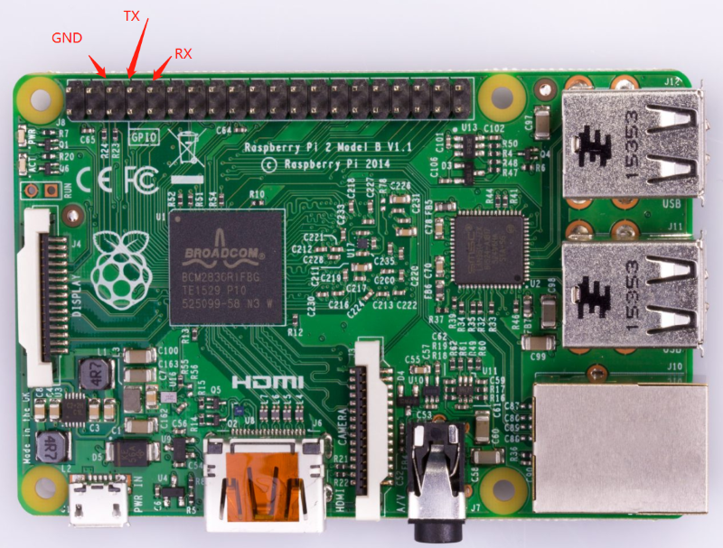

# Raspberry PI 3-64板级支持包说明

## 1. 简介

树莓派由注册于英国的慈善组织“Raspberry Pi 基金会”开发，莓派3有三个发行版本：

* B : 4核 Broadcom BCM2837 (ARMv8-A) 1.2GHz，双核VideoCore IV GPU，1GB内存，100 Base-T Ethernet
* B+: 4核 Broadcom BCM2837B0 Cortex-A53 (ARMv8) 1.4GHz, 1GB LPDDR2 SDRAM， GigaE over USB 2.0
* A+: 4核 Broadcom BCM2837B0 Cortex-A53 (ARMv8) 1.4GHz, 512MB LPDDR2 SDRAM

这份RT-Thread BSP是针对 Raspberry Pi 3 64位模式的一份移植，树莓派价格便宜, 使用者甚众，是研究和运行RT-Thread的可选平台之一。


## 2. 编译说明

### 2.1 Window上的环境搭建

Windows环境下推荐使用[env工具][1]进行编译。

首先下载windows上的aarch64的gcc交叉编译工具，版本为gcc-arm-8.3选择aarch64-elf就可以。

将推荐将gcc解压到`\env\tools\gnu_gcc\arm_gcc`目录下。

接着修改`bsp\raspberry-pi\raspi3-64\rtconfig.py`

修改路径：

```
EXEC_PATH = r'E:/env_released_1.1.2/env/tools/gnu_gcc/arm_gcc/gcc-arm-8.3-2019.03-i686-mingw32-aarch64-elf/bin'
```

然后在`bsp\raspberry-pi\raspi3-64\`下输入scons编译即可。

**window环境搭建注意**

下载完成`gcc-arm-8.3-2019.03-i686-mingw32-aarch64-elf.tar.xz`交叉编译工具链后，最好采用7-zip解压工具进行两次解压。
确保解压目录下的`/bin/aarch64-elf-ld.exe`文件的size不为0。
否则编译会出现如下错误:

```
collect2.exe:fatal error:CreateProcess:No such file or directory
```

### 2.2 Linux上的环境搭建

Linux下推荐使用[gcc工具][2]。Linux版本下gcc版本可采用`gcc-arm-8.3-2019.03-x86_64-aarch64-elf`。

直接进入`bsp\raspberry-pi\raspi3-64`，输入scons编译即可。


## 3. 执行

### 3.1 下载[raspbian镜像][3]，生成可以运行的raspbian SD卡

Windows下，去[etcher.io][4]下载etcher,这是个可以烧写img的工具

解开下载的镜像文件, linux下使用如下的命令

```
unzip 2018-06-27-raspbian-stretch-lite.zip
```

准备一张空SD卡，linux环境下，插入电脑并执行

```
sudo dd if=2018-06-27-raspbian-stretch-lite.img of=/dev/xxx bs=32M conv=fsync
```

**注意: /dev/xxx 要换成真实环境中的SD卡所在设置，千万不要弄错。**

Windows环境下，执行etcher选择解压后的2018-06-27-raspbian-stretch-lite.img文件和SD卡就可以开始烧写了。

最后把kernel8.img放入SD boot分区，删除其它 kernel*.img。

### 3.2 准备好串口线

目前版本是使用raspi3的 GPIO 14, GPIO 15来作路口输出，连线情况如下图所示(图片中的板子是pi2，GPIO引脚是一样的)：



串口参数： 115200 8N1 ，硬件和软件流控为关。

按上面的方法做好SD卡后，插入树莓派，通电可以在串口上看到如下所示的输出信息：

```text
 heap: 0x00020b20 - 0x00400000

 \ | /
- RT -     Thread Operating System
 / | \     3.1.0 build Aug 23 2019
 2006 - 2019 Copyright by rt-thread team
Hello RT-Thread!
msh >
```

## 4. 支持情况

| 驱动 | 支持情况  |  备注  |
| ------ | ----  | :------:  |
| UART | 支持 | UART0|
| GPIO | 支持 | - |
| I2C | 支持 | - |
| RTC | 支持 | - |
| SDIO | 支持 | SDCARD |
| SPI | 支持 | - |
| TIMER | 支持 | - |
| WDT | 支持 | - |
| MBOX | 支持 | - |
| FRAMEBUFFER | 支持 | HDMI |

## 5. 联系人信息

维护人：[bigmagic123][5]

[1]: https://www.rt-thread.org/page/download.html
[2]: https://developer.arm.com/tools-and-software/open-source-software/developer-tools/gnu-toolchain/gnu-a/downloads
[3]: https://downloads.raspberrypi.org/raspbian_lite_latest
[4]: https://etcher.io
[5]: https://github.com/bigmagic123
