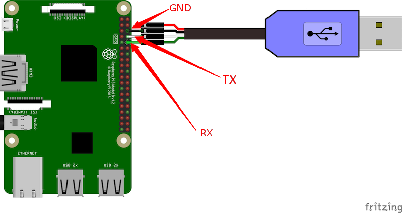

# Raspberry PI 4板级支持包说明

## 1. 简介

树莓派4B的核心处理器为博通BCM2711（四核1.5GHz，Cortex A72架构，树莓派3是四核A53）。LPDDR4内存，由5V/3A USB-C供电或GPIO 5V。

外设支持上，引入了双频Wi-Fi，蓝牙5.0，千兆网卡，MIPI CSI相机接口，两个USB口，40个扩展帧。

这份RT-Thread BSP是针对 Raspberry Pi 4的一份移植，树莓派价格便宜, 使用者甚众，是研究和运行RT-Thread的可选平台之一。


## 2. 编译说明

推荐使用[env工具](https://www.rt-thread.org/page/download.html)，可以在console下进入到`bsp\raspberry-pi\raspi4-32`目录中，运行以下命令：

```
scons
```

来编译这个板级支持包。如果编译正确无误，会产生rtthread.elf、kernel7.img文件。


## 3. 环境搭建
### 3.1 准备好串口线

目前版本是使用raspi4的 GPIO 14, GPIO 15来作路口输出，连线情况如下图所示：



串口参数： 115200 8N1 ，硬件和软件流控为关。

### 3.2 RTT固件放在SD卡运行

首先需要准备一张空的32GB以下的SD卡，如果不想自己制作启动固件，可以直接从百度网盘上下载boot的固件。

```
链接：https://pan.baidu.com/s/1PxgvXAChUIOgueNXhgMs8w 
提取码：pioj 
```

解压后将sd目录下的文件拷贝到sd卡即可。以后每次编译后，将生成的kernel7.img进行替换即可。上电后可以看到程序正常运行。

### 3.3 RTT程序用uboot加载

为了调试方便，已经将uboot引导程序放入uboot目录下，直接将这些文件放到sd卡中即可。

需要注意的以下步骤：

**1.电脑上启动tftp服务器**

windows系统电脑上可以安装tftpd搭建tftp服务器。将目录指定到`bsp\raspberry-pi\raspi4-32`。

**2.修改设置uboot**

在控制台输入下列命令：

```
setenv bootcmd "dhcp 0x00200000 x.x.x.x:kernel7.img;dcache flush;go 0x00200000"
saveenv
reset
```

其中`x.x.x.x`为tftp服务器的pc的ip地址。

**3.修改链接脚本**

将树莓派`bsp\raspberry-pi\raspi4-32\link.ld`的文件链接地址改为`0x200000`。

```
SECTIONS
{
    . = 0x8000;
    . = ALIGN(4096);
    .
    .
    .
}
```

改为

```
SECTIONS
{
    . = 0x200000;
    . = ALIGN(4096);
    .
    .
    .
}
```

重新编译程序：

```
scons -c
scons
```

**3.插入网线**

上述准备完成后，将网线插入，保证开发板和tftp服务器在同一个网段的路由器上。上电后uboot可以自动从tftp服务器上获取固件，然后开始执行了。

完成后可以看到串口的输出信息

```
heap: 0x000607e8 - 0x040607e8

 \ | /
- RT -     Thread Operating System
 / | \     4.0.3 build Oct 27 2020
 2006 - 2020 Copyright by rt-thread team
[I/SDIO] SD card capacity 31205376 KB.
found part[0], begin: 1048576, size: 29.777GB
file system initialization done!
Hi, this is RT-Thread!!
msh />
```

## 4. 支持情况

| 驱动 | 支持情况  |  备注  |
| ------ | ----  | :------:  |
| UART | 支持 | UART0,UART2,UART3,UART4,UART5 |
| GPIO | 支持 | - |
| SPI | 支持 | SPI0 |
| MAILBOX | 支持 | - |
| WATCHDOG | 支持 | - |
| HDMI | 支持 | - |
| SDIO | 支持 | - |
| ETH | 支持 | - |
| BSC | 支持 | - |
| DMA | 支持 | - |
| DSI LCD/TOUCH | 支持     | DSI接口的LCD和TOUCH |
| ILI9486 SPI LCD | 支持 | - |
| XPT2046 TOUCH | 支持     | - |
| BULETOOTH | 正在完善 | 支持reset，loadfirmware |

## 5. 注意事项

目前rt-thread程序可以使用的内存在100MB以内，可以通过调整`board.c`中`platform_mem_desc`表的数据进行相关内存的映射以及修改`board.h`来确定程序使用的堆栈大小。目前在地址`0x08000000`处的1M空间被映射成非cache区供树莓派4的CPU与GPU通信的消息管道。若需要扩大系统内存使用，可自行修改代码进行调整。

## 6. 联系人信息

维护人：[bernard][5]

[1]: https://www.rt-thread.org/page/download.html
[2]: https://developer.arm.com/tools-and-software/open-source-software/developer-tools/gnu-toolchain/gnu-a/downloads
[3]: https://downloads.raspberrypi.org/raspbian_lite_latest
[4]: https://etcher.io
[5]: https://github.com/BernardXiong
