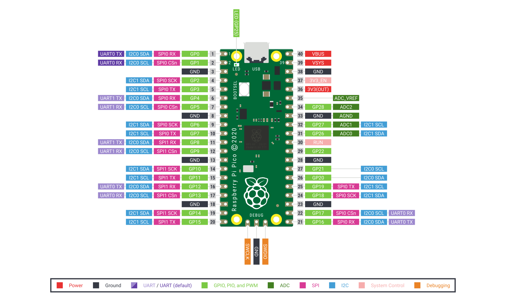

# Raspberry PICO

## Introduction

**Raspberry Pi Pico is a low-cost, high-performance microcontroller board with flexible digital interfaces.**

**Key features include:**

- RP2040 microcontroller chip designed by Raspberry Pi in the United Kingdom
- Dual-core Arm Cortex M0+ processor, flexible clock running up to 133 MHz
- 264KB of SRAM, and 2MB of on-board Flash memory
- Castellated module allows soldering direct to carrier boards
- USB 1.1 with device and host support
- Low-power sleep and dormant modes

- Drag-and-drop programming using mass storage over USB
- 26 × multi-function GPIO pins
- 2 × SPI, 2 × I2C, 2 × UART, 3 × 12-bit ADC, 16 × controllable PWM channels
- Accurate clock and timer on-chip
- Temperature sensor
- Accelerated floating-point libraries on-chip
- 8 × Programmable I/O (PIO) state machines for custom peripheral support




## Supported compiler

Support GCC 6 and above compilers.

## Program firmware

### Step 1: build

```bash
scons -c
scons
```

**gcc version >= 6.x.x**

### Step 2: flash

scons generates a UF2 file:


- Copy the rtthread-pico.uf2 file to the "RPI-RP2" disk
- Then led blink.

## Running Result

The output information on serial port should be like this:

```bash
 \ | /
- RT -     Thread Operating System
 / | \     4.0.3 build Jan 28 2021
 2006 - 2021 Copyright by rt-thread team
Hello, RT-Thread!
msh >
```

## Peripheral Condition

| Drive | Support | Remark  |
| ----- | ------- | ------- |
| UART  | Support | UART0/1 |
| GPIO  | Support | 0-29    |
| I2C   | -       | -       |
| RTC   | -       | -       |
| SDIO  | -       | -       |
| SPI   | -       | -       |
| TIMER | -       | -       |
| WDT   | -       | -       |

