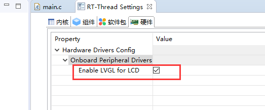
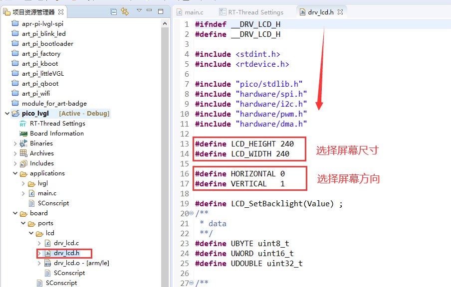
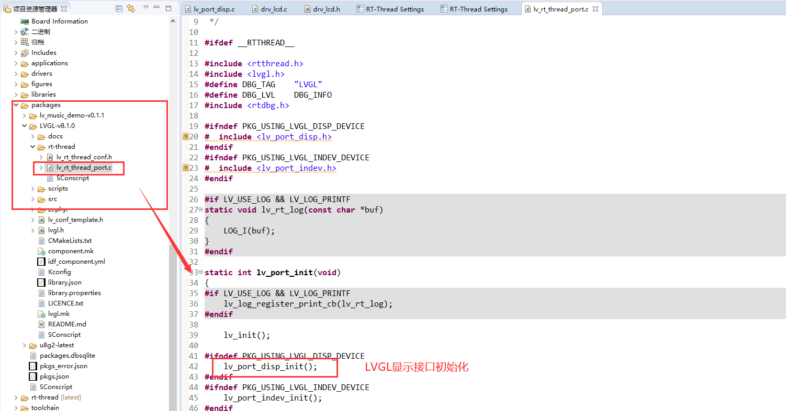
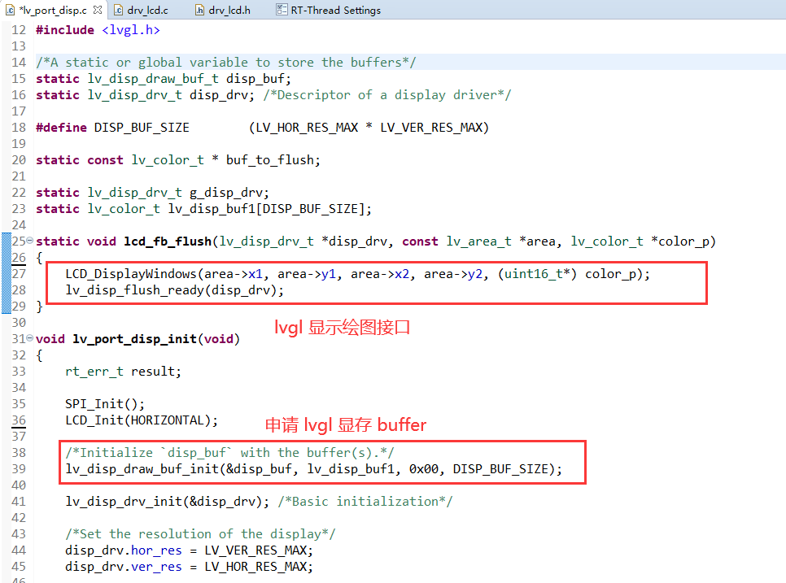
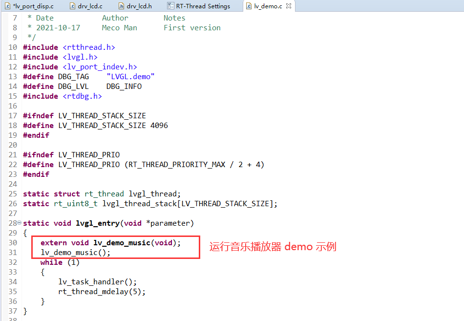

# Raspberry Pi PICO 运行 LVGL 指南

## 硬件参数

树莓派 pico :

* 双核 Arm Cortex-M0 + @ 133MHz
* 芯片内置 264KB SRAM 和 2MB 的板载闪存
* 通过专用 QSPI 总线支持最高 16MB 的片外闪存
* DMA 控制器
* 30 个 GPIO 引脚，其中 4 个可用作模拟输入

- 2 个 UART、2 个 SPI 控制器和 2 个 I2C 控制器

- 16 个 PWM 通道

  更多详见：[树莓派中文站](https://pico.org.cn/)

树莓派拓展板：

* 屏幕：ST7789  SPI 接口

## 软件及环境:

- [RT-Thread IoT OS](https://www.rt-thread.io/) RT-Thread 物联网操作系统
- [RT-Thread Studio](https://www.rt-thread.io/studio.html) IDE (免费版)
- 开源的 [LVGL](https://lvgl.io/) 图形引擎

## 使能 LVGL for LCD 

## 配置屏幕参数

## LVGL 显示接口对接

## 效果展示

<iframe src="//player.bilibili.com/player.html?aid=893079529&bvid=BV1oP4y1E7Md&cid=481212104&page=1" scrolling="no" border="0" frameborder="no" framespacing="0" allowfullscreen="true"> </iframe>

