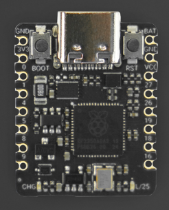
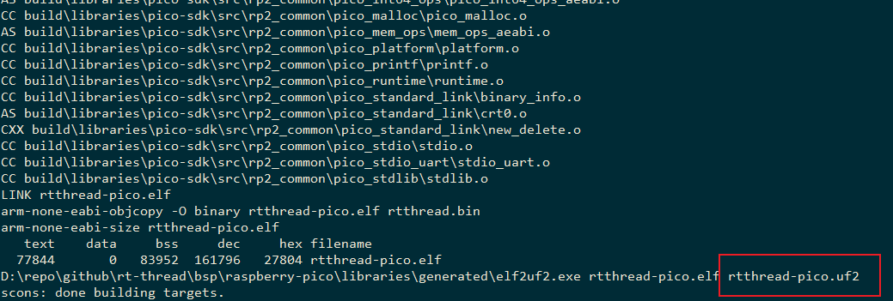

# Raspberry RP2350

## 产品介绍





- 高性能树莓派RP2350芯片
  - 双核双架构设计，可选择Arm Cortex-M33或Hazard3 RISC-V内核
  - 150MHz主频
  - 520KB RAM，2MB flash
- 高度集成，超小尺寸
  - 尺寸仅25*20.5mm
  - 集成锂电池充电管理、电池电压监测
  - 引出11个IO
- 低功耗，休眠功耗仅25uA
- 支持C/C++、MicroPython编程
- 单面布局，半孔工艺，可用于贴片生产


## 程序烧写

- 注意：当前bsp需要在linux环境下才能编译

- 测试环境：Ubuntu21

### Step 1: 下载sdk

```bash
menuconfig
pkgs --update
```

### Step 2: 编译

```bash
scons -c
scons
```

**gcc version >= 6.x.x**

### Step 3: 烧写

编译会生成uf2文件

按住boot键，再短按重启进入u盘烧写模式,此时将rp2350插入电脑会显示一个u盘



- 复制 rtthread-pico.uf2 文件到u盘中
- 自动重启运行

或者进入boot模式后输入以下命令烧写

```bash
picotool load rtthread-pico.uf2
picotool reboot
```

## 运行结果

输出的信息如下

```bash
 \ | /
- RT -     Thread Operating System
 / | \     4.0.3 build Jan 28 2021
 2006 - 2021 Copyright by rt-thread team
Hello, RT-Thread!
msh >
```

## 支持的外设

| Drive | Support | Remark  |
| ----- | ------- | ------- |
| UART  | Support | UART0/1 |
| GPIO  | Support | 0-29    |
