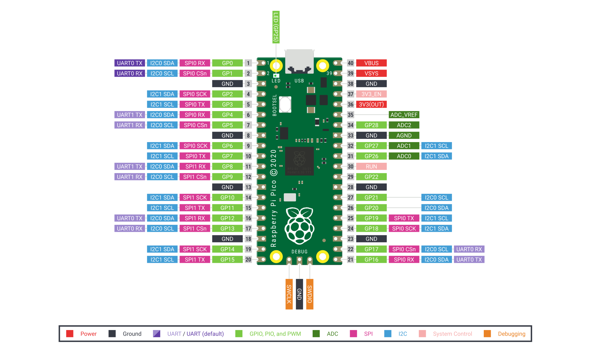

# Raspberry Pi Pico 开发板的Arduino生态兼容说明

## 1 RTduino - RT-Thread的Arduino生态兼容层

Raspberry Pi Pico 开发板已经完整适配了[RTduino软件包](https://github.com/RTduino/RTduino)，即RT-Thread的Arduino生态兼容层。用户可以按照Arduino的编程习惯来操作该BSP，并且可以使用大量Arduino社区丰富的库，是对RT-Thread生态的极大增强。更多信息，请参见[RTduino软件包说明文档](https://github.com/RTduino/RTduino)。

### 1.1 如何开启针对本BSP的Arduino生态兼容层

Env 工具下敲入 menuconfig 命令，或者 RT-Thread Studio IDE 下选择 RT-Thread Settings：

```Kconfig
Hardware Drivers Config --->
    Onboard Peripheral Drivers --->
        [*] Compatible with Arduino Ecosystem (RTduino)
```

## 2 Arduino引脚排布

更多引脚布局相关信息参见 [pins_arduino.c](pins_arduino.c) 和 [pins_arduino.h](pins_arduino.h)。


| Arduino引脚编号  | STM32引脚编号 | 5V容忍 | 备注  |
| ------------------- | --------- | ---- | ------------------------------------------------------------------------- |
| 0 (D0) | P | 是/否 | Serial-TX，默认被RT-Thread的UART设备框架uart1接管 |
| 1 (D1) | P | 是/否 | Serial-RX，默认被RT-Thread的UART设备框架uart1接管 |
| 2 (D2) | P | 是/否 |  |
| 3 (D3) | P | 是/否 |  |
| 4 (D4) | P | 是/否 | I2C0-SDA，默认被RT-Thread的I2C设备框架i2c0接管 |
| 5 (D5) | P | 是/否 | I2C0-SCL，默认被RT-Thread的I2C设备框架i2c0接管 |
| 6 (D6) | P | 是/否 |  |
| 7 (D7) | P | 是/否 |  |
| 8 (D8) | P | 是/否 | Serial2-TX，默认被RT-Thread的UART设备框架uart2接管 |
| 9 (D9) | P | 是/否 | Serial2-RX，默认被RT-Thread的UART设备框架uart2接管 |
| 10 (D10) | P | 是/否 | PWM5-CH0，默认被RT-Thread的PWM设备框架pwm5接管 |
| 11 (D11) | P | 是/否 | PWM5-CH1，默认被RT-Thread的PWM设备框架pwm5接管 |
| 12 (D12) | P | 是/否 | PWM6-CH0，默认被RT-Thread的PWM设备框架pwm6接管 |
| 13 (D13) | P | 是/否 | PWM6-CH1，默认被RT-Thread的PWM设备框架pwm6接管 |
| 14 (D14) | P | 是/否 | PWM7-CH0，默认被RT-Thread的PWM设备框架pwm7接管 |
| 15 (D15) | P | 是/否 | PWM7-CH1，默认被RT-Thread的PWM设备框架pwm7接管 |
| 16 (D16) | P | 是/否 | PWM0-CH0，默认被RT-Thread的PWM设备框架pwm0接管 |
| 17 (D17) | P | 是/否 | PWM0-CH1，默认被RT-Thread的PWM设备框架pwm0接管 |
| 18 (D18) | P | 是/否 | PWM1-CH0，默认被RT-Thread的PWM设备框架pwm1接管 |
| 19 (D19) | P | 是/否 | PWM1-CH1，默认被RT-Thread的PWM设备框架pwm1接管 |
| 20 (D20) | P | 是/否 | PWM2-CH0，默认被RT-Thread的PWM设备框架pwm2接管 |
| 21 (D21) | P | 是/否 | PWM2-CH1，默认被RT-Thread的PWM设备框架pwm2接管 |
| 22 (D22) | P | 是/否 | PWM3-CH0，默认被RT-Thread的PWM设备框架pwm3接管 |
| 23 (D23) | P | 是/否 | PWM3-CH1，默认被RT-Thread的PWM设备框架pwm3接管 |
| 24 (D24) | P | 是/否 | PWM4-CH0，默认被RT-Thread的PWM设备框架pwm4接管 |
| 25 (D25) | P | 是/否 | PWM4-CH1，默认被RT-Thread的PWM设备框架pwm4接管 |
| 26 (A0) | P | 是/否 | ADC0-CH0，默认被RT-Thread的ADC设备框架adc0接管 |
| 27 (A1) | P | 是/否 | ADC1-CH1，默认被RT-Thread的ADC设备框架adc1接管 |
| 28 (A2) | P | 是/否 | ADC2-CH2，默认被RT-Thread的ADC设备框架adc2接管 |

> 注意：
>
> 暂无
