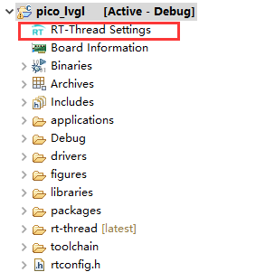
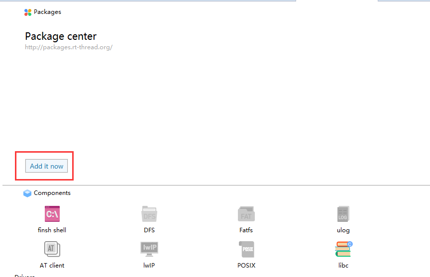
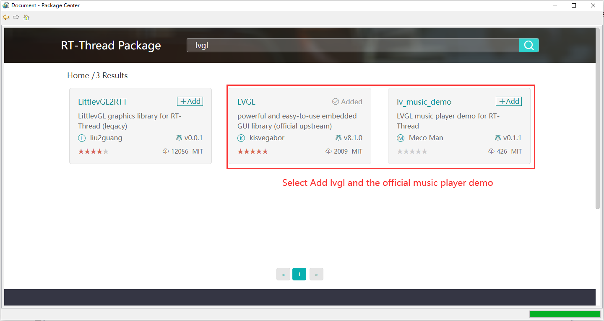

# How to Run LVGL on Raspberry Pi PICO

[中文页](README_zh.md) |

## Hardware: 

- [Raspberry Pi PICO](https://www.raspberrypi.com/products/raspberry-pi-pico/)

- [TFT-SPI ST7789](https://pdf1.alldatasheet.com/datasheet-pdf/view/1170800/SITRONIX/ST7789H2.html)

  - Single chip TFT-LCD Controller/Driver with On-chip Frame Memory (FM) 

  - Display Resolution: 240*RGB (H) *320(V) 

  - Frame Memory Size: 240 x 320 x 18-bit = 1,382,400 bits 

  - LCD Driver Output Circuits 

    \- Source Outputs: 240 RGB Channels 

    \- Gate Outputs: 320 Channels 

    \- Common Electrode Output 

## Software:

- Opensource [RT-Thread IoT OS](https://www.rt-thread.io/) Project
- [RT-Thread Studio](https://www.rt-thread.io/studio.html) IDE (Free)
- Opensource [LVGL](https://lvgl.io/) Project

## Enable LVGL for LCD 

## Configure Screen Parameter

Select the screen size according to your project requirements (This tutorial is using ST7789).

## LVGL Display Interface Adopting

## Presentation

<iframe src="//player.bilibili.com/player.html?aid=893079529&bvid=BV1oP4y1E7Md&cid=481212104&page=1" scrolling="no" border="0" frameborder="no" framespacing="0" allowfullscreen="true"> </iframe>