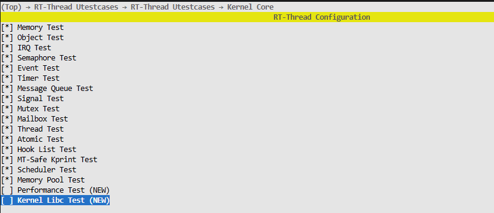
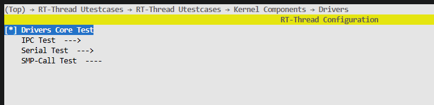

# S100 BSP 编译与加载运行说明

本文说明 `bsp/s100` 这个 RT-Thread BSP 如何在主机侧编译，以及如何在 RDK S100 板端加载并运行。

说明分两部分：

- 本地 BSP 实际构建方式：以当前仓库中的 `SConstruct`、`rtconfig.py`、`link.lds` 为准
- 板端启动流程：参考 D-Robotics 官方文档“[MCU快速入门指南](https://d-robotics.github.io/rdk_doc/rdk_s/Advanced_development/mcu_development/S100/basic_information/)”

## 1. 背景说明

官方文档说明了 S100 的 MCU 启动链路：

- MCU0 负责启动 Acore、MCU1 和电源管理
- MCU1 由 Acore 通过 `remoteproc` 框架间接控制
- 启动时由 Acore 在 `sysfs` 下给 `remoteproc_mcu0` 写入固件名并触发 `start`

参考：

- 官方文档第 “MCU1启动/关闭流程” 章节：`remoteproc_mcu0`、`firmware`、`state`
- 本地链接脚本 [link.lds](./link.lds) 也包含 `.resource_table` 段，说明这个镜像是按 remoteproc 风格组织的 MCU1 ELF

## 2. 主机编译环境

### 2.1 推荐系统

官方文档建议主机使用 Ubuntu 22.04。

### 2.2 依赖安装

官方文档给出的依赖如下：

```bash
sudo apt-get install -y build-essential make cmake libpcre3 libpcre3-dev bc bison \
                        flex python3-numpy mtd-utils zlib1g-dev debootstrap \
                        libdata-hexdumper-perl libncurses5-dev zip qemu-user-static \
                        curl repo git liblz4-tool apt-cacher-ng libssl-dev checkpolicy autoconf \
                        android-sdk-libsparse-utils mtools parted dosfstools udev rsync python3-pip scons
pip install "scons>=4.0.0"
pip install ecdsa
pip install tqdm
```

### 2.3 交叉工具链

当前 BSP 的工具链配置在 [rtconfig.py](./rtconfig.py)：

- 架构：`cortex-r52`
- 工具链前缀：`arm-none-eabi-`
- 默认工具链路径：`/opt/toolchain/gcc-arm-none-eabi-10.3-2021.10/bin`

如果你的工具链不在这个目录，可以通过环境变量覆盖：

```bash
export RTT_EXEC_PATH=/your/toolchain/bin
```

## 3. BSP 编译方法

### 3.1 进入目录

```bash
cd <repo>/bsp/s100
```

### 3.2 执行编译

直接运行：

```bash
scons -j$(nproc)
```

如果你想先清理后重编：

```bash
scons -c
scons -j$(nproc)
```

### 3.3 构建入口

本 BSP 的构建入口是：

- [SConstruct](./SConstruct)
- [rtconfig.py](./rtconfig.py)

构建特征：

- 目标文件名：`rtthread.elf`
- 后处理会自动生成：`rtthread.bin`

## 4. 板端加载运行

### 4.1 固件放置

根据官方 remoteproc 启动流程，MCU1 固件需要放到板端 `/lib/firmware/`。

根据官方 RDK S100 硬件说明，板上有两个有线网口：

- `U43 / eth0`：通用以太网口，IP 需要通过外部 DHCP 获取，或由用户手动配置静态地址
- `U45 / eth1`：固定静态 IP 网口，默认地址为 `192.168.127.10`

如果开发主机直接接在 `U45 / eth1`，可以优先使用固定 IP 方式传文件，这样不需要先查询板端地址。由于当前 BSP 输出文件名是 `rtthread.elf`，可以直接推送这个文件：

```bash
scp rtthread.elf root@192.168.127.10:/lib/firmware/
```

如果你接的是 `U43 / eth0`，则需要先确认板端实际 IP，然后再执行：

```bash
scp rtthread.elf root@<board_ip>:/lib/firmware/
```

### 4.2 启动 MCU1

参考官方文档中的 `remoteproc_mcu0` 启动步骤，板端执行：

如果固件名是 `rtthread.elf`：

```bash
cd /sys/class/remoteproc/remoteproc_mcu0
echo rtthread.elf > firmware
echo start > state
```

### 4.3 停止 MCU1

> 由于该功能还不完善，此处需要重启设备来完成

## 5. 一套完整示例

主机侧：

```bash
cd <repo>/bsp/s100
scons -j$(nproc)
scp rtthread.elf root@192.168.127.10:/lib/firmware/
```

板端：

```bash
cd /sys/class/remoteproc/remoteproc_mcu0
echo rtthread.elf > firmware
echo start > state
```

停止：

```bash
reboot
```

## 6. 系统支持外设说明

- 支持 UART 4、5、6（暂不支持DMA），默认使用串口4作为msh控制台
- 支持GPIO输入、输出、外部中断响应功能，但以下引脚不允许被配置
  
    ```shell
    static const s100_pin_t s100_gpio_blacklist[] =
    {
        0,  /* S100 Power related pins */
        5,  /* S100 debug uart tx */
        38, /* S100 Power related pins */
        15, /* S100 Power related pins */
        68, /* S100 Power related pins */
        69, /* S100 Power related pins */
        71, /* S100 Power related pins */
        80, /* S100 Power related pins */
        81, /* S100 Power related pins */
        82, /* S100 Power related pins */
        83, /* S100 Power related pins */
        AON_PIN_NUM(0),  /* S100 debug uart rx */
        AON_PIN_NUM(12), /* S100 Power related pins */
    };
    ```

- 支持 CAN5、CAN6、CAN7、CAN8、CAN9（只支持基础CAN通信）

## 7.测试方法

### 硬件连接

RDK S100 需要先连接 MCU 接口扩展版

### 软件配置

为了运行当前 `s100` BSP 下的 GPIO、UART、CAN 设备测试，建议至少打开以下配置。

#### 通用测试开关

使用 ` scons --menuconfig `打开配置界面

- 打开内核测试配置：
  

- 打开外设测试配置：
  

当前默认配置里，上述 `utest` 基础开关已经打开；如果你重新裁剪过配置，需确认这些选项仍然存在。

#### GPIO 测试相关配置

- 使能 `BSP_USING_GPIO`(默认已经打开)

GPIO 测试文件为：

- [test_gpio.c](./drivers/utest/test_gpio.c)

当前测试内容包括：

- 非法脚/保留脚拒绝逻辑
- GPIO 输入输出回环
- GPIO 中断上升沿、下降沿、双边沿回环

运行前要求：

- 用跳线连接测试输出脚和测试输入脚
- 默认测试脚为 `GPIO36 -> GPIO37`
- 若板级接线不同，可修改 `test_gpio.c` 中的 `S100_GPIO_TEST_OUT_PIN` 与 `S100_GPIO_TEST_IN_PIN`

#### UART 测试相关配置

- 使能 `BSP_USING_UART`
- 保持 `BSP_USING_UART4=y`
- 额外使能至少一个非控制台串口：
  - `BSP_USING_UART5`
  - 或 `BSP_USING_UART6`

UART 测试文件为：

- [test_uart.c](./drivers/utest/test_uart.c)

当前测试约束如下：

- `uart4` 默认为 `msh` 控制台，不参与设备测试
- 测试对象为已启用的 `uart5`、`uart6`
- `txrx` 用例发送固定二进制数据帧，并逐字节校验接收内容

运行前要求：

- 被测串口需要具备回环条件
- 常见做法是将 `UART5_TX` 与 `UART5_RX` 短接，或将 `UART6_TX` 与 `UART6_RX` 短接
- 若未打开 `uart5/uart6`，`rdk.s100.drivers.uart` 不会覆盖非控制台串口

#### CAN 测试相关配置

- 使能 `BSP_USING_CAN`
- 使能至少一个 CAN 控制器：
  - `BSP_USING_CAN5`
  - `BSP_USING_CAN6`
  - `BSP_USING_CAN7`
  - `BSP_USING_CAN8`
  - `BSP_USING_CAN9`

CAN 测试文件为：

- [test_can.c](./drivers/utest/test_can.c)

当前测试特点如下：

- 使用 `RT_CAN_MODE_LOOPBACK` 内部回环模式
- 不依赖外部 CAN 对端
- 覆盖 `find/open/config/set_mode/set_baud/write/read/get_status/close`
- 发送一帧标准 CAN 数据帧，并逐字节校验接收 payload

#### 构建与运行

完成配置后重新编译：

```bash
scons -j$(nproc)
```

板端启动后，可在 `msh` 中分别执行：

```bash
utest_run rdk.s100.drivers.gpio
utest_run rdk.s100.drivers.uart
utest_run rdk.s100.drivers.can
```

如果只想执行单项测试，保留对应驱动开关即可；未启用的设备不会进入对应测试覆盖范围。

