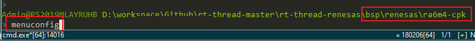
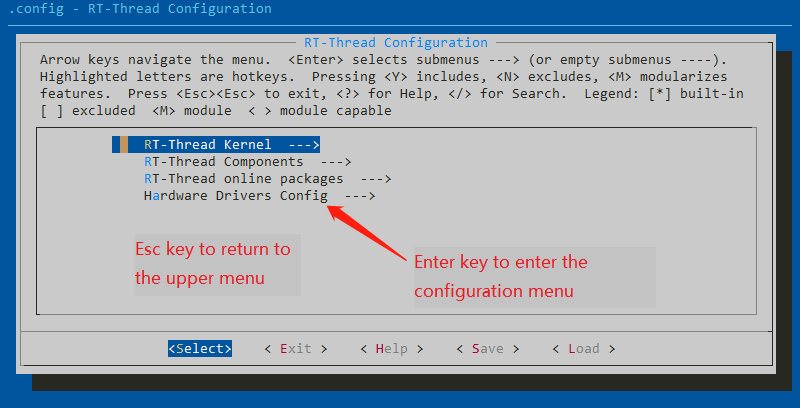
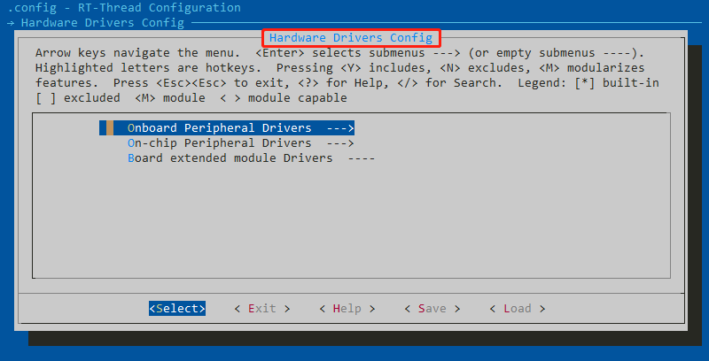
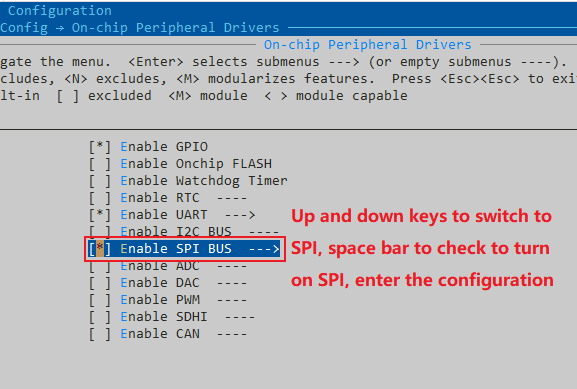
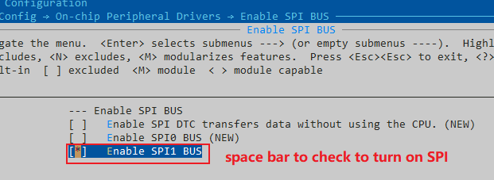
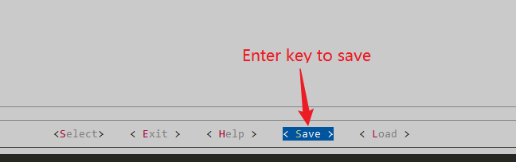
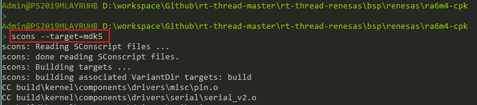
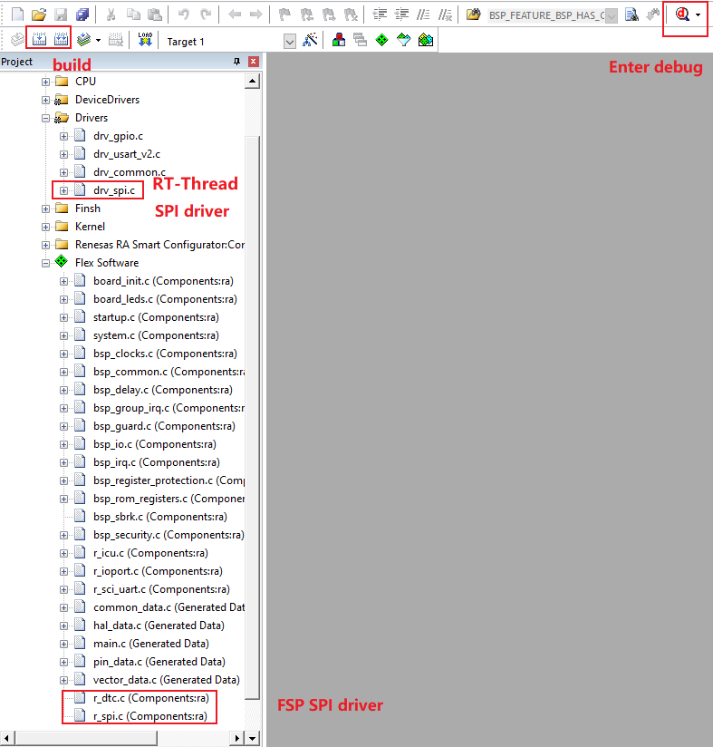

# BSP Peripheral Driver Tutorial of RA Series

## 1. Introduction

This document is for developers who need more board resources on RT-Thread RTOS. By configuring the BSP with the ENV tool, more onboard resources can be turned on and more advanced functions can be realized.

The main contents are following:
1. How to use more onboard resources on the development board
2. How to use more on-chip resources
3. How to add more on-chip resource options

## 2. Prerequisites

- Learn how to use the ENV tool, refer to: [RT-Thread env programming  manual](https://www.rt-thread.org/document/site/#/development-tools/env/env)
- Familiar with the use of the [FSP](https://www2.renesas.cn/jp/zh/software-tool/flexible-software-package-fsp)  configuration tool

## 3. How to Use More Peripheral Resources

There are generally many peripheral resources on-board, such as SPI, SDIO, ADC, etc., but these peripherals' driver are not enabled by default in the BSP project. RT-Thread provides ENV tools to enable or disable BSP peripheral drivers. This article takes the SPI driver on the RA6M4-CPK development board as an example to show step by step how to use the ENV tool to configure the BSP.

### 3.1 Open The Configuration Tool

Open the menuconfig configuration window in the BSP directory.

 

The configuration window that opens is as follows:
  

Move the cursor with the up and down keys on the keyboard, select `Hardware Drivers Config` and press Enter to enter the hardware driver configuration menu.

### 3.2 Enter The Hardware Driver Configuration Menu

There are three options in the hardware configuration menu, namely **on-board peripheral configuration menu**, **on-chip peripheral configuration menu** and **extension module configuration menu**, use the down button to switch to on-chip peripherals, Press Enter to enter the configuration menu.

 

### 3.3 Enable The SPI Flash Option in The Onboard Peripheral Configuration Menu

 

 

### 3.4 Save and Exit

Move the cursor to the right to select Save and press Enter, then press Esc to exit the configuration tool.

 

### 3.5 Generate MDK5 Project

Enter the command `scons --target=mdk5` to regenerate the MDK5 project.

 

### 3.6 Add SPI Peripheral to FSP

 

 

Configure the SPI1 pins in Pins. **Note: The SSLx chip select pin is set to None, the chip select pin is controlled by software in the driver. **

Configuration completes, save and exit FSP.

 

### 3.7 Test Verification
Back to the generated MDK5 project and do the compilation. If a new file is added to the project after the FSP configuration is completed, it will not be added immediately. It needs to be compiled once. If the following prompt pops up, select "Yes" and then compile again.

 

After the compilation is successful, click the debug button to download and enter the debug page.

 

### 3.8 Check Execution Result
After the program runs, enter the command `list_device` to see the bus device named spi1, and the SPI1 bus is ready to use.

 

## 4. Summarize
This article uses SPI as an example to introduce the operation flow of peripheral drivers. For how to use and configure other types of peripherals, please refer to: [RA series use FSP to configure peripheral drivers.md](RA series use FSP to configure peripheral drivers.md )

When developers need to use unenabled peripherals, they only need to enable the related peripherals in the ENV tool, and then add them in the FSP. The corresponding driver files will be added to the regenerated project.

This tutorial translated by [Josh Zou](https://github.com/Firmament-Autopilot)