# Building a BSP for the RA Series Dev Board

This article introduces how to build a BSP for the RENESAS RA series development board. This tutorial helps developers to build a new RA BSP easily, and obtain a better understanding of the architecture of the RA series BSP.

Each BSP folder includes a template project, the `board` folder, and build scripts for RT-Thread projects. General drivers for the RT-Thread port are inside the folder `renesas\libraries\HAL_Drivers`. These are two essential parts of a complete BSP.

The **[Flexible Software Package](https://www2.renesas.cn/jp/zh/software-tool/flexible-software-package-fsp)** (FSP) configuration tool is introduced in the RA series, which is an accessible and flexible software for embedded system designs using the RA series ARM MCU. FSP includes HAL drivers of high-performance and low memory consumption. Besides, we provide an intelligent code generator and a GUI.

Major features of the RA series BSP include:

- RA Templates that are generated using the FSP tool, making it easier to build a new BSP.
- General drivers for further development.
- Peripherals of the chip can be configured using the FSP configuration tool with a GUI.

## 1. BSP Structure

The structure of a BSP：

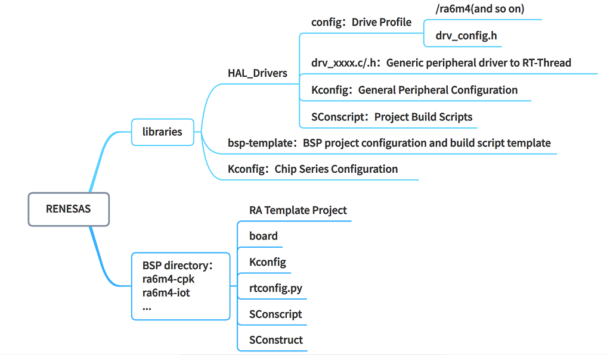 

Each BSP consists of two components: general driver libraries and board specific files. We introduce each component using ra6m4-cpk as an example：

|Component|Folder|Remark|
| - | - | :-- |
| general driver libraries | renesas\libraries\HAL_Drivers | General drivers for RT-Thread |
| board specific files | renesas\ra6m4-cpk | The BSP project of CPK-RA6M4 |

## 2. Prerequisites

To build a proper BSP, you may need to be familiar with the RT-Thread build system：

- Understand how to use RA series BSP

  The [BSP Documentation](../README.md) may help you understand how RA BSP works. The *Device Driver Guidance* is a good reference for adding new device drivers.

- Familiar with the [Scons](https://www.rt-thread.org/document/site/#/development-tools/scons/scons) build system

  RT-Thread adopts `Scons` as its build system, thus it is necessary to understand how `Scons` works.

- Familiar with [Device Driver Framework](https://www.rt-thread.org/document/site/#/rt-thread-version/rt-thread-standard/programming-manual/device/device)

  RT-Thread uses the Device Driver Framework to handle the hardware, thus it could help you build a new BSP.

- Familiar [Kconfig](https://www.rt-thread.org/document/site/#/development-tools/kconfig/kconfig)

  RT-Thread is configured through `menuconfig`, and options in `menuconfig` are written in `Kconfig` , thus it is necessary to familiarize `Kconfig` to configure RT-Thread.

- Familiar with the [FSP](https://www2.renesas.cn/jp/zh/software-tool/flexible-software-package-fsp)  configuration tool

  FSP provides a GUI and smart code generator. The FSP tool is commonly used while building a BSP.

## 3. How to build a BSP

This section introduces how to create a BSP for the CPK-RA6M4 development board. The final BSP will support both MDK and scons.

Creating a new BSP consists of following steps:

1. Create the BSP folder.
2. Create the RA template project.
3. Configure the template project.
4. Modify the `Kconfig` file.
5. Modify the build and configuration file for the project.
6. Re-generate the project.
7. Add GCC link scripts.
8. Modify compiling parameters in `rtconfig.py`.

### 3.1 Create the BSP folder

- To create the BSP folder, you can copy the template from `\renesas\libraries\bsp-template` to `\renesas`, and rename it to be the name of your board. The naming convention could use **ra6m4-cpk** as a reference. As the folder `ra6m4-cpk` already exists, this tutorial uses **ra6m4-test** as the name for the new BSP to be created.

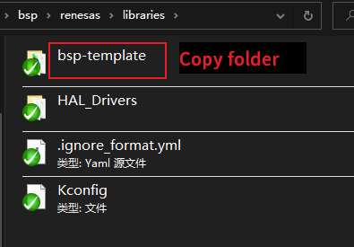 

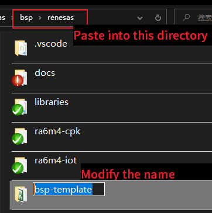 

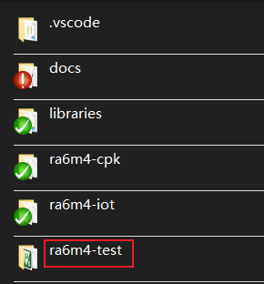 

### 3.2 Create the RA template project

The first step is to create a RA template using the FSP tool.

- Double click on `/eclipse/rasc.exe` from the FSP installation folder. An interface will be presented to help you create a new project.

 

 

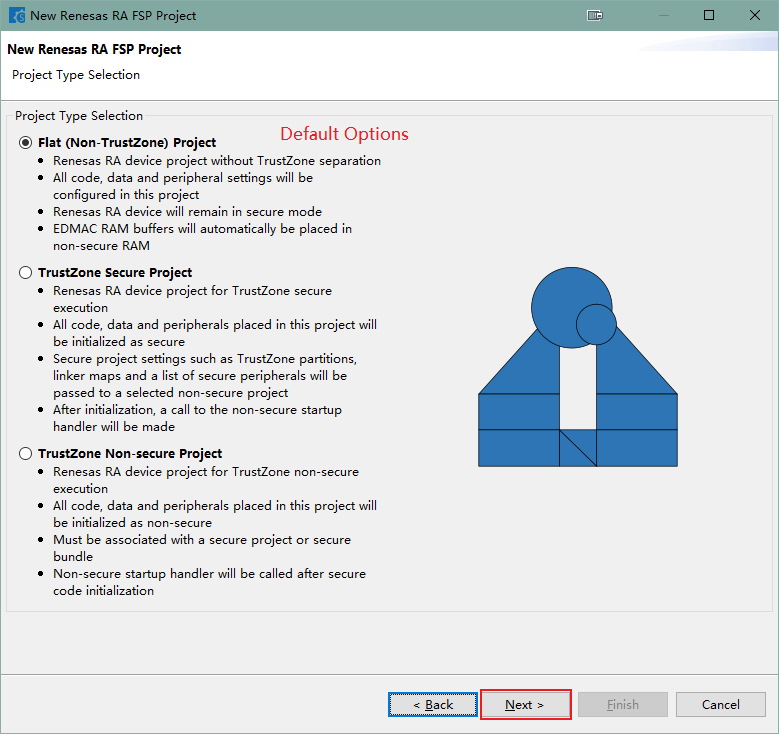 

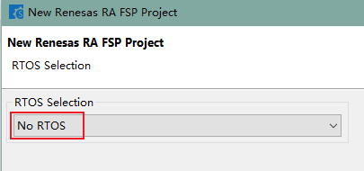 

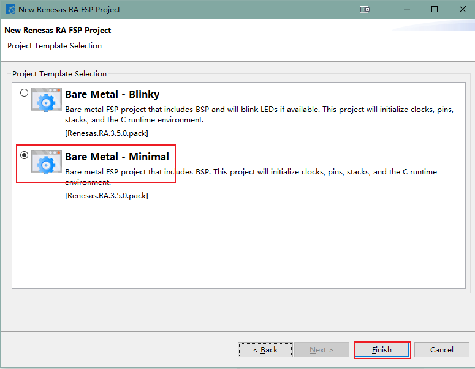 

 

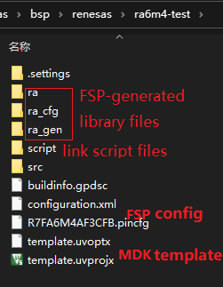 

Now. you should have a RA template, and basic configuration files and drivers for a BSP, as illustrated above.

### 3.3 Configure the project template

When the RA template project is ready, some modifications are required for basic peripherals such as GPIO, UART.

- Open the template project `template.uvprojx`

 

- Modify the MDK project configuration
> **Debug Options：** You may take a screenshot to record default settings. After changing settings in`Device`, part of the settings in the `Debug` page will change, you can reset them to default after changing the `Device`.

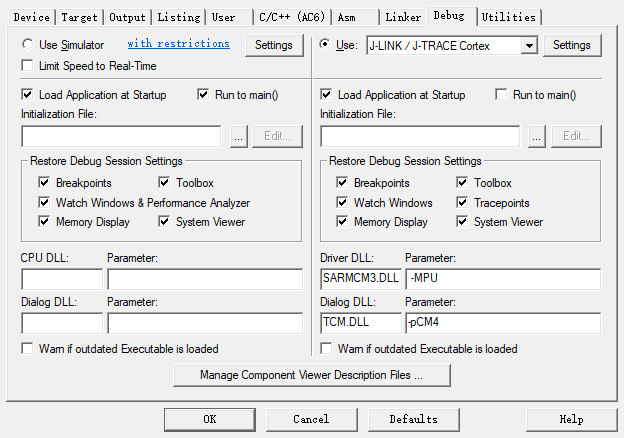 

> **Device Options: **Select the device type of the SoC on your board.

 

> **Output Options：** Change `Name of Exexutable` to be rtthread, and select `Create HEX File` so that it generates the hex file to be flashed.

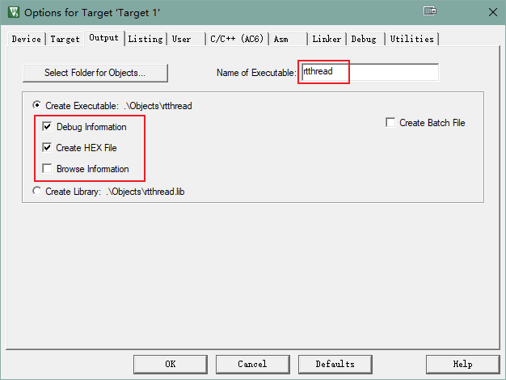 

> **User Options：**If TrustZone is utilized, extra commands are invoked to setup the partition for Secure & Non-Secure . If only the Flat mode is used during development, this can be ignored. Otherwhile please add【cmd /c "start "Renesas" /w cmd /c ""$Slauncher\rasc_launcher.bat" "3.5.0" --gensecurebundle --compiler ARMv6 "$Pconfiguration.xml" "$L%L" 2> "%%TEMP%%\rasc_stderr.out"""】

 

> C/C++ Options: Some warnings can be suppressed, such as “-Wextra“, ”-Wconversion“, ”-Wshadow ”.
>
> Take ra6m4-cpk as an example, following options are added: -Wno-license-management -Wuninitialized -Wall -Wmissing-declarations -Wpointer-arith -Waggregate-return -Wfloat-equal

 

> **Utilities Options**: Select `Use External Tool for Flash Programming`. Click on `OK` to save your settings.

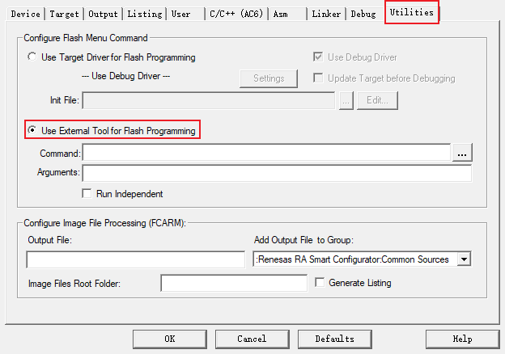 

- Open the FSP from MDK

> **How to open the FSP in MDK:**
>
> 1. Open MDK, choose  “Tools -> Customize Tools Menu…”
> 2. Click on the “new”  icon, then add a customized command: RA Smart Configurator
> 3. Specify the installation folder of the tool in the Command setting, click on “…” and find the “rasc.exe” in the installation folder (In the folder `setup_fsp_xxxxx`)
> 4. Initial Folder: $P
> 5. Arguments: --device $D --compiler ARMv6 configuration.xml
> 6. Click OK and save the command “Tools -> RA smart Configurator”
   
> 7. Click on the command to open the configuration tool: **RA Smart Config**
   

- Add the UART port
> Choose the Stacks tab，click on New Stack and find UART.
   
> Set the UART channel for MSH, and configure the UART parameters, so that it matches RT-Thread drivers. Set **name**, **channel**, **callback** following the convention: channel = **X**，name = g_uart**X**、callback = user_uart**X**_callback
   

### 3.4 Modify options in `Kconfig`

This section modifies `board/Kconfig` an `libraries/Kconfig`:

- SoC series and types
- Available Peripheral options on the BSP

Definitions for the SoC are available in`renesas\libraries\Kconfig`. Check if the definition for the SoC to be added exist before making changes. If it's undefined. you need to add definitions for the SoC series first. Naming conventions are described below:

| Macro              | Meaning    | Format             |
| ------------------ | ---------- | ------------------ |
| SOC_R7FA6M4AF      | SoC Type   | SOC_R7FAxxxxx      |
| SOC_SERIES_R7FA6M4 | SoC Series | SOC_SERIES_R7FAxxx |

Add the SoC series：

 

Available peripheral options for the new BSP only need to include GPIO and UART:

 

### 3.5 Modify the build and configuration files for the project
- Add config for drivers. Several folders should be created according to different SoC series. You can modify configurations according to supported peripherals.

 

​	For instance, you can add configurations for the UART accordingly:

 

- Modify `startup.c`

>  Source code path：**ra6m4-cpk\ra\fsp\src\bsp\cmsis\Device\RENESAS\Source\startup.c**

```c
#ifdef __ARMCC_VERSION
    main();
#elif defined(__GNUC__)
    extern int entry(void);
    entry();
#endif
```

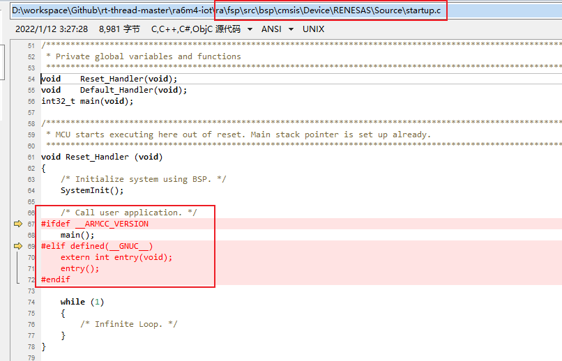 

- Change SRAM size

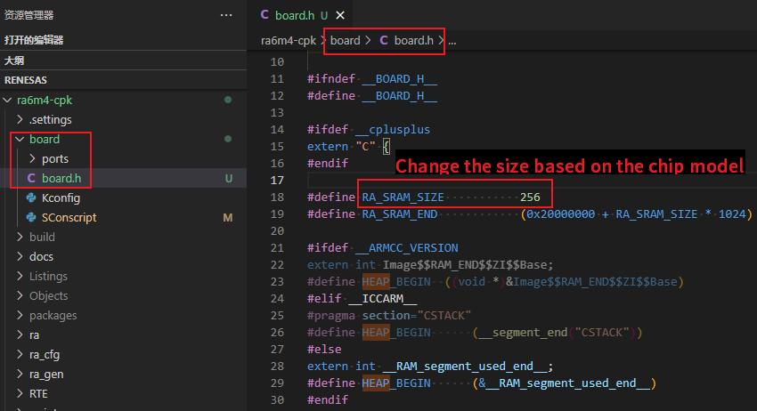 

- Change GPIO interrupt

Change configuration files according to IRQ interrupts supported by the BSP. You can use the FSP configuration tool to look up for the IRQ channel of IO Pins.

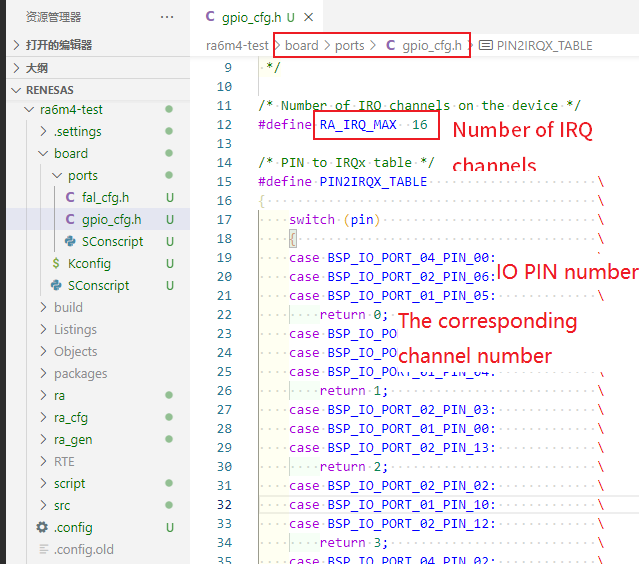 

- Change the code that initializes applications

In RA series BSP, the code for user applications are in `src/hal_entry.c`. Default code generated by the FSP tool should be replaced with the following code, you can remove the code in `while(1)` if there is no onboard LED.

```c
/*
 * Copyright (c) 2006-2021, RT-Thread Development Team
 *
 * SPDX-License-Identifier: Apache-2.0
 *
 * Change Logs:
 * Date           Author        Notes
 * 2021-10-10     Sherman       first version
 */

#include <rtthread.h>
#include "hal_data.h"
#include <rtdevice.h>

#define LED_PIN    BSP_IO_PORT_01_PIN_06 /* Onboard LED pins */

void hal_entry(void)
{
    rt_kprintf("\nHello RT-Thread!\n");

    while (1)
    {
        rt_pin_write(LED_PIN, PIN_HIGH);
        rt_thread_mdelay(500);
        rt_pin_write(LED_PIN, PIN_LOW);
        rt_thread_mdelay(500);
    }
}
```

- Change CPU parameters in `rtconfig.py`

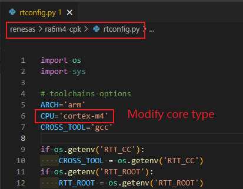 

### 3.6 Re-generate the project

The `env` tool is required to re-generate the project.

- re-generate the `rtconfig.h` file

In the `Env` tool, use the command `menuconfig` to configure the project and generate a new `rtconfig.h` file:

 

Enable the GPIO and UART port for the console.

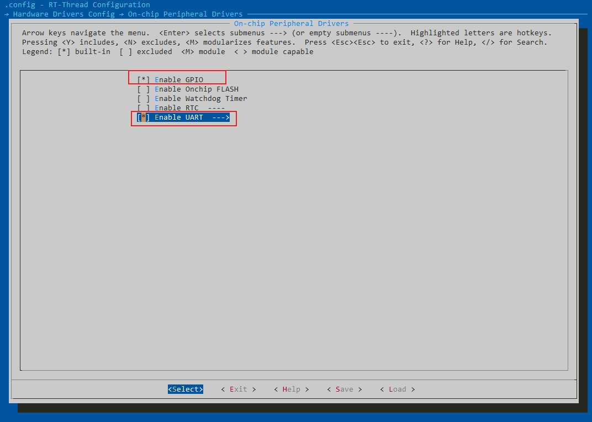 

Change the output device name for the console:

 

- Generate the MDK project:

In the `env` tool use `scons --target=mdk5` to re-generate the project:

 

Successfully re-generated the project：

 

Now the BSP is ready for MDK development. If you would like yo use the GCC toolchain, linker scripts for GCC need to be added.

### 3.7 Add GCC linker script

The Linker scripts for GCC can be generated using the IDE: `e2studio`. In a new project created by `e2studio`:

 

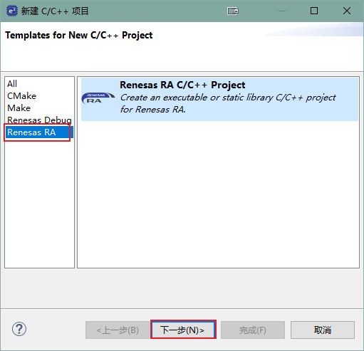 

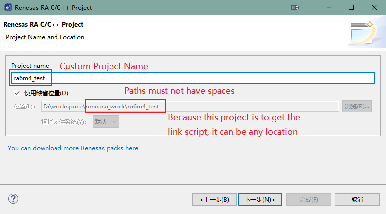 

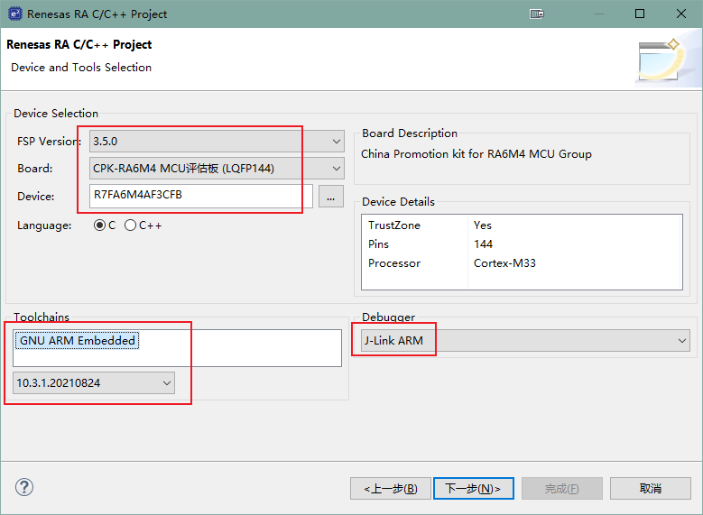 

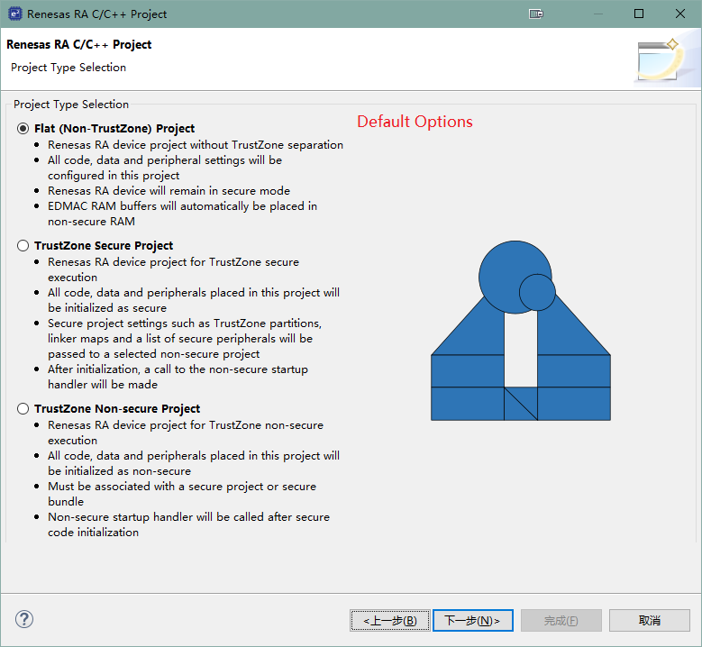 

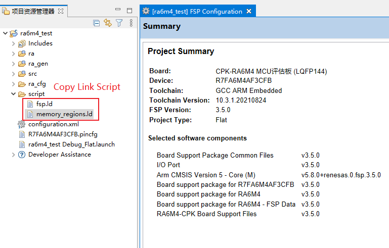 

After creating the project. we need to copy two `xxx.ld` files to the `script` folder.

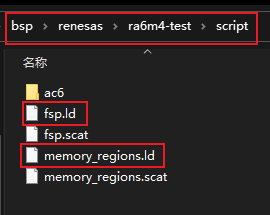 

- Change the path of the linker script:

> Linker script path：**ra6m4-cpk\script\fsp.ld**

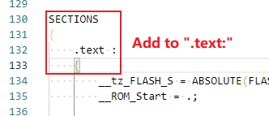 

> Copy the following to the text section **inside text{  }**

```shell
/* section information for finsh shell */
. = ALIGN(4);
__fsymtab_start = .;
KEEP(*(FSymTab))
__fsymtab_end = .;

. = ALIGN(4);
__vsymtab_start = .;
KEEP(*(VSymTab))
__vsymtab_end = .;

/* section information for initial. */
. = ALIGN(4);
__rt_init_start = .;
KEEP(*(SORT(.rti_fn*)))
__rt_init_end = .;

. = ALIGN(4);
KEEP(*(FalPartTable))
```

> It should be like:

 

### 3.8 Modify compiling parameters in `rtconfig.py`

 

Besides the kernel type, we need to confirm compiler parameters as well. Related configurations are explained in the documentation center. [link](https://www.rt-thread.org/document/site/#/development-tools/scons/scons?id=编译器选项).

Eventually, a basic BSP that supports both GCC and MDK is now ready. We can verify the project compiles successfully using MDK or scons.

Thanks for contributions from every contributor. RT-Thread will grow together with you.

## 4. Contribution Guidelines

This section introduces some guidelines for submitting a new RT-Thread RA BSP. Developers could check if these guidelines are followed before creating a PR.

### 4.1 BSP Guidelines

The guidelines consist of project configuration, ENV configuration, and IDE configuration. Existing RA BSP templates are configured following the guidelines. Please keep these configurations for a new BSP while copying from templates. When the new BSP is ready, it's suggested to test corresponding functionalities before creating a PR.

#### 4.1.1 Project Configuration

- Follow RT-Thread coding guidelines with consistent code comments
- Remain the `main`  function consistent
  - If there is a LED, the `main` function implements **only one** functionality: blinking the LED at 1HZ.
- Initialize the heap in `rt_hw_board_init`: Invoke `rt_system_heap_init`.
- By default, only initialize GPIO and the serial driver for FinSH, and the DMA should be disabled.
- When enabling onboard device drivers, the project should compile without changing any code.
- Make sure the GCC and MDK compiler compiles with no error.
- Publish the BSP using `scons --dist`, and make sure the project generated functions properly.

#### 4.1.2 ENV Configuration

- The system tick is set as 1000 (The macro: RT_TICK_PER_SECOND)
- Enable asserting in Debug options (The macro: RT_USING_DEBUG)
- The stack size of the system idle thread is set to be 256 (The macro: IDLE_THREAD_STACK_SIZE)
- Enable component auto initialization (The macro: RT_USING_COMPONENTS_INIT)
- Enable the `user main` option (The macro: RT_USING_USER_MAIN)
- Disable `libc` by default (The macro: RT_USING_LIBC)
- Use MSH by default in FinSH (The macro: FINSH_USING_MSH_ONLY)

#### 4.1.3 IDE Configuration

- Enable autorun after downloading the code.
- Enable C99 Support.
- Enable `One ELF Section per Function` (MDK).
- Temporary build files should be placed in the `build` folder (MDK/IAR).
- The hex file generated by MDK/GCC/IAR should be named as `rtthread.hex`.

### 4.2 BSP Contribution Guidelines

- Please modify the `README.md` carefully before submitting a BSP. The list of supported peripherals in `README.md` should all be supported in this BSP. Other BSP could be a good reference. All the drivers are listed in the [Introduction to RA Series Driver](./RA系列驱动介绍.md).
- Two steps to submit a BSP：
  - Step1: A basic BSP includes drivers for UART and GPIO, and should be able to use the FinSH console. Support for `MDK5`, `IAR` and `GCC` compilers should be complete. You may omit support for MDK4 if the chip itself does not support MDK4. The `README.md` of the BSP should contain all the drivers to be added in the second step.
  - Step 2: Add support for onboard drivers, all onboard peripherals should be ready-to-use with `menuconfig`. Peripherals that are not available on this board can be omitted. Different drivers should be committed separately for future review and merging.
- Only submit necessary files for the BSP. Temporary files should be removed.
- Make sure the BSP compiles using different compilers.
- Make sure the BSP works properly, and follow the project configuration guidelines.


> Translated by: [wuhanstudio](https://github.com/wuhanstudio)
