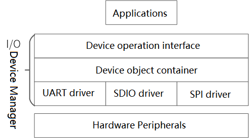
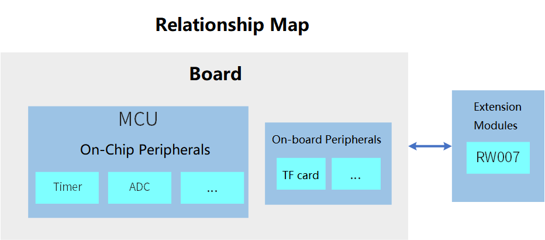

#  Introduction to RA Series Drives

In the RT-Thread real-time operating system, a wide variety of device drivers are managed through a set of I/O device management frameworks. The device management framework provides a set of standard device operation APIs for upper-level applications, and developers can efficiently interact with the underlying hardware peripherals by calling these standard device operation APIs. The structure of the Device Management Framework is shown in the following figure:

 

Developing applications using the I/O Device Management Framework has the following advantages:

- Develop applications using the same standard set of APIs to make applications more portable
- Upgrades and modifications to the underlying drivers do not affect the upper-level code
- Drivers and applications are independent of each other, making it easy for multiple developers to work together

## 1. Introduction to drive classification

This section introduces the different class-driven concepts provided by BSPs, and for a BSP, there are three types of drivers:

- **Onboard Peripheral Drivers**: Refers to peripherals on the development board outside of the MCU, such as TF cards, Ethernet, etc
- **On-chip Peripheral Drivers**: Refers to peripherals on the MCU chip, such as hardware timers, ADCs, and watchdogs
- **Board extended module Drivers**: Refers to modules of a development board that can be connected via an expansion interface or a DuPont wire, such as an RW007 module

A schematic diagram of these three peripherals is shown below:

 

## 2. How to use peripheral drivers

The driver libraries currently provided by RT-Thread already support multiple series of BSPs for RA. Click on the driver name in the table below to jump to the introductory document for the corresponding driver framework. Developers can read the materials to learn how to use these peripheral drivers through the device driver framework in application development.

### 2.1 On-chip peripherals

| Driver                                                         | Introduction                                             |
| ------------------------------------------------------------ | ------------------------------------------------ |
| [GPIO](https://www.rt-thread.org/document/site/#/rt-thread-version/rt-thread-standard/programming-manual/device/pin/pin) | Operate the GPIO pins                                   |
| [UART](https://www.rt-thread.org/document/site/#/rt-thread-version/rt-thread-standard/programming-manual/device/uart/uart_v1/uart) | Send and receive data through serial ports                                 |
| [I2C](https://www.rt-thread.org/document/site/#/rt-thread-version/rt-thread-standard/programming-manual/device/i2c/i2c) | Send and receive data via software I2C                            |
| [SPI](https://www.rt-thread.org/document/site/#/rt-thread-version/rt-thread-standard/programming-manual/device/spi/spi) | Send and receive data over SPI                                |
| [ADC](https://www.rt-thread.org/document/site/#/rt-thread-version/rt-thread-standard/programming-manual/device/adc/adc) | Measure the analog data on the pin                               |
| SDIO                                                         | Read and write data through SDIO                               |
| [TIMER](https://www.rt-thread.org/document/site/#/rt-thread-version/rt-thread-standard/programming-manual/device/hwtimer/hwtimer) | Use hardware timers to implement the function of measuring time and timing execution callback functions |
| [PWM](https://www.rt-thread.org/document/site/#/rt-thread-version/rt-thread-standard/programming-manual/device/pwm/pwm) | Outputs a PWM waveform at a specific pin                        |
| [RTC](https://www.rt-thread.org/document/site/#/rt-thread-version/rt-thread-standard/programming-manual/device/rtc/rtc) | Set and read times                                   |
| [WDT](https://www.rt-thread.org/document/site/#/rt-thread-version/rt-thread-standard/programming-manual/device/watchdog/watchdog) | Watchdog driver                                       |
| [QSPI](https://www.rt-thread.org/document/site/#/rt-thread-version/rt-thread-standard/programming-manual/device/spi/spi?id=配置-qspi-设备) | Send and receive data via SPI (1, 2, 4-wire).                   |

### 2.2 On-board peripherals

| Driver | Introduction                                    |
| ---- | --------------------------------------- |
| I2C  | On-board I2C sensor                         |
| SDIO | SD (TF) card for SPI interface or SDIO interface |

### 2.3 Extensions

| Driver                                                 | Introduction                         |
| ---------------------------------------------------- | ---------------------------- |
| [RW007](https://github.com/RT-Thread-packages/rw007) |  WIFI module with SPI interface           |
| [HS300x](https://github.com/Guozhanxin/hs300x)       | Temperature and humidity sensor with I2C interface       |
| [ZMOD4410](https://github.com/ShermanShao/zmod4410)  | Indoor air quality sensor with I2C interface |

### 2.4 Driver sample code

In RT-Thread's `examples\test` directory, there is sample code provided by RT-Thread based on different peripheral drivers. You can quickly test the drivers provided in BSP by turning on the drivers to be tested in the env tool and adding the corresponding driver framework test files from `examples\test` to the project.

This tutorial translated by [Josh Zou](https://github.com/Firmament-Autopilot)