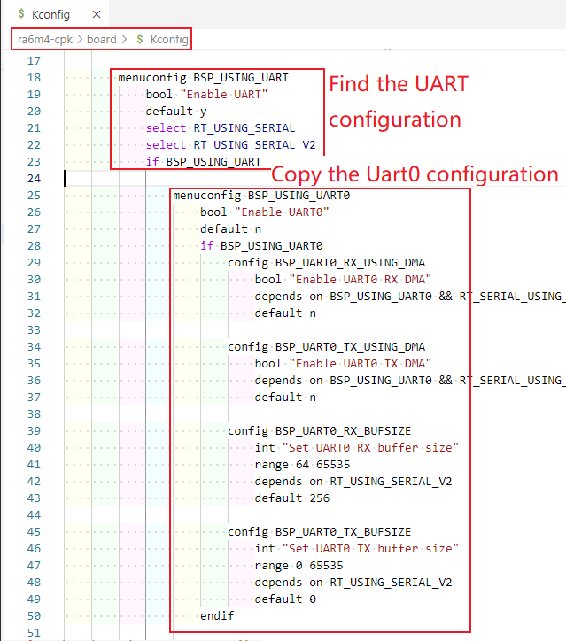
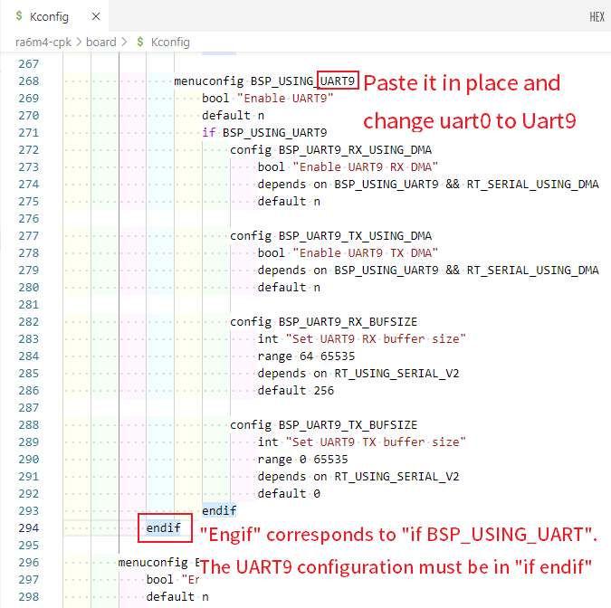
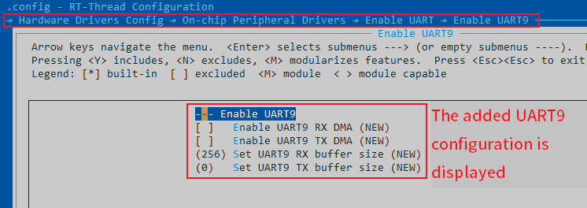
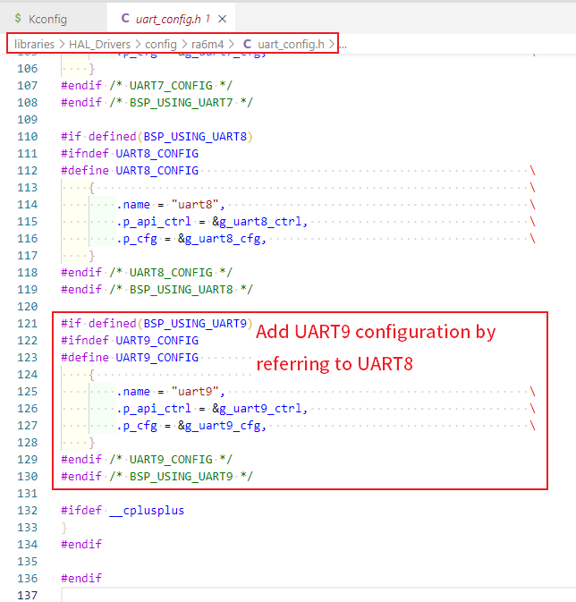
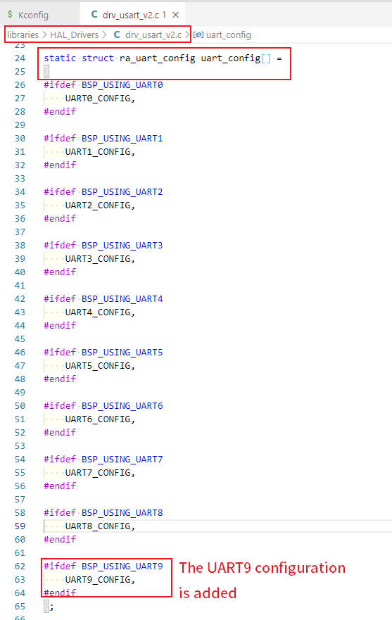

# Peripheral Driver Addition Guide of RA Series

## 1. Introduction

This document is intended for developers who need to add more peripheral drivers to their existing RA series BSPs. By reading this article, developers can add their own drivers to existing BSPs according to their actual situation.

## 2. Prerequisites

- Proficiency in using ENV tools, reference: [RT-Thread env tools user manual](https://www.rt-thread.org/document/site/#/development-tools/env/env)
- Familiar with [Kconfig](https://www.rt-thread.org/document/site/#/development-tools/kconfig/kconfig) programmer
- Familiar with  [FSP](https://www2.renesas.cn/jp/zh/software-tool/flexible-software-package-fsp) tool
- Understanding RT-Thread [Device Driver Framework](https://www.rt-thread.org/document/site/#/rt-thread-version/rt-thread-standard/programming-manual/device/device)

## 3. How to add more peripheral driver options

This section uses the example of adding on-chip peripheral drivers to explain how to add more drivers available to BSPs. If the on-chip peripherals you want to use are not available in the 'On-chip peripheral configuration menu', you need to add them yourself. Below we will demonstrate how to add a UART9 port for ra6m4-cpk.

Adding peripheral support for UART requires the following steps:

### 3.1 Modify the Kconfig file

Open the board\kconfig file in the BSP and add the UART9 configuration.

 

 

After the modification is complete, open the ENV tool in the BSP directory and enter the 'menuconfig' command on the command line to see if the UART9 configuration has been added.

 

### 3.2 Modify the uart_config.h file

Once the configuration of Kconfig is added, you also need to add the corresponding configuration in the configuration file and driver file.

Open the file `libraries\HAL_Drivers\config\ra6m4\uart_config.h` to add the UART9 configuration.

 

### 3.3 Modify the drv_usart_v2.h file

Open `librariesHAL_Driversdrv_usart_v2.c' and add the following code:

 

 

### 3.4 Test validation

1. Open UART9 in menuconfig and save the configuration, regenerating the MDK project using the 'scons --target=mdk5' command.
2. Open the FSP Configuration Tool from the project project and add the UART9 port

 

 

3. Configure the CORRESPONDING IO pin of UART9, save and exit.

 

4. Compile, debug download, enter list_device command to see that the uart9 device has been registered to the kernel, indicating that the device was added successfully, and then you can use the UART9 port to communicate.

 

This tutorial translated by [Josh Zou](https://github.com/Firmament-Autopilot)