# RA Series Uses FSP to Configure Peripheral Drivers

## 1. Preparation

###  1.1 Add custom command to start FSP in MDK

1. Open MDK, select “Tools -> Customize Tools Menu…”
2. Click the “new” icon to add a custom command: RA Smart Configurator
3. Enter the installation path of the tool in Command, click "**...**" to find the "rasc.exe" file under the installation path and select it (under the rasc installation directory)
4. Enter parameter in Initial Folder: $P
5. Enter parameter in Arguments: --device $D --compiler ARMv6 configuration.xml
6. Click OK to save command

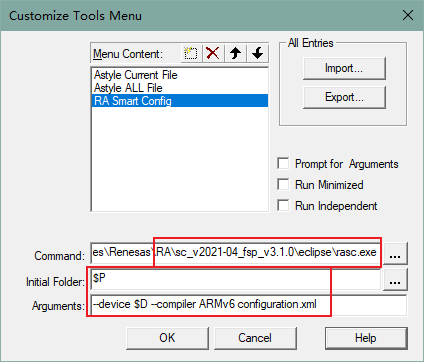 

7. Click the added command "Tools -> RA smart Configurator", **Open the configuration tool**: RA Smart Config

 

PS：The above related operations can also be found in the FSP documentation.

FSP Document：https://www2.renesas.cn/jp/zh/software-tool/flexible-software-package-fsp#document

###  1.2 Precautions

####  1.2.1 FSP Version selection

The RA series has been updated to support the **FSP 3.5.0** version, please use the **FSP 3.5.0** version for configuration modification, **the old version may have compatibility issues**.

**Be sure to check whether the FSP version, Board, Device configuration items are correct before using RASC. **

 

#### 1.2.2 Update project configuration

After the FSP configuration is completed, if a new file is added to the project, it will not be added immediately. It needs to be compiled once. If the following prompt pops up, select "Yes" and then compile again.

 

## 2. Add and configure peripherals using FSP

**PS: The peripheral adding steps in the document are instructions for individual configuration. The typesetting order does not represent the peripheral adding order. If you encounter pin conflicts, please refer to the relevant chapters of the development board and chip manual. **

### UART

How to add a UART port peripheral configuration?

1. Select the Stacks configuration page, click New Stack to find the UART.
 

2. Configure the UART parameters, because it needs to adapt to the naming used in the RT-Thread driver, so you need to modify the naming, and set **name** , **channel** , **callback** to be the same label.
 

###  GPIO Interrupt

How to add an IO interrupt?

1. Select the pin number and enter the configuration, for example, select P105 as the interrupt pin. You can first find the pin to view the IRQx channel number that can be configured.

 

2. Open ICU interrupt channel IRQ00

 

3. Create stack and enter configuration. Because it needs to adapt to the naming used in the RT-Thread driver, it is necessary to modify the naming and set **name** , **channel** to be the same label. Select the trigger method you want, and finally save the configuration to generate the configuration code.

 

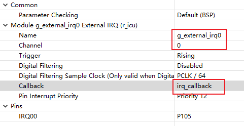 

4. Test whether the interrupt is successfully enabled

   ```c
   #define IRQ_TEST_PIN	"p105"
   void irq_callback_test(void *args)
   {
       rt_kprintf("\n IRQ00 triggered \n");
   }
   
   void icu_sample(void)
   {
       /* init */
       rt_uint32_t pin = rt_pin_get(IRQ_TEST_PIN);
       rt_kprintf("\n pin number : 0x%04X \n", pin);
       rt_err_t err = rt_pin_attach_irq(pin, PIN_IRQ_MODE_RISING, irq_callback_test, RT_NULL);
       if(RT_EOK != err)
       {
           rt_kprintf("\n attach irq failed. \n");
       }
       err = rt_pin_irq_enable(pin, PIN_IRQ_ENABLE);
       if(RT_EOK != err)
       {
           rt_kprintf("\n enable irq failed. \n");
       }
   }
   MSH_CMD_EXPORT(icu_sample, icu sample);
   ```

### WDT

1. Create WDT

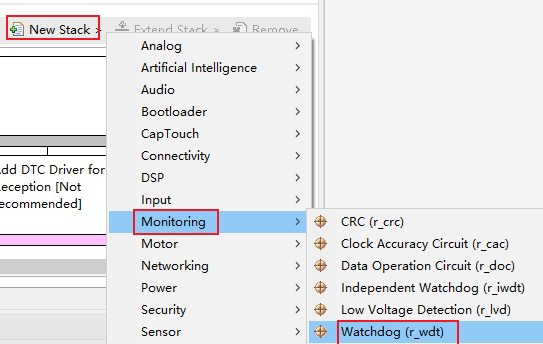 

2. When configuring WDT, it should be noted that only one WDT device is used in RT-Thread, so it is not numbered. If it is a newly created WDT device, you need to pay attention to the name field, which is `g_wdt` by default in the driver.

 

3. How to open WDT in ENV and [WDT interface usage instructions](https://www.rt-thread.org/document/site/#/rt-thread-version/rt-thread-standard/programming-manual/device/watchdog/watchdog)

 

### RTC

1. Add RTC device

 

2. When configuring RTC, it should be noted that only one RTC device is used in RT-Thread, so it is not numbered. If it is a newly created RTC device, you need to pay attention to the name field, which is `g_rtc` by default in the driver. Modify Callback to rtc_callback

 

3. How to open RTC in ENV and [RTC Interface Instructions](https://www.rt-thread.org/document/site/#/rt-thread-version/rt-thread-standard/programming-manual/device/rtc/rtc)

 

### Flash

1. Create Flash

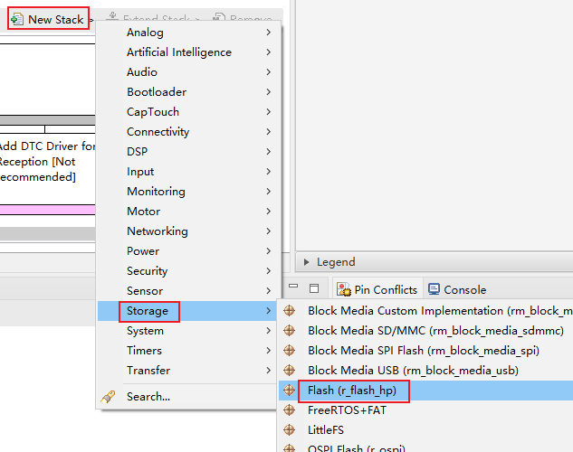 

2. When configuring the Flash, it should be noted that only one flash device is used in RT-Thread, so it is not numbered. If it is a newly created flash device, you need to pay attention to the name field, which is `g_flash` by default in the driver.

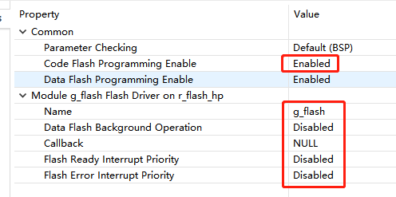 

3. How to open Flash in ENV

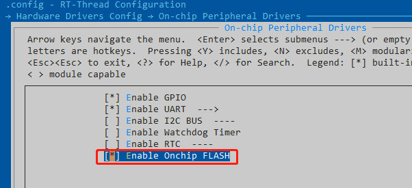 

### SPI

1. Add an SPI peripheral port

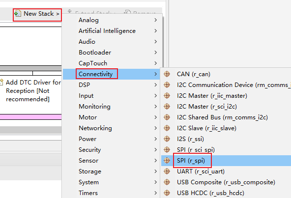 

2. Configure parameters such as channel, name, Clock Phase, Clock Polarity, Callback, SPI Mode, etc. The baud rate can be modified in the code through the API, and a default value can be set here.

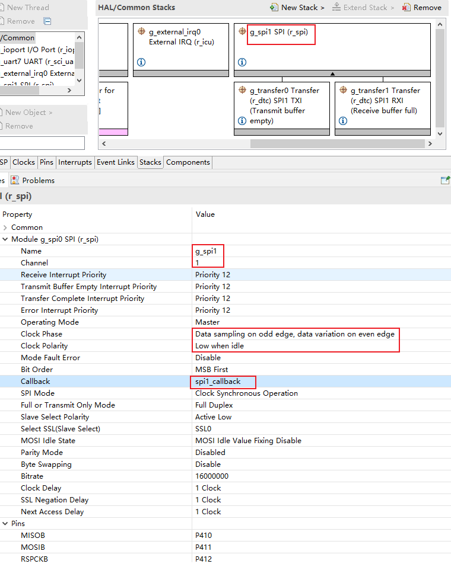 

3. Open SPI1 in Pins to configure the port pins. **Note: Do not configure the SSLx chip select pins here, the control of the chip select pins is controlled by software in the driver. **

 


4. How to open SPI in ENV and [SPI Interface Instructions](https://www.rt-thread.org/document/site/#/rt-thread-version/rt-thread-standard/programming-manual/device/spi/spi)

    

### ADC/DAC

Create ADC/DAC

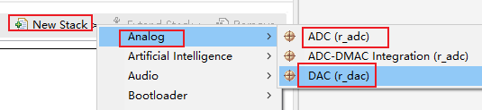 

- **ADC**

1. Configure name, unit, mode, and select the channel number to scan

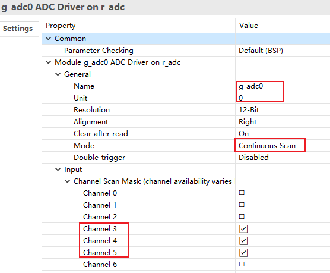 

2. Configure the pins corresponding to the scan channel

 

3. Open the corresponding channel in menuconfig

- **DAC**

1. You need to turn off the default mode of P014 first

 

2. Enable DAC0 channel

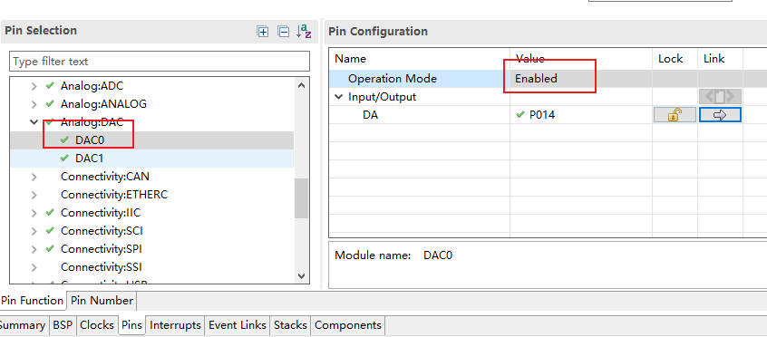 

3. Modify the channel number to 0, corresponding to DAC0

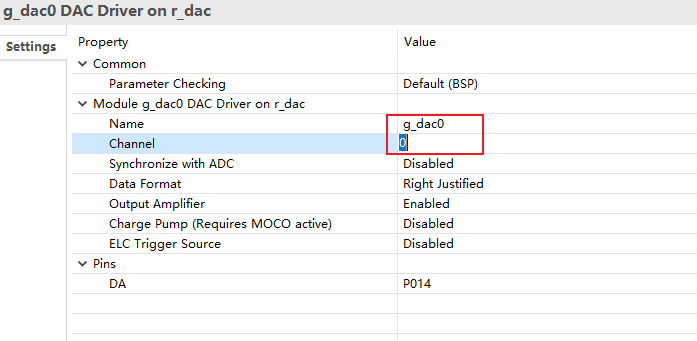 

4. Open the corresponding channel in menuconfig

### PWM（GPT）

The GPT timer can be used as a general-purpose timer in this chip, and can also be used to generate PWM signals. When it is used to generate PWM signals, the GPT timer provides a total of 10 channels gpt0 - gpt9, and each channel can be set to two output ports. The current version of the PWM driver treats each channel as a separate PWM device, each with only one channel. Users can choose to turn on any output port of a channel, or turn on both ports, but when both ports are turned on at the same time, their output waveforms will be exactly the same.

1. Add GPT device

 

2. Configure channels

 

The more critical configuration of GPT is shown in the figure, and the specific explanation is as follows:

   1. Set ``Common`` ->``Pin Output Support`` to Enable to enable the PWM output.
   2. Specify the GPT channel, and specify the name of the GPT according to the number of channels, for example, specify GPT channel 3 here, so the name of the GPT must be ``g_timer3``. And set the timer mode to PWM and specify the count value for each PWM period.
   3. Set the duty cycle of the default output of the PWM channel, here is 50%.
   4. Set the enable state of the two output ports under the GPT channel.
   5. Here, the corresponding pins of the two output ports under the GPT channel are set.
3. Configure output pins

 

   After completing the setting of the GPT timer in the previous step, find the interface corresponding to the GPT channel output pin setting (here is GPT3) according to the figure, and set the label **1** in the figure to ``GTIOCA or GTIOCB`` , and set the corresponding output pins of the two output ports under the GPT channel at the label **2** in the figure as required.

   4. Open the corresponding channel in menuconfig, [Introduction to RT-Thread's pwm framework](https://www.rt-thread.org/document/site/#/rt-thread-version/rt-thread-standard/programming-manual/device/pwm/pwm)

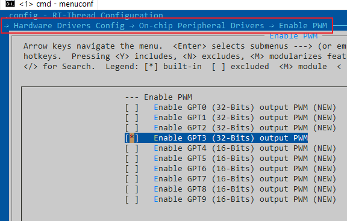 

### CAN

1. Add CAN

 

2. Configure Callback as 'can0_callback' or 'can1_callback'

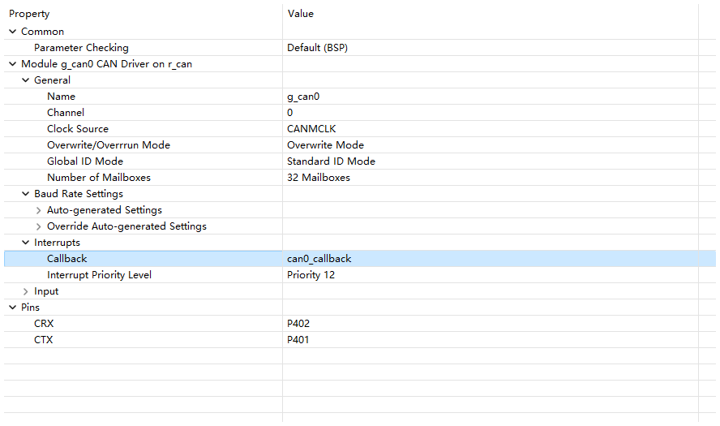 

3. Configure additional options and generate code.

4. Enable CAN using ENV. [CAN Equipment Instructions](https://www.rt-thread.org/document/site/#/rt-thread-version/rt-thread-standard/programming-manual/device/can/can)

 

### SDHI

1. Add sdhi drivers

 

1. Add DMAC

 

2. Configure DMAC interrupt

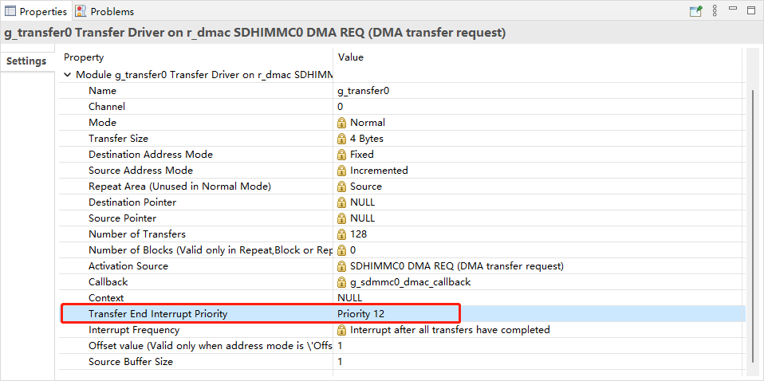 

3. Set the SDHI interrupt and pins

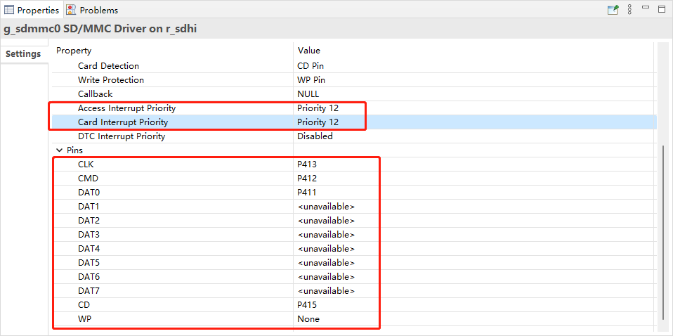 

4. Turn on SDHI in ENV

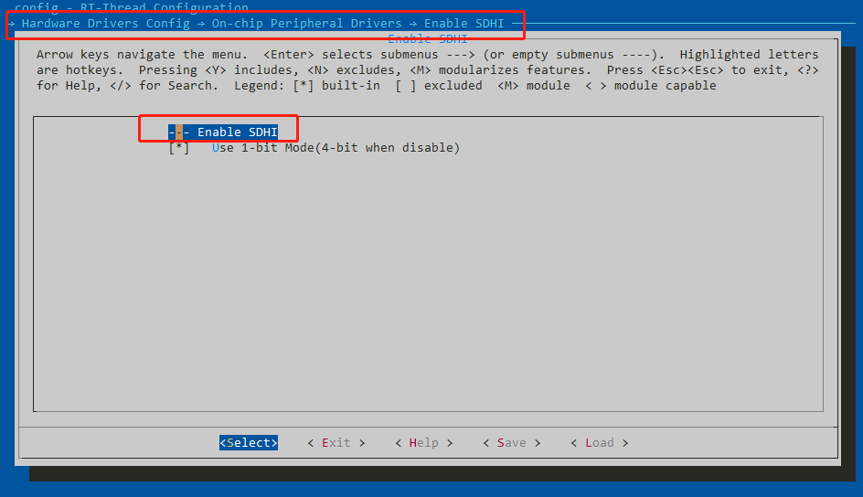 

5. Configure DFS in ENV and add file systems such as FatFS

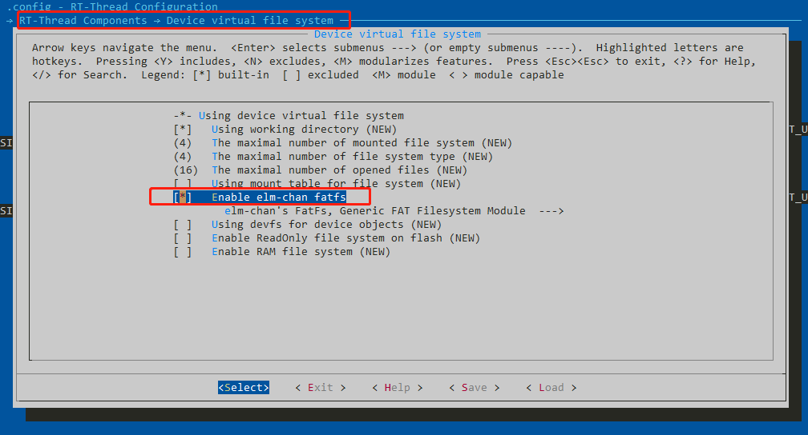 

6. At the command line, format the SD card with 'mkfs sd0 -t elm'

7. At the command line, mount sd0 to '/' using 'mount sd0 /elm'

8. Refer to RT-Thread DFS User Guide [Virtual File System (rt-thread.org)](https://www.rt-thread.org/document/site/#/rt-thread-version/rt-thread-standard/programming-manual/filesystem/filesystem)

### WiFi Module: [RW007 ](https://github.com/RT-Thread-packages/rw007)

1. Locate the RW007 in the package configuration and modify it to the configuration in the following figure.

 

2. The RW007 configuration for the driver is opened in menuconfig, and the SPI1 port is used by default. So you need to open the SPI1 bus.

 

 

3. Open [WLAN Framework](https://www.rt-thread.org/document/site/#/rt-thread-version/rt-thread-standard/programming-manual/device/wlan/wlan) in the Device Driver Framework

 

Open the NETDEV component in the network configuration:

 

Open the mempool configuration in the kernel:

 

4. Open the Add SPI peripheral port in the FSP, [How to Add SPI] (#SPI). The following figure takes the SPI1 port as an example of the configuration as follows:

 

5. RW007 has a slave-controlled INT pin that requires an IRQ channel, as shown in the following figure, the P506 is configured as follows:

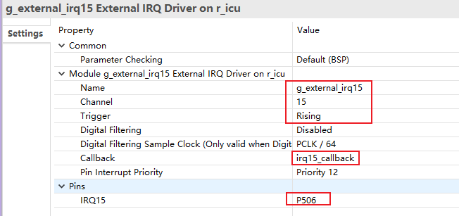 

6. The RESET control pin of the RW007 modifies the default configuration, where mode is set to off in RASC and controlled by RW007.

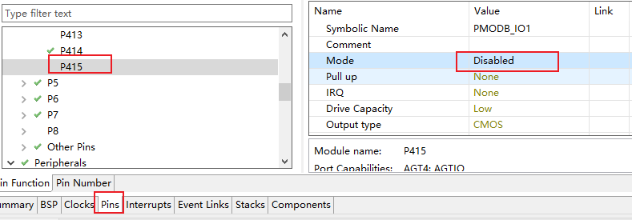 

7. When the configuration is complete, check that the necessary files are included in the MDK project

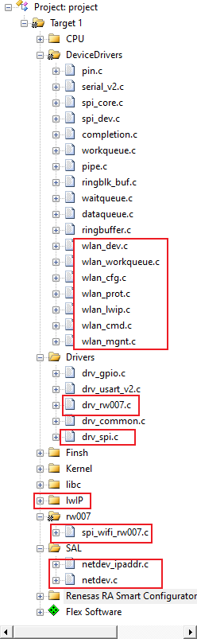 

8. Compile the download and verify the results.

The system boots up to automatically get the information for the RW007, entering the 'wifi scan' command to scan the WiFi signal in the environment. [More WiFi Commands](https://www.rt-thread.org/document/site/#/rt-thread-version/rt-thread-standard/programming-manual/device/wlan/wlan?id=finsh-%e5%91%bd%e4%bb%a4)

 

Connect to a WiFi hotspot using the 'WiFi join' command:

 

Test the network connection using 'ping rt-thread.com':

 


This tutorial translated by [Josh Zou](https://github.com/Firmament-Autopilot)